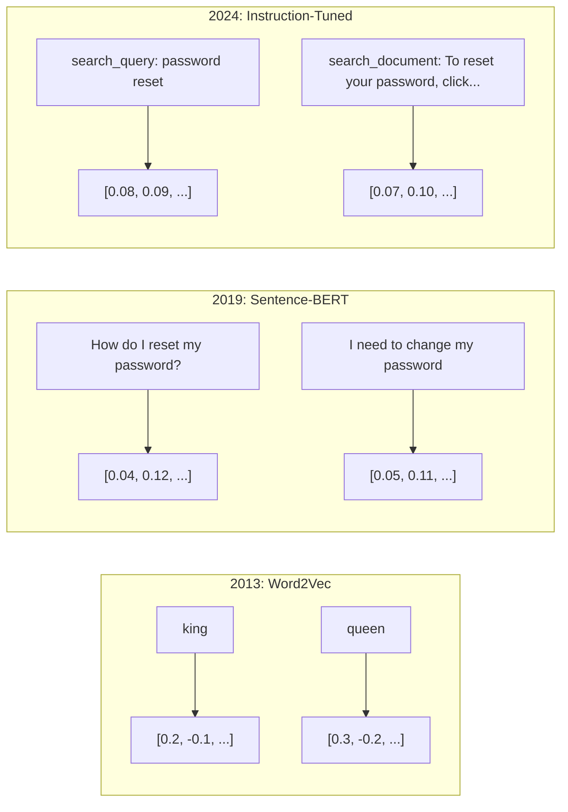
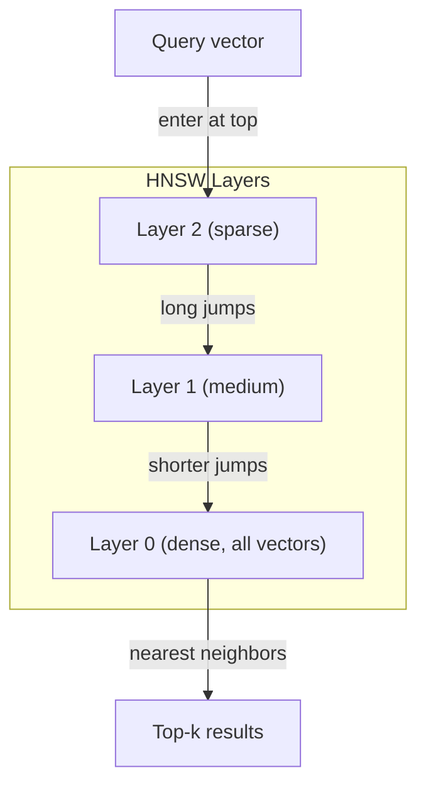
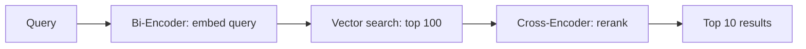

# 임베딩과 벡터 표현

> 텍스트는 이산적이고, 수학은 연속적입니다. LLM에게 "비슷한" 문서를 찾거나, 의미를 비교하거나, keyword를 넘어 검색하라고 할 때마다 이 두 세계를 잇는 다리에 의존합니다. 그 다리가 embedding입니다. embedding을 이해하지 못하면 현대 AI를 이해하지 못합니다. 그저 사용할 뿐입니다.

**Type:** Build
**Languages:** Python
**Prerequisites:** Phase 11, Lesson 01 (Prompt Engineering)
**Time:** ~75 minutes
**Related:** Phase 5 · 22 (Embedding Models Deep Dive)는 dense vs sparse vs multi-vector, Matryoshka truncation, axis별 model selection을 다룹니다. 이 lesson은 production pipeline(vector DB, HNSW, similarity math)에 집중합니다. 모델을 고르기 전에 Phase 5 · 22를 먼저 읽으세요.

## 학습 목표

- API provider와 open-source model로 text embedding을 생성하고 cosine similarity를 계산합니다.
- keyword search가 해결하지 못하는 vocabulary mismatch problem을 embedding이 왜 해결하는지 설명합니다.
- 정확한 keyword match가 아니라 의미로 문서를 retrieve하는 semantic search index를 만듭니다.
- retrieval benchmark(precision@k, recall)로 embedding 품질을 평가하고 작업에 맞는 embedding model을 고릅니다.

## 문제

지원 티켓 10,000개가 있습니다. 고객이 "my payment didn't go through"라고 씁니다. 비슷한 과거 티켓을 찾아야 합니다. keyword search는 "payment"와 "didn't go through"가 들어간 티켓을 찾지만, "transaction failed", "charge was declined", "billing error"는 놓칩니다. 완전히 다른 단어로 같은 문제를 설명하기 때문입니다.

이것이 vocabulary mismatch problem입니다. 인간 언어에는 같은 뜻을 말하는 방식이 수십 가지 있습니다. keyword search는 각 단어를 의미 없는 독립 기호로 취급합니다. "declined"와 "didn't go through"가 같은 개념을 가리킨다는 사실을 알 수 없습니다.

필요한 것은 철자가 아니라 의미가 similarity를 결정하는 텍스트 표현입니다. "my payment didn't go through"와 "transaction was declined"는 어떤 수학적 공간에서 가까이 놓고, "payment"라는 단어를 공유하더라도 "my payment arrived on time"은 멀리 밀어내는 방법이 필요합니다.

그 표현이 embedding입니다.

## 개념

### embedding이란 무엇인가?

embedding은 텍스트의 의미를 나타내는 dense vector입니다. "dense"가 중요합니다. bag-of-words나 TF-IDF 같은 sparse representation은 대부분 차원이 0이지만, dense embedding은 모든 차원이 정보를 담습니다.

"The cat sat on the mat"은 `[0.023, -0.041, 0.087, ..., 0.012]` 같은 768-3072개 숫자의 목록이 됩니다. 이 숫자는 의미를 encode합니다. 직접 들여다보지는 않습니다. 서로 비교합니다.

### Word2Vec의 돌파구

2013년 Tomas Mikolov와 Google 동료들은 Word2Vec을 발표했습니다. 핵심 통찰은 간단했습니다. 주변 단어로부터 단어를 예측하거나 단어로부터 주변 단어를 예측하도록 neural network를 학습시키면, hidden layer weight가 의미 있는 vector representation이 됩니다.

```text
king - man + woman = queen
```

word embedding의 vector arithmetic은 semantic relationship을 포착합니다. "man"에서 "woman"으로 가는 방향은 대략 "king"에서 "queen"으로 가는 방향과 같습니다. 이 결과는 geometry가 meaning을 encode할 수 있다는 사실을 field에 각인시켰습니다.

Word2Vec은 300-dimensional vector를 만들었습니다. 단어 하나에는 context와 상관없이 vector 하나만 있었습니다. "river bank"의 "bank"와 "bank account"의 "bank"가 같은 embedding을 받았습니다. 이 한계가 이후 10년의 연구를 밀어붙였습니다.

### 단어에서 문장으로

word embedding은 단일 token을 표현합니다. production system은 sentence, paragraph, document 전체를 embed해야 합니다. 네 가지 접근이 등장했습니다.

**Averaging**: 문장 안 모든 word vector의 평균을 냅니다. 싸고 lossy하지만 짧은 텍스트에는 의외로 괜찮습니다. word order를 완전히 잃기 때문에 "dog bites man"과 "man bites dog"가 같은 embedding을 받습니다.

**CLS token**: BERT 같은 transformer model은 전체 input을 대표하는 special `[CLS]` token embedding을 출력합니다. averaging보다 좋지만 `[CLS]` token은 similarity가 아니라 next-sentence prediction을 위해 학습되었습니다.

**Contrastive learning**: 비슷한 pair는 가깝게, 다른 pair는 멀게 밀도록 모델을 직접 학습합니다. Sentence-BERT(Reimers & Gurevych, 2019)가 이 접근을 사용했고 modern embedding model의 기반이 되었습니다.

**Instruction-tuned embeddings**: 최신 접근입니다. E5와 GTE 같은 model은 `"search_query:"`, `"search_document:"` 같은 task prefix를 받아 어떤 종류의 embedding을 만들지 알 수 있습니다. 하나의 model이 여러 task를 지원할 수 있습니다.



### 현대 embedding model

production-grade option은 몇 가지로 수렴했습니다(MTEB v2 기준, 2026년 초 점수).

| 모델 | 제공자 | 차원 | MTEB | 컨텍스트 | 1M 토큰당 비용 |
|-------|----------|-----------|------|---------|------------------|
| Gemini Embedding 2 | Google | 3072 (Matryoshka) | 67.7 (retrieval) | 8192 | $0.15 |
| embed-v4 | Cohere | 1024 (Matryoshka) | 65.2 | 128K | $0.12 |
| voyage-4 | Voyage AI | 1024/2048 (Matryoshka) | 66.8 | 32K | $0.12 |
| text-embedding-3-large | OpenAI | 3072 (Matryoshka) | 64.6 | 8192 | $0.13 |
| text-embedding-3-small | OpenAI | 1536 (Matryoshka) | 62.3 | 8192 | $0.02 |
| BGE-M3 | BAAI | 1024 (dense+sparse+ColBERT) | 63.0 multilingual | 8192 | Open-weight |
| Qwen3-Embedding | Alibaba | 4096 (Matryoshka) | 66.9 | 32K | Open-weight |
| Nomic-embed-v2 | Nomic | 768 (Matryoshka) | 63.1 | 8192 | Open-weight |

MTEB(Massive Text Embedding Benchmark) v2는 retrieval, classification, clustering, reranking, summarization 등 100개 이상의 task를 다룹니다. 높을수록 좋습니다. 2026년에는 open-weight model(Qwen3-Embedding, BGE-M3)이 대부분 축에서 closed hosted model과 맞먹거나 능가합니다. Gemini Embedding 2는 pure retrieval을, Voyage/Cohere는 finance, law, code 같은 특정 domain을 잘합니다. 최종 선택 전에는 항상 자기 query로 benchmark하세요.

### 유사도 지표

두 embedding vector가 있을 때 similarity를 재는 대표 방법은 세 가지입니다.

**Cosine similarity**: 두 vector 사이 각도의 cosine입니다. -1(반대)부터 1(같은 방향)까지입니다. magnitude를 무시하므로 10단어 문장과 500단어 문서도 같은 방향이면 1.0을 받을 수 있습니다. use case의 90%에서 default입니다.

```text
cosine_sim(a, b) = dot(a, b) / (||a|| * ||b||)
```

**Dot product**: 두 vector의 raw inner product입니다. vector가 normalized(unit length)되어 있으면 cosine similarity와 ranking이 같습니다. 계산이 더 빠릅니다. OpenAI embedding은 normalized되어 있으므로 dot product와 cosine은 같은 ranking을 냅니다.

```text
dot(a, b) = sum(a_i * b_i)
```

**Euclidean (L2) distance**: vector space에서 직선 거리입니다. 작을수록 더 비슷합니다. magnitude 차이에 민감합니다. 방향뿐 아니라 공간상의 절대 위치가 중요할 때 사용합니다.

```text
L2(a, b) = sqrt(sum((a_i - b_i)^2))
```

| Metric | 사용할 때 | 피할 때 |
|--------|----------|---------|
| Cosine similarity | 길이가 다른 텍스트 비교, 대부분 retrieval task | magnitude가 정보를 담을 때 |
| Dot product | embedding이 이미 normalized되어 있고 최대 속도가 필요할 때 | vector magnitude가 제각각일 때 |
| Euclidean distance | clustering, spatial nearest-neighbor 문제 | 길이가 크게 다른 문서 비교 |

### Vector database와 HNSW

brute-force similarity search는 query를 저장된 모든 vector와 비교합니다. 1536차원 vector 100만 개라면 query 하나에 15억 번의 multiply-add가 필요합니다. 너무 느립니다.

vector database는 Approximate Nearest Neighbor(ANN) algorithm으로 이 문제를 풉니다. 대표 algorithm은 HNSW(Hierarchical Navigable Small World)입니다.

1. vector의 multi-layer graph를 만듭니다.
2. top layer는 sparse하며 먼 cluster 사이 long-range connection을 둡니다.
3. bottom layer는 dense하며 가까운 vector 사이 fine-grained connection을 둡니다.
4. search는 top layer에서 시작해 greedy하게 내려오며 refine합니다.
5. O(n) 대신 O(log n) 시간에 approximate top-k result를 반환합니다.

HNSW는 작은 accuracy loss(보통 95-99% recall)를 대가로 큰 speed gain을 얻습니다. 1천만 vector에서 brute force는 초 단위가 걸리지만 HNSW는 millisecond 단위입니다.



| 데이터베이스 | 유형 | 가장 적합한 경우 | 최대 규모 |
|----------|------|----------|-----------|
| Pinecone | 관리형 SaaS | 운영 부담 없는 production | 수십억 |
| Weaviate | 오픈 소스 | 자체 호스팅, hybrid search | 100M+ |
| Qdrant | 오픈 소스 | 고성능, 필터링 | 100M+ |
| ChromaDB | 임베디드 | 프로토타이핑, local dev | 1M |
| pgvector | Postgres 확장 | 이미 Postgres를 쓰는 경우 | 10M |
| FAISS | 라이브러리 | 프로세스 내 실행, 연구 | 1B+ |

### Chunking 전략

문서는 하나의 vector로 embed하기에 너무 깁니다. 50페이지 PDF는 수십 topic을 포함하므로 embedding이 모든 것의 평균이 되어 어떤 구체적 의미와도 비슷하지 않게 됩니다. 그래서 문서를 chunk로 나누고 각 chunk를 embed합니다.

**Fixed-size chunking**: N token마다 자르고 M-token overlap을 둡니다. 단순하고 예측 가능합니다. 명확한 구조가 없는 문서에 잘 맞습니다.

**Sentence-based chunking**: sentence boundary에서 나누고 token limit까지 sentence를 묶습니다. 생각을 반으로 자르지 않기 때문에 fixed-size보다 좋습니다.

**Recursive chunking**: 가장 큰 boundary(section header)부터 시도하고, 너무 크면 paragraph, sentence, character limit 순서로 내려갑니다. Markdown, HTML, mixed corpus에 잘 맞습니다.

**Semantic chunking**: 각 sentence를 embed한 뒤 embedding similarity가 높은 consecutive sentence를 묶습니다. similarity가 threshold 아래로 떨어지면 새 chunk를 시작합니다. 비싸지만 가장 coherent한 chunk를 만듭니다.

| 전략 | 복잡도 | 품질 | 가장 적합한 경우 |
|----------|-----------|---------|----------|
| 고정 크기 | 낮음 | 보통 | 비정형 텍스트, 로그 |
| 문장 기반 | 낮음 | 좋음 | 기사, 이메일 |
| 재귀적 | 중간 | 좋음 | Markdown, HTML, 혼합 문서 |
| 의미 기반 | 높음 | 최고 | 검색 품질이 중요한 경우 |

대부분 system의 sweet spot은 256-512 token chunk와 50-token overlap입니다.

### Bi-encoder vs Cross-encoder

bi-encoder는 query와 document를 독립적으로 embed한 뒤 vector를 비교합니다. query를 한 번만 embed하고 pre-computed document embedding과 비교하므로 빠릅니다. retrieval에 사용합니다.

cross-encoder는 query와 document를 하나의 input으로 넣고 relevance score를 출력합니다. 각 query-document pair를 full model로 처리하므로 느리지만, query와 document token 사이를 동시에 attend할 수 있어 훨씬 정확합니다.

production pattern은 bi-encoder로 top-100 candidate를 retrieve하고, cross-encoder로 top-10까지 rerank하는 retrieve-then-rerank pipeline입니다.



### Matryoshka embedding과 binary quantization

traditional embedding은 all-or-nothing입니다. 1536-dimensional vector는 1536 float를 사용합니다. retraining 없이 256 dimension으로 자를 수 없습니다.

Matryoshka Representation Learning(Kusupati et al., 2022)은 이 문제를 해결합니다. model을 학습할 때 첫 N dimension이 가장 중요한 정보를 담도록 만듭니다. 러시아 nesting doll처럼 1536-d Matryoshka embedding을 256 dimension으로 잘라도 일부 accuracy만 잃고 여전히 동작합니다.

OpenAI의 `text-embedding-3-small`과 `text-embedding-3-large`는 `dimensions` parameter로 Matryoshka truncation을 지원합니다. 1536 대신 256 dimension을 요청하면 storage가 6x 줄고 MTEB benchmark에서 대략 3-5% accuracy loss가 납니다.

binary quantization은 각 float를 단일 bit로 바꿉니다. 양수는 1, 음수는 0입니다. 1536-dimensional float32 embedding은 6,144 bytes를 쓰지만 binary로는 192 bytes만 씁니다. retrieval recall은 5-10% 정도 낮아지지만, 첫 pass는 binary로 millions vector를 검색하고 top-1000을 full-precision vector로 rescore하면 32x 적은 memory로 full-precision accuracy의 95% 이상을 얻을 수 있습니다.

```figure
cosine-similarity
```

## 직접 만들기

semantic search engine을 처음부터 만듭니다. vector database도 외부 embedding API도 쓰지 않습니다. math에는 numpy만 사용합니다. 핵심 구현은 `code/embeddings.py`와 `code/main.ts`에 있습니다.

### 1단계: 텍스트 청킹

```python
def chunk_text(text, chunk_size=200, overlap=50):
    words = text.split()
    chunks = []
    start = 0
    while start < len(words):
        end = start + chunk_size
        chunk = " ".join(words[start:end])
        chunks.append(chunk)
        start += chunk_size - overlap
    return chunks
```

### Step 2: scratch에서 embedding 만들기

TF-IDF와 L2 normalization으로 간단한 dense embedding을 구현합니다. neural embedding은 아니지만 contract는 같습니다. text가 들어오면 fixed-size vector가 나오고, 비슷한 text는 비슷한 vector를 만듭니다.

```python
class SimpleEmbedder:
    def __init__(self):
        self.vocab = []
        self.idf = []
        self.word_to_idx = {}

    def fit(self, documents):
        ...

    def embed(self, text):
        ...
```

### Step 3: Similarity 함수

```python
def cosine_similarity(a, b):
    dot = np.dot(a, b)
    norm_a = np.linalg.norm(a)
    norm_b = np.linalg.norm(b)
    if norm_a == 0 or norm_b == 0:
        return 0.0
    return float(dot / (norm_a * norm_b))
```

### 4단계: brute-force 벡터 인덱스

`VectorIndex`는 vector, original text, metadata를 함께 저장하고 query vector와 모든 저장 vector를 비교해 top-k를 반환합니다. production에서는 HNSW나 vector DB를 쓰지만, 여기서는 검색 contract를 이해하기 위해 brute force로 구현합니다.

### 5단계: 시맨틱 검색 엔진

`SemanticSearchEngine`은 chunking, embedding, indexing, searching을 하나의 pipeline으로 묶습니다. 문서를 chunk로 나누고, chunk 전체에 대해 vocabulary와 IDF를 학습한 뒤, 각 chunk를 vector index에 넣습니다.

## 사용하기

production embedding API를 써도 architecture는 같습니다. embedder만 바뀝니다.

```python
from openai import OpenAI

client = OpenAI()

def openai_embed(texts, model="text-embedding-3-small", dimensions=None):
    kwargs = {"model": model, "input": texts}
    if dimensions:
        kwargs["dimensions"] = dimensions
    response = client.embeddings.create(**kwargs)
    return [item.embedding for item in response.data]
```

OpenAI의 Matryoshka truncation은 같은 model에서 더 적은 dimension과 더 낮은 storage를 제공합니다.

```python
full = openai_embed(["semantic search query"], dimensions=1536)
compact = openai_embed(["semantic search query"], dimensions=256)
```

256-d vector는 storage를 6x 적게 씁니다. 문서 1천만 개라면 61 GB 대신 10 GB입니다. 표준 benchmark에서 accuracy loss는 대략 3-5%입니다.

reranking에는 Cohere를 사용할 수 있습니다.

```python
import cohere

co = cohere.ClientV2()

results = co.rerank(
    model="rerank-v3.5",
    query="What is the refund policy?",
    documents=["Full refund within 30 days...", "No refunds after 90 days..."],
    top_n=3
)
```

API dependency 없이 local embedding을 쓰려면 `sentence_transformers`를 사용할 수 있습니다.

```python
from sentence_transformers import SentenceTransformer

model = SentenceTransformer("BAAI/bge-small-en-v1.5")
embeddings = model.encode(["semantic search query", "another document"])
```

이 lesson에서 만든 `VectorIndex`는 이 모든 embedding 함수와 함께 작동합니다. embedding function만 바꾸고 search logic은 유지하세요.

## 결과물

이 lesson은 두 산출물을 만듭니다.

- `outputs/prompt-embedding-advisor.md`: 특정 use case에 맞는 embedding model과 strategy를 선택하는 prompt
- `outputs/skill-embedding-patterns.md`: agent가 production에서 embedding을 효과적으로 쓰도록 가르치는 skill

## 연습문제

1. **Metric comparison**: sample document에 같은 query 5개를 cosine similarity, dot product, euclidean distance로 실행하세요. 각 metric의 top-3 result를 기록하세요. 어떤 query에서 metric이 서로 다른 결과를 내나요? 왜인가요?
2. **Chunk size experiment**: chunk size 50, 100, 200, 500 words로 sample document를 index하세요. 각 설정에서 query 5개를 실행하고 top-1 similarity score를 기록하세요. chunk size와 retrieval quality의 관계를 plot하고, 더 큰 chunk가 해를 끼치기 시작하는 지점을 찾으세요.
3. **Matryoshka simulation**: 500-d vector를 만드는 `SimpleEmbedder`를 만들고 50, 100, 200, 500 dimension으로 truncate하세요. 각 truncation에서 retrieval recall이 얼마나 떨어지는지 측정하세요.
4. **Binary quantization**: search engine의 embedding을 binary(양수면 1, 음수면 0)로 바꾸고 Hamming distance search를 구현하세요. full-precision cosine similarity의 top-10과 비교해 overlap percentage를 측정하세요.
5. **Sentence-based chunking**: fixed-size chunking을 `chunk_by_sentences`로 바꾸세요. 같은 query를 실행하고 retrieval score를 비교하세요. sentence boundary를 존중하면 결과가 좋아지나요?

## 핵심 용어

| Term | 사람들이 흔히 말하는 것 | 실제 의미 |
|------|------------------------|----------|
| Embedding | "Text to numbers" | geometric proximity가 semantic similarity를 encode하는 dense vector |
| Word2Vec | "The OG embedding" | context word 예측으로 word vector를 학습한 2013년 model; vector arithmetic이 meaning을 encode함을 보임 |
| Cosine similarity | "두 vector가 얼마나 비슷한가" | vector 사이 각도의 cosine; 1 = 같은 방향, 0 = 직교, -1 = 반대 |
| HNSW | "빠른 vector search" | O(log n) approximate nearest neighbor search를 가능하게 하는 multi-layer graph |
| Bi-encoder | "따로 embed하고 빠르게 비교" | query와 document를 독립적으로 vector로 encode해 pre-computation과 빠른 retrieval을 가능하게 함 |
| Cross-encoder | "느리지만 정확한 reranker" | query-document pair를 full model로 함께 처리해 accuracy를 높임 |
| Matryoshka embeddings | "자를 수 있는 vector" | 첫 N dimension이 가장 중요한 정보를 담도록 학습된 embedding |
| Binary quantization | "1-bit embeddings" | float vector를 binary로 변환해 32x storage reduction과 Hamming distance search를 얻는 방식 |
| Chunking | "문서를 embedding용으로 나누기" | 문서를 256-512 token segment로 나누어 각각 embed하고 retrieve하는 방식 |
| Vector database | "embedding용 search engine" | vector 저장과 scale 있는 approximate nearest neighbor search에 최적화된 datastore |
| Contrastive learning | "비교로 학습" | 비슷한 pair embedding은 가깝게, 다른 pair는 멀게 미는 training approach |
| MTEB | "embedding benchmark" | embedding model 비교를 위한 Massive Text Embedding Benchmark |

## 더 읽을거리

- Mikolov et al., "Efficient Estimation of Word Representations in Vector Space" (2013): king-queen analogy로 embedding revolution을 연 Word2Vec 논문
- Reimers & Gurevych, "Sentence-BERT: Sentence Embeddings using Siamese BERT-Networks" (2019): sentence-level similarity를 위한 bi-encoder 학습법
- Kusupati et al., "Matryoshka Representation Learning" (2022): variable-dimension embedding의 기반이 되는 기법
- Malkov & Yashunin, "Efficient and Robust Approximate Nearest Neighbor using Hierarchical Navigable Small World Graphs" (2018): 대부분 production vector search 뒤의 HNSW 논문
- OpenAI Embeddings Guide (platform.openai.com/docs/guides/embeddings): Matryoshka dimension reduction을 포함한 text-embedding-3 실무 reference
- MTEB Leaderboard (huggingface.co/spaces/mteb/leaderboard): task와 language 전반의 embedding model live benchmark
- [Muennighoff et al., "MTEB: Massive Text Embedding Benchmark" (EACL 2023)](https://arxiv.org/abs/2210.07316): leaderboard가 보고하는 8개 task category를 정의한 benchmark
- [Sentence Transformers documentation](https://www.sbert.net/): bi-encoder vs cross-encoder, pooling strategy, ingest-split-embed-store RAG pipeline의 canonical reference
