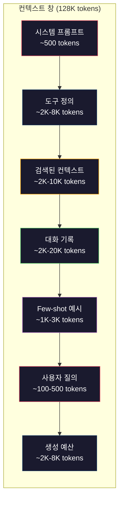
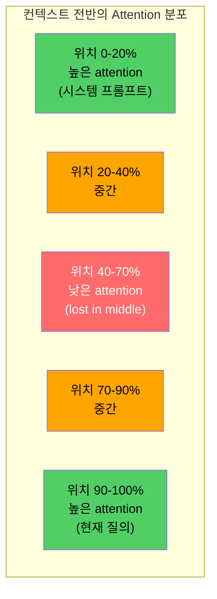
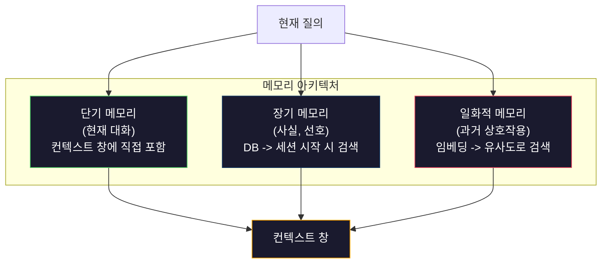

# 컨텍스트 엔지니어링: 창, 예산, 메모리, 검색

> 프롬프트 엔지니어링은 부분집합입니다. Context engineering은 전체 게임입니다. 프롬프트는 사용자가 입력하는 문자열입니다. 컨텍스트는 시스템 지시, 검색된 문서, 도구 정의, 대화 기록, few-shot 예시, 프롬프트 자체처럼 모델 창에 들어가는 모든 것입니다. 2026년의 뛰어난 AI 엔지니어는 context engineer입니다. 이들은 무엇을 넣고, 무엇을 빼며, 어떤 순서로 둘지 결정합니다.

**Type:** Build
**Languages:** Python
**Prerequisites:** Phase 10 (LLMs from Scratch), Phase 11 Lesson 01-02
**Time:** ~90 minutes
**Related:** Phase 11 · 15 (Prompt Caching) — 캐시 친화적 레이아웃은 context engineering의 확장입니다. NIAH/RULER로 lost-in-the-middle을 측정하는 방법은 Phase 5 · 28 (Long-Context Evaluation)을 보세요.

## 학습 목표

- 모든 컨텍스트 창 컴포넌트(시스템 프롬프트, 도구, 기록, 검색된 문서, 생성 여유분)에 걸친 토큰 예산을 계산합니다
- 대화 기록을 위한 자르기, 요약, sliding window 같은 컨텍스트 창 관리 전략을 구현합니다
- 가장 관련 있는 정보에 모델의 주의를 극대화하도록 컨텍스트 컴포넌트의 우선순위를 정하고 순서를 배치합니다
- 질의 유형과 사용 가능한 창 공간에 따라 토큰을 동적으로 배분하는 context assembler를 만듭니다

## 문제

Claude Opus 4.7은 200K 토큰 창을 갖고 있습니다(베타에서는 1M). GPT-5는 400K입니다. Gemini 3 Pro는 2M입니다. Llama 4는 10M을 주장합니다. 이 숫자들은 채워 보기 전까지는 엄청나게 커 보입니다.

코딩 어시스턴트의 실제 분해 예시는 다음과 같습니다. 시스템 프롬프트: 500토큰. 도구 50개의 도구 정의: 8,000토큰. 검색된 문서: 4,000토큰. 대화 기록(10턴): 6,000토큰. 현재 사용자 질의: 200토큰. 생성 예산(최대 출력): 4,000토큰. 총합: 22,700토큰입니다. 이는 128K 창의 18%에 불과합니다.

하지만 attention은 컨텍스트 길이에 선형으로 확장되지 않습니다. 128K 토큰 컨텍스트를 가진 모델은 이차 attention 비용을 냅니다(기본 transformer에서는 O(n^2)이지만, 대부분의 프로덕션 모델은 효율적인 attention 변형을 사용합니다). 더 중요한 것은 검색 정확도가 떨어진다는 점입니다. "Needle in a Haystack" 테스트는 모델이 긴 컨텍스트의 가운데에 놓인 정보를 찾는 데 어려움을 겪는다는 사실을 보여 줍니다. Liu et al. (2023)의 연구는 LLM이 긴 컨텍스트의 시작과 끝에 있는 정보는 거의 완벽한 정확도로 검색하지만, 가운데에 놓인 정보(컨텍스트의 40-70% 위치)는 정확도가 10-20% 하락한다는 점을 보였습니다. 이 "lost-in-the-middle" 효과는 모델마다 다르지만 현재 모든 아키텍처에 영향을 줍니다.

실용적인 교훈은 명확합니다. 200K 토큰을 사용할 수 있다고 해서 200K 토큰을 쓰는 것이 효과적이라는 뜻은 아닙니다. 신중하게 선별한 10K 토큰 컨텍스트가 마구 쏟아 넣은 100K 토큰 컨텍스트보다 더 나은 경우가 많습니다. Context engineering은 컨텍스트 창 안에서 신호 대 잡음비를 극대화하는 규율입니다.

창에 넣는 모든 토큰은 더 관련 있는 정보를 담을 수 있었던 토큰 하나를 밀어냅니다. 관련 없는 도구 정의, 오래된 대화 턴, 질문에 답하지 않는 검색 텍스트 청크 하나하나가 모델의 작업 성능을 조금씩 낮춥니다.

## 개념

### 컨텍스트 창은 희소한 자원입니다

컨텍스트 창을 디스크가 아니라 RAM이라고 생각하세요. 빠르고 직접 접근할 수 있지만 제한되어 있습니다. 모든 것을 넣을 수는 없습니다. 선택해야 합니다.



각 컴포넌트는 공간을 두고 경쟁합니다. 도구 정의를 더 넣으면 대화 기록을 위한 공간이 줄어듭니다. 검색된 컨텍스트를 더 넣으면 few-shot 예시를 위한 공간이 줄어듭니다. Context engineering은 작업 성능을 극대화하도록 이 예산을 배분하는 기술입니다.

### Lost-in-the-Middle 현상

Context engineering에서 가장 중요한 경험적 발견입니다. 모델은 컨텍스트의 시작과 끝에 있는 정보에 더 잘 주의를 기울입니다. 가운데에 있는 정보는 attention 점수가 낮아지고 무시될 가능성이 더 큽니다.

Liu et al. (2023)은 이를 체계적으로 테스트했습니다. 관련 문서 하나를 관련 없는 문서 20개 사이의 여러 위치에 배치하고 답변 정확도를 측정했습니다. 관련 문서가 처음이나 마지막에 있을 때 정확도는 85-90%였습니다. 가운데(20개 중 10번째 위치)에 있을 때 정확도는 60-70%로 떨어졌습니다.

이는 직접적인 엔지니어링 함의를 갖습니다.

- 가장 중요한 정보(시스템 프롬프트, 핵심 지시)를 앞에 둡니다
- 현재 질의와 가장 관련 있는 컨텍스트를 마지막에 둡니다(최신성 편향이 도움이 됩니다)
- 컨텍스트 가운데를 가장 낮은 우선순위 구역으로 취급합니다
- 반드시 가운데에 정보를 넣어야 한다면 핵심 포인트를 끝에 반복합니다



### 컨텍스트 컴포넌트

**시스템 프롬프트**: 페르소나, 제약, 행동 규칙을 설정합니다. 가장 먼저 들어가며 턴이 바뀌어도 일정하게 유지됩니다. Claude Code는 도구 정의와 행동 지시를 포함해 시스템 프롬프트에 대략 6,000토큰을 사용합니다. 간결하게 유지하세요. 시스템 프롬프트의 모든 단어는 모든 API 호출마다 반복됩니다.

**도구 정의**: 각 도구는 50-200토큰(이름, 설명, 파라미터 스키마)을 더합니다. 도구 50개가 각각 150토큰이면 대화가 시작되기도 전에 7,500토큰입니다. 현재 질의와 관련 있는 도구만 포함하는 동적 도구 선택은 이를 60-80% 줄일 수 있습니다.

**검색된 컨텍스트**: 벡터 데이터베이스의 문서, 검색 결과, 파일 내용입니다. 검색 품질은 응답 품질을 직접 결정합니다. 나쁜 검색은 검색하지 않는 것보다 더 나쁩니다. 창을 잡음으로 채우고 모델을 적극적으로 오도하기 때문입니다.

**대화 기록**: 이전 모든 사용자 메시지와 어시스턴트 응답입니다. 대화 길이에 선형으로 증가합니다. 턴당 200토큰인 50턴 대화는 10,000토큰의 기록입니다. 대부분은 현재 질의와 무관합니다.

**Few-shot 예시**: 원하는 동작을 보여 주는 입력/출력 쌍입니다. 잘 고른 예시 2-3개는 수천 토큰의 지시보다 출력 품질을 더 높이는 경우가 많습니다. 하지만 공간을 차지합니다.

**생성 예산**: 모델 응답을 위해 예약한 토큰입니다. 창을 한계까지 채우면 모델이 답할 공간이 없습니다. 생성에는 최소 2,000-4,000토큰을 예약하세요.

### 컨텍스트 압축 전략

**기록 요약**: 이전 모든 턴을 원문 그대로 유지하는 대신 주기적으로 대화를 요약합니다. "X를 논의했고, Y를 결정했으며, 사용자는 Z를 원한다"라는 100토큰 요약이 2,000토큰을 차지하던 10턴을 대체합니다. 기록이 임계값(예: 5,000토큰)을 넘으면 요약을 실행하세요.

**관련성 필터링**: 검색된 각 문서를 현재 질의와 비교해 점수화하고 임계값 아래 문서를 버립니다. 청크 10개를 검색했지만 3개만 관련 있다면 나머지 7개는 버리세요. 평범한 청크 10개보다 관련성 높은 청크 3개가 낫습니다.

**도구 가지치기**: 사용자 질의 의도를 분류하고 그 의도와 관련 있는 도구만 포함합니다. 코드 질문에는 캘린더 도구가 필요 없습니다. 일정 질문에는 파일 시스템 도구가 필요 없습니다. 이렇게 하면 도구 정의를 8,000토큰에서 1,000토큰으로 줄일 수 있습니다.

**재귀 요약**: 매우 긴 문서는 단계적으로 요약합니다. 먼저 각 섹션을 요약한 뒤, 그 요약들을 다시 요약합니다. 50페이지 문서가 핵심 포인트를 담은 500토큰 digest가 됩니다.

### 메모리 시스템

Context engineering은 세 가지 시간 지평을 가로지릅니다.

**단기 메모리**: 현재 대화입니다. 컨텍스트 창에 직접 저장됩니다. 각 턴마다 증가합니다. 요약과 자르기로 관리합니다.

**장기 메모리**: 대화가 바뀌어도 지속되는 사실과 선호입니다. "사용자는 TypeScript를 선호한다." "프로젝트는 PostgreSQL을 사용한다." 데이터베이스에 저장하고 세션 시작 시 검색합니다. Claude Code는 이를 CLAUDE.md 파일에 저장합니다. ChatGPT는 메모리 기능에 저장합니다.

**일화적 메모리**: 관련 있을 수 있는 특정 과거 상호작용입니다. "지난 화요일에 auth 모듈에서 비슷한 문제를 디버그했다." 임베딩으로 저장하고 현재 대화가 과거 에피소드와 일치할 때 검색합니다.



### 동적 컨텍스트 조립

핵심 통찰은 질의마다 필요한 컨텍스트가 다르다는 것입니다. 정적 시스템 프롬프트 + 정적 도구 + 정적 기록은 낭비입니다. 최고의 시스템은 질의마다 컨텍스트를 동적으로 조립합니다.

1. 질의 의도를 분류합니다
2. 관련 도구를 선택합니다(모든 도구가 아님)
3. 관련 문서를 검색합니다(고정 집합이 아님)
4. 관련 있는 기록 턴을 포함합니다(모든 기록이 아님)
5. 작업 유형에 맞는 few-shot 예시를 추가합니다
6. 중요도에 따라 모든 것을 정렬합니다. 핵심은 처음에, 중요한 것은 마지막에, 선택적인 것은 가운데에 둡니다

이것이 좋은 AI 애플리케이션과 뛰어난 AI 애플리케이션을 가릅니다. 모델은 같습니다. 차별화 요소는 컨텍스트입니다.

## 직접 구현하기

### 1단계: 토큰 카운터

측정할 수 없는 것은 예산을 잡을 수 없습니다. 간단한 토큰 카운터를 만드세요. 정확한 개수는 tokenizer에 따라 달라지므로 여기서는 공백 분할을 이용한 근사값을 씁니다.

```python
import json
import numpy as np
from collections import OrderedDict

def count_tokens(text):
    if not text:
        return 0
    return int(len(text.split()) * 1.3)

def count_tokens_json(obj):
    return count_tokens(json.dumps(obj))
```

### 2단계: 컨텍스트 예산 관리자

핵심 추상화입니다. 예산 관리자는 각 컴포넌트가 쓰는 토큰 수를 추적하고 한도를 강제합니다.

```python
class ContextBudget:
    def __init__(self, max_tokens=128000, generation_reserve=4000):
        self.max_tokens = max_tokens
        self.generation_reserve = generation_reserve
        self.available = max_tokens - generation_reserve
        self.allocations = OrderedDict()

    def allocate(self, component, content, max_tokens=None):
        tokens = count_tokens(content)
        if max_tokens and tokens > max_tokens:
            words = content.split()
            target_words = int(max_tokens / 1.3)
            content = " ".join(words[:target_words])
            tokens = count_tokens(content)

        used = sum(self.allocations.values())
        if used + tokens > self.available:
            allowed = self.available - used
            if allowed <= 0:
                return None, 0
            words = content.split()
            target_words = int(allowed / 1.3)
            content = " ".join(words[:target_words])
            tokens = count_tokens(content)

        self.allocations[component] = tokens
        return content, tokens

    def remaining(self):
        used = sum(self.allocations.values())
        return self.available - used

    def utilization(self):
        used = sum(self.allocations.values())
        return used / self.max_tokens

    def report(self):
        total_used = sum(self.allocations.values())
        lines = []
        lines.append(f"Context Budget Report ({self.max_tokens:,} token window)")
        lines.append("-" * 50)
        for component, tokens in self.allocations.items():
            pct = tokens / self.max_tokens * 100
            bar = "#" * int(pct / 2)
            lines.append(f"  {component:<25} {tokens:>6} tokens ({pct:>5.1f}%) {bar}")
        lines.append("-" * 50)
        lines.append(f"  {'Used':<25} {total_used:>6} tokens ({total_used/self.max_tokens*100:.1f}%)")
        lines.append(f"  {'Generation reserve':<25} {self.generation_reserve:>6} tokens")
        lines.append(f"  {'Remaining':<25} {self.remaining():>6} tokens")
        return "\n".join(lines)
```

### 3단계: Lost-in-the-Middle 재정렬

재정렬 전략을 구현합니다. 가장 중요한 항목은 처음과 마지막에 두고, 가장 덜 중요한 항목은 가운데에 둡니다.

```python
def reorder_lost_in_middle(items, scores):
    paired = sorted(zip(scores, items), reverse=True)
    sorted_items = [item for _, item in paired]

    if len(sorted_items) <= 2:
        return sorted_items

    first_half = sorted_items[::2]
    second_half = sorted_items[1::2]
    second_half.reverse()

    return first_half + second_half

def score_relevance(query, documents):
    query_words = set(query.lower().split())
    scores = []
    for doc in documents:
        doc_words = set(doc.lower().split())
        if not query_words:
            scores.append(0.0)
            continue
        overlap = len(query_words & doc_words) / len(query_words)
        scores.append(round(overlap, 3))
    return scores
```

### 4단계: 대화 기록 압축기

오래된 대화 턴을 요약해 토큰 예산을 회수합니다.

```python
class ConversationManager:
    def __init__(self, max_history_tokens=5000):
        self.turns = []
        self.summaries = []
        self.max_history_tokens = max_history_tokens

    def add_turn(self, role, content):
        self.turns.append({"role": role, "content": content})
        self._compress_if_needed()

    def _compress_if_needed(self):
        total = sum(count_tokens(t["content"]) for t in self.turns)
        if total <= self.max_history_tokens:
            return

        while total > self.max_history_tokens and len(self.turns) > 4:
            old_turns = self.turns[:2]
            summary = self._summarize_turns(old_turns)
            self.summaries.append(summary)
            self.turns = self.turns[2:]
            total = sum(count_tokens(t["content"]) for t in self.turns)

    def _summarize_turns(self, turns):
        parts = []
        for t in turns:
            content = t["content"]
            if len(content) > 100:
                content = content[:100] + "..."
            parts.append(f"{t['role']}: {content}")
        return "Previous: " + " | ".join(parts)

    def get_context(self):
        parts = []
        if self.summaries:
            parts.append("[Conversation Summary]")
            for s in self.summaries:
                parts.append(s)
        parts.append("[Recent Conversation]")
        for t in self.turns:
            parts.append(f"{t['role']}: {t['content']}")
        return "\n".join(parts)

    def token_count(self):
        return count_tokens(self.get_context())
```

### 5단계: 동적 도구 선택기

현재 질의와 관련 있는 도구만 포함합니다. 의도를 분류한 다음 필터링합니다.

```python
TOOL_REGISTRY = {
    "read_file": {
        "description": "Read contents of a file",
        "tokens": 120,
        "categories": ["code", "files"],
    },
    "write_file": {
        "description": "Write content to a file",
        "tokens": 150,
        "categories": ["code", "files"],
    },
    "search_code": {
        "description": "Search for patterns in codebase",
        "tokens": 130,
        "categories": ["code"],
    },
    "run_command": {
        "description": "Execute a shell command",
        "tokens": 140,
        "categories": ["code", "system"],
    },
    "create_calendar_event": {
        "description": "Create a new calendar event",
        "tokens": 180,
        "categories": ["calendar"],
    },
    "list_emails": {
        "description": "List recent emails",
        "tokens": 160,
        "categories": ["email"],
    },
    "send_email": {
        "description": "Send an email message",
        "tokens": 200,
        "categories": ["email"],
    },
    "web_search": {
        "description": "Search the web for information",
        "tokens": 140,
        "categories": ["research"],
    },
    "query_database": {
        "description": "Run a SQL query on the database",
        "tokens": 170,
        "categories": ["code", "data"],
    },
    "generate_chart": {
        "description": "Generate a chart from data",
        "tokens": 190,
        "categories": ["data", "visualization"],
    },
}

def classify_intent(query):
    query_lower = query.lower()

    intent_keywords = {
        "code": ["code", "function", "bug", "error", "file", "implement", "refactor", "debug", "test"],
        "calendar": ["meeting", "schedule", "calendar", "appointment", "event"],
        "email": ["email", "mail", "send", "inbox", "message"],
        "research": ["search", "find", "what is", "how does", "explain", "look up"],
        "data": ["data", "query", "database", "chart", "graph", "analytics", "sql"],
    }

    scores = {}
    for intent, keywords in intent_keywords.items():
        score = sum(1 for kw in keywords if kw in query_lower)
        if score > 0:
            scores[intent] = score

    if not scores:
        return ["code"]

    max_score = max(scores.values())
    return [intent for intent, score in scores.items() if score >= max_score * 0.5]

def select_tools(query, token_budget=2000):
    intents = classify_intent(query)
    relevant = {}
    total_tokens = 0

    for name, tool in TOOL_REGISTRY.items():
        if any(cat in intents for cat in tool["categories"]):
            if total_tokens + tool["tokens"] <= token_budget:
                relevant[name] = tool
                total_tokens += tool["tokens"]

    return relevant, total_tokens
```

### 6단계: 전체 컨텍스트 조립 파이프라인

모든 것을 연결합니다. 질의가 주어지면 최적의 컨텍스트를 동적으로 조립합니다.

```python
class ContextEngine:
    def __init__(self, max_tokens=128000, generation_reserve=4000):
        self.budget = ContextBudget(max_tokens, generation_reserve)
        self.conversation = ConversationManager(max_history_tokens=5000)
        self.system_prompt = (
            "You are a helpful AI assistant. You have access to tools for "
            "code editing, file management, web search, and data analysis. "
            "Use the appropriate tools for each task. Be concise and accurate."
        )
        self.knowledge_base = [
            "Python 3.12 introduced type parameter syntax for generic classes using bracket notation.",
            "The project uses PostgreSQL 16 with pgvector for embedding storage.",
            "Authentication is handled by Supabase Auth with JWT tokens.",
            "The frontend is built with Next.js 15 using the App Router.",
            "API rate limits are set to 100 requests per minute per user.",
            "The deployment pipeline uses GitHub Actions with Docker multi-stage builds.",
            "Test coverage must be above 80% for all new modules.",
            "The codebase follows the repository pattern for data access.",
        ]

    def assemble(self, query):
        self.budget = ContextBudget(self.budget.max_tokens, self.budget.generation_reserve)

        system_content, _ = self.budget.allocate("system_prompt", self.system_prompt, max_tokens=1000)

        tools, tool_tokens = select_tools(query, token_budget=2000)
        tool_text = json.dumps(list(tools.keys()))
        tool_content, _ = self.budget.allocate("tools", tool_text, max_tokens=2000)

        relevance = score_relevance(query, self.knowledge_base)
        threshold = 0.1
        relevant_docs = [
            doc for doc, score in zip(self.knowledge_base, relevance)
            if score >= threshold
        ]

        if relevant_docs:
            doc_scores = [s for s in relevance if s >= threshold]
            reordered = reorder_lost_in_middle(relevant_docs, doc_scores)
            doc_text = "\n".join(reordered)
            doc_content, _ = self.budget.allocate("retrieved_context", doc_text, max_tokens=3000)

        history_text = self.conversation.get_context()
        if history_text.strip():
            history_content, _ = self.budget.allocate("conversation_history", history_text, max_tokens=5000)

        query_content, _ = self.budget.allocate("user_query", query, max_tokens=500)

        return self.budget

    def chat(self, query):
        self.conversation.add_turn("user", query)
        budget = self.assemble(query)
        response = f"[Response to: {query[:50]}...]"
        self.conversation.add_turn("assistant", response)
        return budget


def run_demo():
    print("=" * 60)
    print("  Context Engineering Pipeline Demo")
    print("=" * 60)

    engine = ContextEngine(max_tokens=128000, generation_reserve=4000)

    print("\n--- Query 1: Code task ---")
    budget = engine.chat("Fix the bug in the authentication module where JWT tokens expire too early")
    print(budget.report())

    print("\n--- Query 2: Research task ---")
    budget = engine.chat("What is the best approach for implementing vector search in PostgreSQL?")
    print(budget.report())

    print("\n--- Query 3: After conversation history builds up ---")
    for i in range(8):
        engine.conversation.add_turn("user", f"Follow-up question number {i+1} about the implementation details of the system")
        engine.conversation.add_turn("assistant", f"Here is the response to follow-up {i+1} with technical details about the architecture")

    budget = engine.chat("Now implement the changes we discussed")
    print(budget.report())

    print("\n--- Tool Selection Examples ---")
    test_queries = [
        "Fix the bug in auth.py",
        "Schedule a meeting with the team for Tuesday",
        "Show me the database query performance stats",
        "Search for best practices on error handling",
    ]

    for q in test_queries:
        tools, tokens = select_tools(q)
        intents = classify_intent(q)
        print(f"\n  Query: {q}")
        print(f"  Intents: {intents}")
        print(f"  Tools: {list(tools.keys())} ({tokens} tokens)")

    print("\n--- Lost-in-the-Middle Reordering ---")
    docs = ["Doc A (most relevant)", "Doc B (somewhat relevant)", "Doc C (least relevant)",
            "Doc D (relevant)", "Doc E (moderately relevant)"]
    scores = [0.95, 0.60, 0.20, 0.80, 0.50]
    reordered = reorder_lost_in_middle(docs, scores)
    print(f"  Original order: {docs}")
    print(f"  Scores:         {scores}")
    print(f"  Reordered:      {reordered}")
    print(f"  (Most relevant at start and end, least relevant in middle)")
```

## 활용하기

### Claude Code의 컨텍스트 전략

Claude Code는 계층적 접근으로 컨텍스트를 관리합니다. 시스템 프롬프트에는 행동 규칙과 도구 정의가 포함됩니다(~6K 토큰). 파일을 열면 그 내용이 컨텍스트로 주입됩니다. 검색하면 결과가 추가됩니다. 오래된 대화 턴은 요약됩니다. CLAUDE.md는 세션을 넘어 지속되는 장기 메모리를 제공합니다.

핵심 엔지니어링 결정은 Claude Code가 전체 코드베이스를 컨텍스트에 쏟아 넣지 않는다는 점입니다. 필요한 순간 관련 파일을 검색합니다. 이것이 실제 context engineering입니다.

### Cursor의 동적 컨텍스트 로딩

Cursor는 전체 코드베이스를 임베딩으로 색인합니다. 질의를 입력하면 벡터 유사도를 사용해 가장 관련 있는 파일과 코드 블록을 검색합니다. 그 조각들만 컨텍스트 창에 들어갑니다. 500K 라인 코드베이스가 가장 관련 있는 코드 블록 5-10개로 압축됩니다.

패턴은 이렇습니다. 모든 것을 임베딩하고, 필요할 때 검색하며, 중요한 것만 포함합니다.

### ChatGPT 메모리

ChatGPT는 사용자 선호와 사실을 장기 메모리로 저장합니다. 각 대화가 시작될 때 관련 메모리를 검색해 시스템 프롬프트에 포함합니다. "사용자는 Python을 선호한다"는 5토큰이 들지만, 대화마다 반복되는 수백 토큰의 지시를 절약합니다.

### 컨텍스트 엔지니어링으로서의 RAG

Retrieval-Augmented Generation은 형식화된 context engineering입니다. 지식을 모델 가중치(학습)나 시스템 프롬프트(정적 컨텍스트)에 욱여넣는 대신, 질의 시점에 관련 문서를 검색해 컨텍스트 창에 주입합니다. RAG 파이프라인 전체, 즉 chunking, embedding, retrieval, reranking은 하나의 문제를 풀기 위해 존재합니다. 올바른 정보를 컨텍스트 창에 넣는 것입니다.

## 배포하기

이 lesson은 `outputs/prompt-context-optimizer.md`를 만듭니다. 컨텍스트 조립 전략을 감사하고 최적화를 추천하는 재사용 가능한 프롬프트입니다. 시스템 프롬프트, 도구 수, 평균 기록 길이, 검색 전략을 입력하면 토큰 낭비를 식별하고 개선안을 제안합니다.

또한 `outputs/skill-context-engineering.md`도 만듭니다. 작업 유형, 컨텍스트 창 크기, 지연 시간 예산을 기준으로 컨텍스트 조립 파이프라인을 설계하기 위한 의사결정 프레임워크입니다.

## 연습 문제

1. ContextBudget 클래스에 "token waste detector"를 추가하세요. 예산의 30%를 넘게 사용하는 컴포넌트를 표시하고 각 컴포넌트 유형에 맞는 압축 전략(기록 요약, 도구 가지치기, 문서 re-rank)을 제안해야 합니다.

2. 검색된 컨텍스트에 대한 의미적 중복 제거를 구현하세요. 검색된 두 문서가 단어 겹침이나 임베딩 코사인 유사도로 80% 넘게 유사하면 점수가 더 높은 것만 유지합니다. 이로써 얼마나 많은 토큰 예산을 회수하는지 측정하세요.

3. "context replay" 도구를 만드세요. 대화 transcript가 주어지면 ContextEngine을 통해 재생하고 예산 배분이 턴마다 어떻게 변하는지 시각화합니다. 시간에 따른 컴포넌트별 토큰 사용량을 그리세요. 컨텍스트 압축이 시작되는 턴을 식별하세요.

4. 우선순위 기반 도구 선택기를 구현하세요. 이진 include/exclude 대신 현재 질의에 대한 각 도구의 관련성 점수를 부여합니다. 도구 예산이 소진될 때까지 관련성 내림차순으로 도구를 포함합니다. 도구 5개, 10개, 20개, 50개를 포함했을 때의 작업 성능을 비교하세요.

5. 다중 전략 컨텍스트 압축기를 만드세요. 세 가지 압축 전략(자르기, 요약, 핵심 문장 추출)을 구현하고 20개 문서 집합에서 벤치마크합니다. 압축률과 정보 보존 사이의 트레이드오프를 측정하세요. 압축된 버전이 여전히 질의에 대한 답을 포함하나요?

## 핵심 용어

| 용어 | 사람들이 흔히 말하는 것 | 실제 의미 |
|------|----------------|----------------------|
| Context window | "모델이 읽을 수 있는 양" | 모델이 한 번의 forward pass에서 처리하는 최대 토큰 수(입력 + 출력)입니다. GPT-5는 400K, Claude Opus 4.7은 200K(1M beta), Gemini 3 Pro는 2M입니다 |
| Context engineering | "고급 프롬프트 엔지니어링" | 컨텍스트 창에 무엇을, 어떤 순서로, 어떤 우선순위로 넣을지 결정하는 규율입니다. 검색, 압축, 도구 선택, 메모리 관리를 포함합니다 |
| Lost-in-the-middle | "모델이 가운데 내용을 잊는다" | LLM이 컨텍스트의 시작과 끝에 더 잘 주의를 기울이며, 가운데에 놓인 정보는 정확도가 10-20% 하락한다는 경험적 발견입니다 |
| Token budget | "남은 토큰 수" | 시스템 프롬프트, 도구, 기록, 검색, 생성 같은 컴포넌트에 컨텍스트 창 용량을 명시적으로 배분하고 컴포넌트별 한도를 두는 것입니다 |
| Dynamic context | "필요할 때 로딩하기" | 의도 분류, 관련 도구 선택, 검색 결과에 따라 각 질의마다 컨텍스트 창을 다르게 조립하는 것입니다 |
| History summarization | "대화 압축하기" | 오래된 대화 턴 원문을 간결한 요약으로 대체해 핵심 정보를 보존하면서 토큰 비용을 줄이는 것입니다 |
| Tool pruning | "관련 도구만 포함하기" | 질의 의도를 분류하고 일치하는 도구 정의만 포함해 도구 토큰 비용을 60-80% 줄이는 것입니다 |
| Long-term memory | "세션을 넘어 기억하기" | 데이터베이스에 저장하고 세션 시작 시 검색하는 사실과 선호입니다. CLAUDE.md, ChatGPT Memory, 유사 시스템이 여기에 해당합니다 |
| Episodic memory | "특정 과거 사건 기억하기" | 과거 상호작용을 임베딩으로 저장하고 현재 질의가 과거 대화와 유사할 때 검색하는 것입니다 |
| Generation budget | "답변을 위한 공간" | 모델 출력용으로 예약한 토큰입니다. 컨텍스트가 창을 완전히 채우면 모델이 응답할 공간이 없습니다 |

## 더 읽을거리

- [Liu et al., 2023 -- "Lost in the Middle: How Language Models Use Long Contexts"](https://arxiv.org/abs/2307.03172) -- 위치 의존 attention에 대한 결정적 연구입니다. 모델이 긴 컨텍스트의 가운데에 있는 정보에 어려움을 겪는다는 점을 보여 줍니다
- [Anthropic's Contextual Retrieval blog post](https://www.anthropic.com/news/contextual-retrieval) -- Anthropic이 context-aware 청크 검색에 접근하는 방식과 검색 실패를 49% 줄이는 방법을 설명합니다
- [Simon Willison's "Context Engineering"](https://simonwillison.net/2025/Jun/27/context-engineering/) -- 이 규율에 이름을 붙이고 프롬프트 엔지니어링과 구분한 블로그 글입니다
- [LangChain documentation on RAG](https://python.langchain.com/docs/tutorials/rag/) -- context engineering 패턴으로서 retrieval-augmented generation을 실용적으로 구현합니다
- [Greg Kamradt's Needle in a Haystack test](https://github.com/gkamradt/LLMTest_NeedleInAHaystack) -- 모든 주요 모델에서 위치 의존 검색 실패를 드러낸 벤치마크입니다
- [Pope et al., "Efficiently Scaling Transformer Inference" (2022)](https://arxiv.org/abs/2211.05102) -- 컨텍스트 길이가 메모리와 지연 시간을 좌우하는 이유, 그리고 KV cache, MQA, GQA가 예산 계산을 어떻게 바꾸는지 설명합니다.
- [Agrawal et al., "SARATHI: Efficient LLM Inference by Piggybacking Decodes with Chunked Prefills" (2023)](https://arxiv.org/abs/2308.16369) -- 긴 프롬프트가 TTFT에서는 비싸지만 TPOT에서는 저렴해지는 추론의 두 단계를 설명합니다. context-packing 트레이드오프의 실제 근거입니다.
- [Ainslie et al., "GQA: Training Generalized Multi-Query Transformer Models from Multi-Head Checkpoints" (EMNLP 2023)](https://arxiv.org/abs/2305.13245) -- 품질 손실 없이 프로덕션 decoder에서 KV 메모리를 8배 줄인 grouped-query attention 논문입니다.
