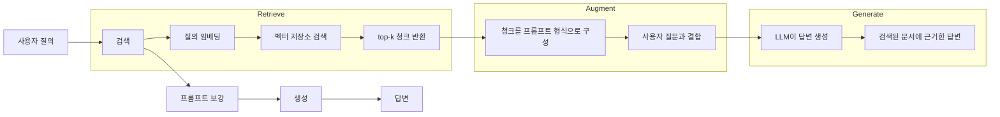
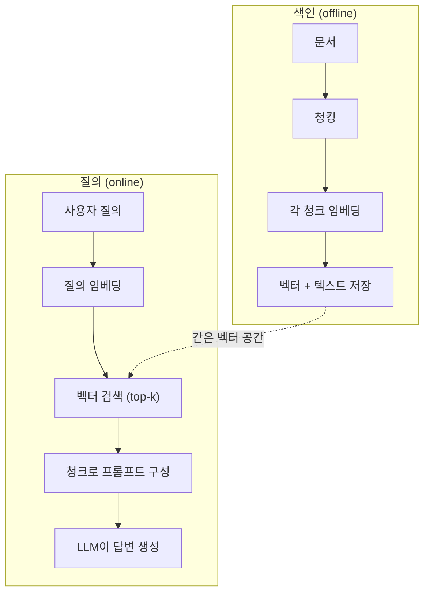

# RAG (Retrieval-Augmented Generation)

> LLM은 학습 cutoff까지의 모든 것을 알고 있습니다. 하지만 회사 문서, 코드베이스, 지난주 회의록은 전혀 모릅니다. RAG는 관련 문서를 검색해 프롬프트에 넣는 방식으로 이 문제를 해결합니다. 프로덕션 AI에서 가장 많이 배포된 패턴입니다. 이 과정에서 딱 하나만 만든다면 RAG 파이프라인을 만드세요.

**Type:** Build
**Languages:** Python
**Prerequisites:** Phase 10 (LLMs from Scratch), Phase 11 Lessons 01-05
**Time:** ~90 minutes
**Related:** 여섯 가지 chunking 알고리즘과 각각이 유리한 상황은 Phase 5 · 23 (Chunking Strategies for RAG)을 보세요. embedder 선택은 Phase 5 · 22 (Embedding Models Deep Dive)를 보세요. hybrid search, reranking, query transformation은 Phase 11 · 07 (Advanced RAG)를 보세요.

## 학습 목표

- 문서 로딩, chunking, embedding, vector storage, retrieval, generation을 포함한 완전한 RAG 파이프라인을 만듭니다
- 적절한 색인을 갖춘 벡터 데이터베이스(ChromaDB, FAISS, Pinecone)를 사용해 semantic search를 구현합니다
- 지식 기반 애플리케이션에서 fine-tuning보다 RAG가 선호되는 이유를 비용, 최신성, 출처 표시 관점에서 설명합니다
- 검색 지표(precision, recall)와 생성 지표(faithfulness, relevance)를 사용해 RAG 품질을 평가합니다

## 문제

회사를 위한 챗봇을 만들었다고 해 봅시다. 고객이 "엔터프라이즈 플랜의 환불 정책은 무엇인가요?"라고 묻습니다. LLM은 일반적인 SaaS 환불 정책에 대한 평범한 답을 합니다. 하지만 실제 정책은 200페이지짜리 내부 wiki 안에 묻혀 있고, 엔터프라이즈 고객에게는 60일 기간과 비례 환불이 제공된다고 말합니다. LLM은 이 문서를 본 적이 없습니다. 학습하지 않은 것은 알 수 없습니다.

Fine-tuning은 한 가지 해결책입니다. LLM을 가져와 내부 문서로 학습시키고 업데이트된 모델을 배포합니다. 작동은 하지만 심각한 문제가 있습니다. Fine-tuning에는 수천 달러의 compute 비용이 듭니다. 문서가 바뀌는 순간 모델은 오래됩니다. 모델이 어떤 출처에서 답을 끌어왔는지 알 방법도 없습니다. 그리고 다음 달 회사가 다른 제품 라인을 인수하면 다시 fine-tuning해야 합니다.

RAG는 다른 해결책입니다. 모델은 그대로 둡니다. 질문이 들어오면 문서 저장소에서 관련 passage를 검색하고, 질문 앞의 프롬프트에 붙여 넣고, 모델이 그 passage를 컨텍스트로 사용해 답하게 합니다. 문서 저장소는 몇 분 안에 업데이트할 수 있습니다. 어떤 문서가 검색됐는지 정확히 볼 수 있습니다. 모델 자체는 절대 바뀌지 않습니다. 이것이 RAG가 프로덕션의 지배적인 패턴인 이유입니다. 더 저렴하고, 더 최신이며, 감사 가능성이 높고, 어떤 LLM과도 작동합니다.

## 개념

### RAG 패턴

전체 패턴은 네 단계로 요약됩니다.



Query -> Retrieve -> Augment prompt -> Generate. 모든 RAG 시스템은 이 패턴을 따릅니다. 프로덕션 RAG 시스템의 차이는 각 단계의 세부사항에 있습니다. 어떻게 chunking하고, 어떻게 embedding하고, 어떻게 검색하며, 어떻게 프롬프트를 구성하는가입니다.

### RAG가 Fine-Tuning보다 나은 이유

| 관심사 | Fine-tuning | RAG |
|---------|------------|-----|
| 비용 | 학습 실행당 $1,000-$100,000+ | 질의당 $0.01-$0.10(embedding + LLM) |
| 최신성 | 재학습 전까지 오래된 상태 | 문서 재색인으로 몇 분 안에 업데이트 |
| 감사 가능성 | 답변을 출처로 추적할 수 없음 | 정확히 검색된 passage를 보여 줄 수 있음 |
| Hallucination | 여전히 자유롭게 hallucination 발생 | 검색된 문서에 근거함 |
| 데이터 프라이버시 | 학습 데이터가 가중치에 baked-in됨 | 문서가 벡터 저장소 안에 머묾 |

Fine-tuning은 모델 가중치를 영구적으로 바꿉니다. RAG는 모델의 컨텍스트를 일시적으로 바꿉니다. 대부분의 애플리케이션에서는 일시적 컨텍스트가 원하는 것입니다.

Fine-tuning이 이기는 한 가지 경우는 프롬프팅만으로 달성할 수 없는 특정 스타일, 어조, reasoning 패턴을 모델이 채택해야 할 때입니다. 사실 지식 검색에서는 RAG가 항상 이깁니다.

### 임베딩 모델

Embedding model은 텍스트를 dense vector로 변환합니다. 비슷한 텍스트는 이 고차원 공간에서 서로 가까운 벡터를 만듭니다. "How do I reset my password?"와 "I need to change my password"는 공유하는 단어가 적어도 거의 같은 벡터를 만듭니다. "The cat sat on the mat"은 매우 다른 벡터를 만듭니다.

일반적인 embedding model(2026 라인업 — 전체 분석은 Phase 5 · 22 참조):

| 모델 | 차원 | 제공자 | 참고 |
|-------|-----------|----------|-------|
| text-embedding-3-small | 1536 (Matryoshka) | OpenAI | 대부분의 사용 사례에서 최고의 가격 대비 성능 |
| text-embedding-3-large | 3072 (Matryoshka) | OpenAI | 더 높은 정확도, 256/512/1024로 자를 수 있음 |
| Gemini Embedding 2 | 3072 (Matryoshka) | Google | 최상위 MTEB retrieval, 8K context |
| voyage-4 | 1024/2048 (Matryoshka) | Voyage AI | 도메인 변형(code, finance, law) |
| Cohere embed-v4 | 1024 (Matryoshka) | Cohere | 강한 다국어 성능, 128K context |
| BGE-M3 | 1024 (dense + sparse + ColBERT) | BAAI (open-weight) | 하나의 모델에서 세 가지 view |
| Qwen3-Embedding | 4096 (Matryoshka) | Alibaba (open-weight) | 최상위 open-weight retrieval 점수 |
| all-MiniLM-L6-v2 | 384 | Open-weight (Sentence Transformers) | 프로토타이핑 baseline |

이 lesson에서는 TF-IDF를 사용해 간단한 자체 embedding을 만듭니다. TF-IDF가 프로덕션 시스템에서 쓰이는 방식이라서가 아니라, 개념을 구체적으로 보여 주기 때문입니다. 텍스트가 들어가고, 벡터가 나오며, 비슷한 텍스트는 비슷한 벡터를 만듭니다.

### 벡터 유사도

두 벡터가 주어졌을 때 유사도는 어떻게 측정할까요? 세 가지 선택지가 있습니다.

**코사인 유사도**: 두 벡터 사이 각도의 코사인입니다. -1(반대)부터 1(동일)까지의 범위를 갖습니다. 크기는 무시하고 방향만 봅니다. RAG의 기본값입니다.

```text
cosine_sim(a, b) = dot(a, b) / (||a|| * ||b||)
```

**내적**: 원시 inner product입니다. 더 큰 벡터가 더 높은 점수를 얻습니다. 크기가 정보를 담을 때 유용합니다. 더 긴 문서가 더 관련 있을 수 있는 경우입니다.

```text
dot(a, b) = sum(a_i * b_i)
```

**L2(Euclidean) 거리**: 벡터 공간의 직선 거리입니다. 거리가 작을수록 더 유사합니다. 크기 차이에 민감합니다.

```text
L2(a, b) = sqrt(sum((a_i - b_i)^2))
```

코사인 유사도가 표준입니다. 크기로 정규화하기 때문에 길이가 다른 문서도 잘 다룹니다. 누군가 "vector search"라고 말하면 거의 항상 코사인 유사도를 뜻합니다.

### Chunking 전략

문서는 단일 벡터로 임베딩하기에는 너무 깁니다. 50페이지 PDF는 수십 개 주제를 담고 있어 형편없는 embedding을 만들 수 있습니다. 대신 문서를 청크로 나누고 각 청크를 따로 임베딩합니다.

**고정 크기 chunking**: N토큰마다 나눕니다. 단순하고 예측 가능합니다. 50-token overlap이 있는 512-token 청크는 청크 1이 토큰 0-511, 청크 2가 토큰 462-973이 되는 식입니다. overlap은 운 나쁜 경계에서 문장을 끊지 않도록 보장합니다.

**의미 기반 chunking**: 자연스러운 경계에서 나눕니다. 문단, 섹션, markdown header가 예입니다. 각 청크는 일관된 의미 단위입니다. 구현은 더 복잡하지만 더 좋은 검색 결과를 만듭니다.

**재귀 chunking**: 가장 큰 경계(섹션 header)부터 나누려고 시도합니다. 섹션이 여전히 너무 크면 문단 경계에서 나눕니다. 문단도 너무 크면 문장 경계에서 나눕니다. LangChain RecursiveCharacterTextSplitter 접근 방식이며 실제로 잘 작동합니다.

청크 크기는 사람들이 생각하는 것보다 더 중요합니다.

- 너무 작음(64-128 tokens): 각 청크에 컨텍스트가 부족합니다. "지난 분기 15% 증가했다"는 "그것"이 무엇인지 모르면 의미가 없습니다.
- 너무 큼(2048+ tokens): 각 청크가 여러 주제를 다뤄 관련성을 희석합니다. 매출 데이터를 검색했는데 매출은 10%, 인원수는 90%인 청크를 받게 됩니다.
- 적정 범위(256-512 tokens): 자체 완결적일 만큼 충분한 컨텍스트가 있고, 관련 있을 만큼 초점이 잡혀 있습니다.

대부분의 프로덕션 RAG 시스템은 50-token overlap을 둔 256-512 token 청크를 사용합니다. Anthropic의 RAG 가이드라인도 이 범위를 권장합니다.

### 벡터 데이터베이스

임베딩을 얻었으면 저장하고 검색할 장소가 필요합니다. 선택지는 다음과 같습니다.

| 데이터베이스 | 유형 | 적합한 경우 |
|----------|------|----------|
| FAISS | 라이브러리(in-process) | 프로토타이핑, 중소형 데이터셋 |
| Chroma | 경량 DB | 로컬 개발, 소규모 배포 |
| Pinecone | 관리형 서비스 | 운영 부담 없는 프로덕션 |
| Weaviate | 오픈소스 DB | Self-hosted 프로덕션 |
| pgvector | Postgres 확장 | 이미 Postgres를 사용 중 |
| Qdrant | 오픈소스 DB | 고성능 self-hosted |

이 lesson에서는 단순한 in-memory vector store를 만듭니다. 벡터를 리스트에 저장하고 brute-force 코사인 유사도 검색을 수행합니다. 이는 flat index를 사용하는 FAISS와 같습니다. 느려지기 전까지 대략 100,000개 벡터까지 확장됩니다. 프로덕션 시스템은 HNSW 같은 approximate nearest neighbor(ANN) 알고리즘으로 수백만 개 벡터를 밀리초 단위로 검색합니다.

### 전체 파이프라인



색인 단계는 문서마다 한 번 실행됩니다(또는 문서가 업데이트될 때 실행됩니다). 질의 단계는 모든 사용자 요청마다 실행됩니다. 프로덕션에서 색인은 수백만 개 문서를 몇 시간에 걸쳐 처리할 수 있습니다. 질의는 1초 안에 응답해야 합니다.

### 실제 숫자

대부분의 프로덕션 RAG 시스템은 다음 파라미터를 사용합니다.

- 질의당 검색 청크 **k = 5-10**
- 50-token overlap을 둔 **Chunk size = 256-512 tokens**
- **컨텍스트 예산**: 질의당 검색된 콘텐츠 2,500-5,000 tokens
- **전체 프롬프트**: ~8,000-16,000 tokens(시스템 프롬프트 + 검색된 청크 + 대화 기록 + 사용자 질의)
- **Embedding dimension**: 모델에 따라 384-3072
- **색인 throughput**: API embeddings 기준 초당 100-1,000 문서
- **질의 latency**: 검색 50-200ms, 생성 500-3000ms

```figure
rag-chunking
```

## 직접 구현하기

### 1단계: 문서 청킹

```python
def chunk_text(text, chunk_size=200, overlap=50):
    words = text.split()
    chunks = []
    start = 0
    while start < len(words):
        end = start + chunk_size
        chunk = " ".join(words[start:end])
        chunks.append(chunk)
        start += chunk_size - overlap
    return chunks
```

### 2단계: TF-IDF 임베딩

간단한 embedding 함수를 만듭니다. TF-IDF(Term Frequency-Inverse Document Frequency)는 neural embedding은 아니지만 단어 중요도를 포착하는 방식으로 텍스트를 벡터로 변환합니다. 문서 안에서 자주 등장하는 단어는 더 높은 TF를 얻습니다. corpus 전체에서 드문 단어는 더 높은 IDF를 얻습니다. 그 곱은 중요하고 구별력 있는 단어가 높은 값을 갖는 벡터를 만듭니다.

```python
import math
from collections import Counter

def build_vocabulary(documents):
    vocab = set()
    for doc in documents:
        vocab.update(doc.lower().split())
    return sorted(vocab)

def compute_tf(text, vocab):
    words = text.lower().split()
    count = Counter(words)
    total = len(words)
    return [count.get(word, 0) / total for word in vocab]

def compute_idf(documents, vocab):
    n = len(documents)
    idf = []
    for word in vocab:
        doc_count = sum(1 for doc in documents if word in doc.lower().split())
        idf.append(math.log((n + 1) / (doc_count + 1)) + 1)
    return idf

def tfidf_embed(text, vocab, idf):
    tf = compute_tf(text, vocab)
    return [t * i for t, i in zip(tf, idf)]
```

### 3단계: 코사인 유사도 검색

```python
def cosine_similarity(a, b):
    dot = sum(x * y for x, y in zip(a, b))
    norm_a = math.sqrt(sum(x * x for x in a))
    norm_b = math.sqrt(sum(x * x for x in b))
    if norm_a == 0 or norm_b == 0:
        return 0.0
    return dot / (norm_a * norm_b)

def search(query_embedding, stored_embeddings, top_k=5):
    scores = []
    for i, emb in enumerate(stored_embeddings):
        sim = cosine_similarity(query_embedding, emb)
        scores.append((i, sim))
    scores.sort(key=lambda x: x[1], reverse=True)
    return scores[:top_k]
```

### 4단계: 프롬프트 구성

RAG의 "augmented"가 일어나는 지점입니다. 검색된 청크를 가져와 프롬프트 형식으로 만들고, LLM에게 제공된 컨텍스트를 바탕으로 답하라고 요청합니다.

```python
def build_rag_prompt(query, retrieved_chunks):
    context = "\n\n---\n\n".join(
        f"[Source {i+1}]\n{chunk}"
        for i, chunk in enumerate(retrieved_chunks)
    )
    return f"""Answer the question based ONLY on the following context.
If the context doesn't contain enough information, say "I don't have enough information to answer that."

Context:
{context}

Question: {query}

Answer:"""
```

### 5단계: 완전한 RAG 파이프라인

```python
class RAGPipeline:
    def __init__(self):
        self.chunks = []
        self.embeddings = []
        self.vocab = []
        self.idf = []

    def index(self, documents):
        all_chunks = []
        for doc in documents:
            all_chunks.extend(chunk_text(doc))
        self.chunks = all_chunks
        self.vocab = build_vocabulary(all_chunks)
        self.idf = compute_idf(all_chunks, self.vocab)
        self.embeddings = [
            tfidf_embed(chunk, self.vocab, self.idf)
            for chunk in all_chunks
        ]

    def query(self, question, top_k=5):
        query_emb = tfidf_embed(question, self.vocab, self.idf)
        results = search(query_emb, self.embeddings, top_k)
        retrieved = [(self.chunks[i], score) for i, score in results]
        prompt = build_rag_prompt(
            question, [chunk for chunk, _ in retrieved]
        )
        return prompt, retrieved
```

### 6단계: 생성(시뮬레이션)

프로덕션에서는 여기서 LLM API를 호출합니다. 이 lesson에서는 검색된 컨텍스트에서 가장 관련 있는 문장을 추출하는 방식으로 생성을 시뮬레이션합니다.

```python
def simple_generate(prompt, retrieved_chunks):
    query_words = set(prompt.lower().split("question:")[-1].split())
    best_sentence = ""
    best_score = 0
    for chunk in retrieved_chunks:
        for sentence in chunk.split("."):
            sentence = sentence.strip()
            if not sentence:
                continue
            words = set(sentence.lower().split())
            overlap = len(query_words & words)
            if overlap > best_score:
                best_score = overlap
                best_sentence = sentence
    return best_sentence if best_sentence else "I don't have enough information."
```

## 활용하기

실제 embedding model과 LLM을 사용해도 코드는 거의 바뀌지 않습니다.

```python
from openai import OpenAI

client = OpenAI()

def embed(text):
    response = client.embeddings.create(
        model="text-embedding-3-small",
        input=text
    )
    return response.data[0].embedding

def generate(prompt):
    response = client.chat.completions.create(
        model="gpt-4o-mini",
        messages=[{"role": "user", "content": prompt}],
        temperature=0
    )
    return response.choices[0].message.content
```

Or with Anthropic:

```python
import anthropic

client = anthropic.Anthropic()

def generate(prompt):
    response = client.messages.create(
        model="claude-sonnet-4-20250514",
        max_tokens=1024,
        messages=[{"role": "user", "content": prompt}]
    )
    return response.content[0].text
```

파이프라인은 같습니다. embedding 함수를 바꿉니다. generation 함수를 바꿉니다. 검색 로직, chunking, 프롬프트 구성은 어떤 모델을 쓰든 모두 동일합니다.

대규모 벡터 저장에는 brute-force 검색을 적절한 벡터 데이터베이스로 교체합니다.

```python
import chromadb

client = chromadb.Client()
collection = client.create_collection("my_docs")

collection.add(
    documents=chunks,
    ids=[f"chunk_{i}" for i in range(len(chunks))]
)

results = collection.query(
    query_texts=["What is the refund policy?"],
    n_results=5
)
```

Chroma는 내부적으로 embedding을 처리하고(기본적으로 all-MiniLM-L6-v2 사용) 벡터를 로컬 데이터베이스에 저장합니다. 같은 패턴이고 배관만 다릅니다.

## 배포하기

이 lesson은 다음을 만듭니다.
- `outputs/prompt-rag-architect.md` -- 특정 사용 사례에 맞는 RAG 시스템을 설계하기 위한 프롬프트
- `outputs/skill-rag-pipeline.md` -- 에이전트에게 RAG 파이프라인을 만들고 디버그하는 방법을 가르치는 skill

## 연습 문제

1. TF-IDF embeddings를 단순한 bag-of-words 접근으로 바꾸세요(이진: 단어가 있으면 1, 없으면 0). 샘플 문서에서 검색 품질을 비교하세요. TF-IDF는 드문 단어에 더 높은 가중치를 주기 때문에 더 나은 성능을 내야 합니다.

2. 청크 크기를 실험하세요. 같은 문서 집합에서 50, 100, 200, 500단어를 시도합니다. 각 크기에 대해 같은 질의 5개를 실행하고 top-3 안에 관련 청크가 반환되는 횟수를 세세요. 검색 품질이 최고가 되는 sweet spot을 찾으세요.

3. 각 청크에 metadata(출처 문서 이름, 청크 위치)를 추가하세요. LLM이 출처를 인용하도록 프롬프트 템플릿을 수정해 source attribution을 포함하세요.

4. 간단한 평가를 구현하세요. 질문-답변 쌍 10개가 주어지면 각 질문을 RAG 파이프라인에 통과시키고, 검색된 청크 중 몇 퍼센트가 답을 포함하는지 측정합니다. 이것이 retrieval recall at k입니다.

5. 대화 인식 RAG 파이프라인을 만드세요. 마지막 3번의 교환 기록을 유지하고 검색된 청크와 함께 프롬프트에 포함합니다. 가격에 대해 물은 뒤 "엔터프라이즈는요?" 같은 후속 질문으로 테스트하세요.

## 핵심 용어

| 용어 | 사람들이 흔히 말하는 것 | 실제 의미 |
|------|----------------|----------------------|
| RAG | "문서를 읽는 AI" | 관련 문서를 검색해 프롬프트에 붙이고, 그 문서에 근거한 답변을 생성하는 것입니다 |
| Embedding | "텍스트를 숫자로 바꾸기" | 비슷한 의미가 비슷한 벡터를 만들도록 텍스트를 dense vector로 표현한 것입니다 |
| Vector database | "AI용 검색 엔진" | 벡터 저장과 유사도 기반 nearest neighbor 탐색에 최적화된 데이터 저장소입니다 |
| Chunking | "문서를 조각으로 나누기" | 각 조각을 독립적으로 임베딩하고 검색할 수 있도록 문서를 더 작은 세그먼트(보통 256-512 tokens)로 나누는 것입니다 |
| Cosine similarity | "두 벡터가 얼마나 비슷한가" | 두 벡터 사이 각도의 코사인입니다. 1 = 같은 방향, 0 = 직교, -1 = 반대입니다 |
| Top-k retrieval | "최고 k개 매치 가져오기" | 벡터 저장소에서 질의와 가장 유사한 k개 청크를 반환하는 것입니다 |
| Context window | "LLM이 볼 수 있는 텍스트 양" | LLM이 단일 요청에서 처리할 수 있는 최대 토큰 수입니다. 검색된 청크는 이 안에 들어가야 합니다 |
| Augmented generation | "주어진 컨텍스트로 답하기" | 학습된 지식에만 의존하지 않고 검색된 문서를 컨텍스트로 사용해 응답을 생성하는 것입니다 |
| TF-IDF | "단어 중요도 점수" | Term Frequency 곱하기 Inverse Document Frequency입니다. corpus 안에서 단어가 얼마나 구별력 있는지에 따라 가중치를 줍니다 |
| Indexing | "검색을 위해 문서 준비하기" | 질의 시점에 검색할 수 있도록 문서를 chunking, embedding, storing하는 오프라인 과정입니다 |

## 더 읽을거리

- Lewis et al., "Retrieval-Augmented Generation for Knowledge-Intensive NLP Tasks" (2020) -- retrieve-then-generate 패턴을 형식화한 Facebook AI Research의 원래 RAG 논문입니다
- Anthropic's RAG documentation (docs.anthropic.com) -- 청크 크기, 프롬프트 구성, 평가에 대한 실용 가이드라인입니다
- Pinecone Learning Center, "What is RAG?" -- 프로덕션 고려사항과 함께 RAG 파이프라인을 명확한 시각 자료로 설명합니다
- Sentence-BERT: Reimers & Gurevych (2019) -- all-MiniLM embedding model의 기반이 되는 논문이며, semantic similarity를 위한 bi-encoder 학습 방법을 보여 줍니다
- [Karpukhin et al., "Dense Passage Retrieval for Open-Domain Question Answering" (EMNLP 2020)](https://arxiv.org/abs/2004.04906) -- open-domain QA에서 dense bi-encoder retrieval이 BM25를 이긴다는 것을 증명하고 현대 RAG retriever의 패턴을 세운 DPR 논문입니다.
- [LlamaIndex High-Level Concepts](https://docs.llamaindex.ai/en/stable/getting_started/concepts.html) -- RAG 파이프라인을 만들 때 알아야 할 핵심 개념입니다. data loader, node parser, index, retriever, response synthesizer를 다룹니다.
- [LangChain RAG tutorial](https://python.langchain.com/docs/tutorials/rag/) -- 같은 retrieve-then-generate 패턴을 chain-of-runnables 관점에서 보여 주는 다른 스타일의 orchestrator입니다.
