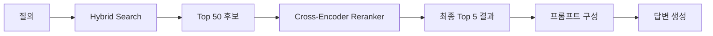
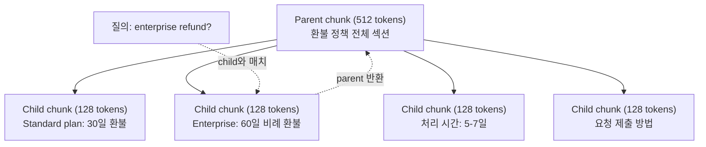
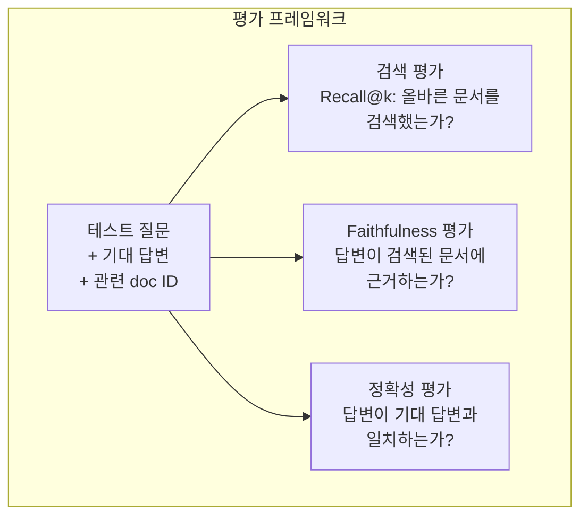

# 고급 RAG(청킹, Reranking, Hybrid Search)

> Basic RAG는 가장 유사한 top-k 청크를 검색합니다. 단순한 질문에는 작동합니다. 하지만 multi-hop reasoning, 모호한 질의, 큰 corpus에서는 무너집니다. Advanced RAG는 문서 10개에서 작동하는 데모와 1천만 개에서 작동하는 시스템의 차이를 만듭니다.

**Type:** Build
**Languages:** Python
**Prerequisites:** Phase 11, Lesson 06 (RAG)
**Time:** ~90 minutes
**Related:** Phase 5 · 23 (Chunking Strategies for RAG)은 recursive, semantic, sentence, parent-document, late chunking, contextual retrieval 여섯 가지 chunking 알고리즘을 Vectara/Anthropic 벤치마크와 함께 다룹니다. 이 lesson은 그 위에 hybrid search, reranking, query transformation을 쌓습니다.

## 학습 목표

- 문서 구조와 컨텍스트를 보존하는 advanced chunking 전략(semantic, recursive, parent-child)을 구현합니다
- BM25 keyword matching, semantic vector search, cross-encoder reranker를 결합한 hybrid search 파이프라인을 만듭니다
- 모호하거나 복잡한 질문의 검색을 개선하기 위해 query transformation 기법(HyDE, multi-query, step-back)을 적용합니다
- 잘못된 청크 검색, 컨텍스트에 답 없음, multi-hop reasoning 붕괴 같은 흔한 RAG 실패를 진단하고 수정합니다

## 문제

Lesson 06에서 basic RAG 파이프라인을 만들었습니다. 작은 corpus의 직선적인 질문에는 잘 작동합니다. 이제 다음을 시도해 보세요.

**모호한 질의**: "지난 분기 매출은 얼마였나요?" Semantic search는 매출 전략, 매출 전망, 매출 성장에 대한 CFO의 생각을 담은 청크를 반환합니다. 모두 "revenue"라는 단어와 의미적으로 비슷합니다. 하지만 실제 숫자는 없습니다. 올바른 청크는 "$47.2M in Q3 2025"라고 말하지만 "revenue" 대신 "earnings"라는 단어를 사용합니다. embedding model은 "Q3 earnings were $47.2M"보다 "revenue strategy"가 질의에 더 가깝다고 판단합니다.

**Multi-hop 질문**: "고객 만족도 점수가 가장 많이 개선된 팀은 어디인가요?" 각 팀의 만족도 점수를 찾고, 비교하고, 최댓값을 식별해야 합니다. 단일 청크에는 답이 없습니다. 정보가 팀 보고서 전반에 흩어져 있습니다.

**큰 corpus 문제**: 200만 개 청크가 있습니다. 정답은 #1,847,293 청크에 있습니다. top-5 검색은 #14, #89,201, #1,200,000, #44, #901,333 청크를 가져옵니다. embedding space에서는 가깝지만 답을 포함한 것은 없습니다. 이 규모에서는 approximate nearest neighbor search가 충분한 오류를 도입해 관련 결과가 top-k 밖으로 밀려납니다.

Basic RAG가 실패하는 이유는 벡터 유사도가 관련성과 같지 않기 때문입니다. 청크는 질의와 의미적으로 비슷해도 답변에는 쓸모없을 수 있습니다. Advanced RAG는 네 가지 기법으로 이를 해결합니다. hybrid search(keyword matching 추가), reranking(후보를 더 신중하게 점수화), query transformation(검색 전에 질의를 고침), 더 나은 chunking(올바른 granularity로 검색)입니다.

## 개념

### Hybrid Search: 의미 기반 + 키워드

Semantic search(벡터 유사도)는 의미 이해에 강합니다. "구독을 어떻게 취소하나요?"는 공유 단어가 없어도 "플랜을 종료하는 단계"와 매치됩니다. 하지만 정확한 매치를 놓칩니다. embedding model이 "E-4021"을 잡음으로 취급하면 "Error code E-4021"은 "E-4021"이 들어 있는 청크와 매치되지 않을 수 있습니다.

Keyword search(BM25)는 반대입니다. 정확한 매치에 뛰어납니다. "E-4021"은 완벽하게 매치됩니다. 하지만 문서가 "terminate your plan"이라고 말한다면 "cancel my subscription"은 결과 0개를 반환합니다.

Hybrid search는 둘 다 실행한 다음 결과를 병합합니다.

**BM25**(Best Matching 25)는 표준 keyword search 알고리즘입니다. 1990년대부터 검색 엔진의 중추였습니다. 공식은 다음과 같습니다.

```text
BM25(q, d) = sum over terms t in q:
    IDF(t) * (tf(t,d) * (k1 + 1)) / (tf(t,d) + k1 * (1 - b + b * |d| / avgdl))
```

여기서 tf(t,d)는 문서 d에서 term t의 빈도, IDF(t)는 inverse document frequency, |d|는 문서 길이, avgdl은 평균 문서 길이, k1은 term frequency saturation(기본 1.2), b는 length normalization(기본 0.75)을 제어합니다.

쉽게 말해 BM25는 문서가 질의 term, 특히 드문 term을 포함할 때 더 높은 점수를 주지만 반복 term에는 체감 수익을 적용합니다. "revenue"라는 단어가 50번 나오는 문서가 한 번 나오는 문서보다 50배 더 관련 있는 것은 아닙니다.

### Reciprocal Rank Fusion (RRF)

두 개의 순위 목록이 있습니다. 하나는 vector search에서, 하나는 BM25에서 왔습니다. 어떻게 결합할까요? Reciprocal Rank Fusion이 표준 접근입니다.

```text
RRF_score(d) = sum over rankings R:
    1 / (k + rank_R(d))
```

k는 최상위 결과가 지배하지 못하게 막는 상수입니다(보통 60).

vector search에서 #1, BM25에서 #5인 문서는 1/(60+1) + 1/(60+5) = 0.0164 + 0.0154 = 0.0318을 얻습니다.

vector search에서 #3, BM25에서 #2인 문서는 1/(60+3) + 1/(60+2) = 0.0159 + 0.0161 = 0.0320을 얻습니다.

RRF는 두 신호의 균형을 자연스럽게 맞춥니다. 두 목록 모두에서 높은 순위를 받은 문서가 최고의 점수를 얻습니다. 한 목록에서 #1이지만 다른 목록에는 없는 문서는 중간 점수를 얻습니다. raw score가 아니라 rank를 사용하므로 두 시스템 간 점수 분포 차이가 문제가 되지 않아 견고합니다.

### Reranking

Retrieval(vector, keyword, hybrid 모두)은 빠르지만 부정확합니다. bi-encoder를 사용하기 때문입니다. 질의와 각 문서를 독립적으로 임베딩한 뒤 비교합니다. 임베딩은 한 번 계산되어 캐시됩니다. 이 방식은 수백만 문서까지 확장됩니다.

Reranking은 cross-encoder를 사용합니다. 질의와 후보 문서를 함께 모델에 넣고 관련성 점수를 출력합니다. 모델은 두 텍스트를 동시에 보고 그 사이의 세밀한 상호작용을 포착할 수 있습니다. bi-encoder가 연결을 놓쳤더라도 cross-encoder는 "Q3 earnings는 얼마였나요?"가 "$47.2M in Q3"가 들어 있는 청크와 매우 관련 높다는 점을 이해할 수 있습니다.

트레이드오프는 cross-encoder가 query-document 쌍을 함께 처리하기 때문에 bi-encoder보다 100-1000배 느리다는 것입니다. 백만 개 문서에 대한 cross-encoder 점수를 미리 계산할 수는 없습니다. 해결책은 더 큰 후보 집합(hybrid search의 top-50)을 검색한 뒤 cross-encoder로 rerank해 최종 top-5를 얻는 것입니다.



일반적인 reranking model(2026 라인업):
- Cohere Rerank 3.5: 관리형 API, 다국어, 혼합 corpus에서 최고의 recall 개선
- Voyage rerank-2.5: 관리형 API, hosted 옵션 중 가장 낮은 지연 시간
- Jina-Reranker-v2 Multilingual: open-weight, 100개 이상 언어
- bge-reranker-v2-m3: open-weight, 강한 baseline
- cross-encoder/ms-marco-MiniLM-L-6-v2: open-weight, 프로토타이핑에서 CPU로 실행 가능
- ColBERTv2 / Jina-ColBERT-v2: late-interaction multi-vector reranker — 점수화 시간이 O(docs)가 아니라 O(tokens)

### 쿼리 변환

때로는 문제가 검색이 아니라 질의 자체입니다. "새 정책 변경에 관한 그거 뭐였죠?"는 형편없는 검색 질의입니다. 구체적인 용어가 없습니다. 임베딩도 모호합니다. 어떤 검색 시스템도 이 질의만으로는 올바른 문서를 찾을 수 없습니다.

**Query rewriting**: 사용자 질의를 더 나은 검색 질의로 다시 표현합니다. LLM이 이를 수행할 수 있습니다.

```text
User: "What was that thing about the new policy change?"
Rewritten: "Recent policy changes and updates"
```

**HyDE(Hypothetical Document Embeddings)**: 질의로 검색하는 대신 가상의 답변을 생성하고, 그것을 임베딩한 다음, 비슷한 실제 문서를 검색합니다.

```text
Query: "What is the refund policy for enterprise?"
Hypothetical answer: "Enterprise customers are eligible for a full refund
within 60 days of purchase. Refunds are pro-rated based on the remaining
subscription period and processed within 5-7 business days."
```

가상의 답변을 임베딩하고 이와 비슷한 실제 문서를 검색합니다. 직관은 이렇습니다. 가상의 답변은 원래 질문보다 embedding space에서 실제 답변에 더 가깝습니다. 질문과 답변은 언어 구조가 다릅니다. 가상의 답변을 생성하면 임베딩에서 "question space"와 "answer space" 사이의 간극을 메울 수 있습니다.

HyDE는 검색 전에 LLM 호출 하나를 추가합니다. 지연 시간이 500-2000ms 늘어납니다. 원시 질의의 검색 품질이 나쁠 때 그만한 가치가 있습니다.

### Parent-Child Chunking

표준 chunking은 트레이드오프를 강제합니다. 정밀 검색에는 작은 청크가 좋고 충분한 컨텍스트에는 큰 청크가 좋습니다. Parent-child chunking은 이 트레이드오프를 제거합니다.

검색을 위해 작은 청크(128 tokens)를 색인합니다. 작은 청크가 검색되면 프롬프트에는 그 parent chunk(512 tokens)를 반환합니다. 작은 청크는 질의와 정밀하게 매치됩니다. parent chunk는 LLM이 좋은 답변을 생성하기에 충분한 컨텍스트를 제공합니다.



"enterprise refund?" 질의는 child chunk C2와 정밀하게 매치됩니다. 하지만 프롬프트는 처리 시간과 제출 절차에 관한 주변 컨텍스트를 포함한 전체 parent chunk P를 받습니다.

### 메타데이터 필터링

vector search를 실행하기 전에 metadata로 corpus를 필터링합니다. 날짜, 출처, 카테고리, 작성자, 언어가 예입니다. 이렇게 하면 검색 공간이 줄고 무관한 결과를 막을 수 있습니다.

"지난달 보안 정책에서 무엇이 바뀌었나요?"는 보안 카테고리의 최근 30일 문서만 검색해야 합니다. metadata filtering이 없으면 전체 corpus를 검색하고 우연히 의미적으로 비슷한 2년 전 보안 문서를 검색할 수 있습니다.

프로덕션 RAG 시스템은 각 청크와 함께 metadata를 저장합니다. 출처 문서, 생성일, 카테고리, 작성자, 버전이 예입니다. 벡터 데이터베이스는 유사도 검색 전에 metadata로 pre-filtering하는 기능을 지원하며, 이는 대규모 성능에 중요합니다.

### 평가

RAG 시스템을 만들었습니다. 작동하는지 어떻게 알 수 있을까요? 세 가지 지표가 있습니다.

**검색 관련성(Recall@k)**: 관련 문서가 알려진 테스트 질문 집합에서 관련 문서의 몇 퍼센트가 top-k 결과에 나타나나요? 질문의 답이 #47 청크에 있다면 #47 청크가 top-5에 나타나나요?

**Faithfulness**: 생성된 답변이 검색된 문서에 근거하나요? 검색된 청크가 "60-day refund window"라고 말하는데 모델이 "90-day refund window"라고 말한다면 faithfulness 실패입니다. 올바른 컨텍스트가 있음에도 모델이 hallucination한 것입니다.

**답변 정확성**: 생성된 답변이 기대 답변과 일치하나요? 이는 end-to-end 지표입니다. 검색 품질과 생성 품질을 결합합니다.

간단한 faithfulness check는 생성된 답변의 각 claim을 가져와 검색된 청크에 실질적으로 나타나는지 확인하는 것입니다. 답변에 검색된 어떤 청크에도 없는 사실이 포함되어 있다면 hallucination일 가능성이 큽니다.



## 직접 구현하기

### 1단계: BM25 구현

```python
import math
from collections import Counter

class BM25:
    def __init__(self, k1=1.2, b=0.75):
        self.k1 = k1
        self.b = b
        self.docs = []
        self.doc_lengths = []
        self.avg_dl = 0
        self.doc_freqs = {}
        self.n_docs = 0

    def index(self, documents):
        self.docs = documents
        self.n_docs = len(documents)
        self.doc_lengths = []
        self.doc_freqs = {}

        for doc in documents:
            words = doc.lower().split()
            self.doc_lengths.append(len(words))
            unique_words = set(words)
            for word in unique_words:
                self.doc_freqs[word] = self.doc_freqs.get(word, 0) + 1

        self.avg_dl = sum(self.doc_lengths) / self.n_docs if self.n_docs else 1

    def score(self, query, doc_idx):
        query_words = query.lower().split()
        doc_words = self.docs[doc_idx].lower().split()
        doc_len = self.doc_lengths[doc_idx]
        word_counts = Counter(doc_words)
        score = 0.0

        for term in query_words:
            if term not in word_counts:
                continue
            tf = word_counts[term]
            df = self.doc_freqs.get(term, 0)
            idf = math.log((self.n_docs - df + 0.5) / (df + 0.5) + 1)
            numerator = tf * (self.k1 + 1)
            denominator = tf + self.k1 * (1 - self.b + self.b * doc_len / self.avg_dl)
            score += idf * numerator / denominator

        return score

    def search(self, query, top_k=10):
        scores = [(i, self.score(query, i)) for i in range(self.n_docs)]
        scores.sort(key=lambda x: x[1], reverse=True)
        return scores[:top_k]
```

### 2단계: Reciprocal Rank Fusion

```python
def reciprocal_rank_fusion(ranked_lists, k=60):
    scores = {}
    for ranked_list in ranked_lists:
        for rank, (doc_id, _) in enumerate(ranked_list):
            if doc_id not in scores:
                scores[doc_id] = 0.0
            scores[doc_id] += 1.0 / (k + rank + 1)
    fused = sorted(scores.items(), key=lambda x: x[1], reverse=True)
    return fused
```

### 3단계: Hybrid Search 파이프라인

```python
def hybrid_search(query, chunks, vector_embeddings, vocab, idf, bm25_index, top_k=5, fusion_k=60):
    query_emb = tfidf_embed(query, vocab, idf)
    vector_results = search(query_emb, vector_embeddings, top_k=top_k * 3)
    bm25_results = bm25_index.search(query, top_k=top_k * 3)
    fused = reciprocal_rank_fusion([vector_results, bm25_results], k=fusion_k)
    return fused[:top_k]
```

### 4단계: 간단한 Reranker

프로덕션에서는 cross-encoder model을 사용합니다. 여기서는 단어 겹침, term 중요도, phrase matching을 사용해 query-document 관련성을 점수화하는 reranker를 만듭니다.

```python
def rerank(query, candidates, chunks):
    query_words = set(query.lower().split())
    stop_words = {"the", "a", "an", "is", "are", "was", "were", "what", "how",
                  "why", "when", "where", "do", "does", "for", "of", "in", "to",
                  "and", "or", "on", "at", "by", "it", "its", "this", "that",
                  "with", "from", "be", "has", "have", "had", "not", "but"}
    query_terms = query_words - stop_words

    scored = []
    for doc_id, initial_score in candidates:
        chunk = chunks[doc_id].lower()
        chunk_words = set(chunk.split())

        term_overlap = len(query_terms & chunk_words)

        query_bigrams = set()
        q_list = [w for w in query.lower().split() if w not in stop_words]
        for i in range(len(q_list) - 1):
            query_bigrams.add(q_list[i] + " " + q_list[i + 1])
        bigram_matches = sum(1 for bg in query_bigrams if bg in chunk)

        position_boost = 0
        for term in query_terms:
            pos = chunk.find(term)
            if pos != -1 and pos < len(chunk) // 3:
                position_boost += 0.5

        rerank_score = (
            term_overlap * 1.0
            + bigram_matches * 2.0
            + position_boost
            + initial_score * 5.0
        )
        scored.append((doc_id, rerank_score))

    scored.sort(key=lambda x: x[1], reverse=True)
    return scored
```

### 5단계: HyDE(Hypothetical Document Embeddings)

```python
def hyde_generate_hypothesis(query):
    templates = {
        "what": "The answer to '{query}' is as follows: Based on our documentation, {topic} involves specific policies and procedures that define how the process works.",
        "how": "To address '{query}': The process involves several steps. First, you need to initiate the request. Then, the system processes it according to the defined rules.",
        "default": "Regarding '{query}': Our records indicate specific details and policies related to this topic that provide a comprehensive answer."
    }
    query_lower = query.lower()
    if query_lower.startswith("what"):
        template = templates["what"]
    elif query_lower.startswith("how"):
        template = templates["how"]
    else:
        template = templates["default"]

    topic_words = [w for w in query.lower().split()
                   if w not in {"what", "is", "the", "how", "do", "does", "a", "an",
                                "for", "of", "to", "in", "on", "at", "by", "and", "or"}]
    topic = " ".join(topic_words) if topic_words else "this topic"

    return template.format(query=query, topic=topic)


def hyde_search(query, chunks, vector_embeddings, vocab, idf, top_k=5):
    hypothesis = hyde_generate_hypothesis(query)
    hypothesis_emb = tfidf_embed(hypothesis, vocab, idf)
    results = search(hypothesis_emb, vector_embeddings, top_k)
    return results, hypothesis
```

### 6단계: Parent-Child Chunking

```python
def create_parent_child_chunks(text, parent_size=200, child_size=50):
    words = text.split()
    parents = []
    children = []
    child_to_parent = {}

    parent_idx = 0
    start = 0
    while start < len(words):
        parent_end = min(start + parent_size, len(words))
        parent_text = " ".join(words[start:parent_end])
        parents.append(parent_text)

        child_start = start
        while child_start < parent_end:
            child_end = min(child_start + child_size, parent_end)
            child_text = " ".join(words[child_start:child_end])
            child_idx = len(children)
            children.append(child_text)
            child_to_parent[child_idx] = parent_idx
            child_start += child_size

        parent_idx += 1
        start += parent_size

    return parents, children, child_to_parent
```

### 7단계: 충실도 평가

```python
def evaluate_faithfulness(answer, retrieved_chunks):
    answer_sentences = [s.strip() for s in answer.split(".") if len(s.strip()) > 10]
    if not answer_sentences:
        return 1.0, []

    grounded = 0
    ungrounded = []
    context = " ".join(retrieved_chunks).lower()

    for sentence in answer_sentences:
        words = set(sentence.lower().split())
        stop_words = {"the", "a", "an", "is", "are", "was", "were", "and", "or",
                      "to", "of", "in", "for", "on", "at", "by", "it", "this", "that"}
        content_words = words - stop_words
        if not content_words:
            grounded += 1
            continue

        matched = sum(1 for w in content_words if w in context)
        ratio = matched / len(content_words) if content_words else 0

        if ratio >= 0.5:
            grounded += 1
        else:
            ungrounded.append(sentence)

    score = grounded / len(answer_sentences) if answer_sentences else 1.0
    return score, ungrounded


def evaluate_retrieval_recall(queries_with_relevant, retrieval_fn, k=5):
    total_recall = 0.0
    results = []

    for query, relevant_indices in queries_with_relevant:
        retrieved = retrieval_fn(query, k)
        retrieved_indices = set(idx for idx, _ in retrieved)
        relevant_set = set(relevant_indices)
        hits = len(retrieved_indices & relevant_set)
        recall = hits / len(relevant_set) if relevant_set else 1.0
        total_recall += recall
        results.append({
            "query": query,
            "recall": recall,
            "hits": hits,
            "total_relevant": len(relevant_set)
        })

    avg_recall = total_recall / len(queries_with_relevant) if queries_with_relevant else 0
    return avg_recall, results
```

## 활용하기

reranking에 실제 cross-encoder를 사용하면 다음과 같습니다.

```python
from sentence_transformers import CrossEncoder

reranker = CrossEncoder("cross-encoder/ms-marco-MiniLM-L-6-v2")

def rerank_with_cross_encoder(query, candidates, chunks, top_k=5):
    pairs = [(query, chunks[doc_id]) for doc_id, _ in candidates]
    scores = reranker.predict(pairs)
    scored = list(zip([doc_id for doc_id, _ in candidates], scores))
    scored.sort(key=lambda x: x[1], reverse=True)
    return scored[:top_k]
```

Cohere의 관리형 reranker를 사용하면 다음과 같습니다.

```python
import cohere

co = cohere.Client()

def rerank_with_cohere(query, candidates, chunks, top_k=5):
    docs = [chunks[doc_id] for doc_id, _ in candidates]
    response = co.rerank(
        model="rerank-english-v3.0",
        query=query,
        documents=docs,
        top_n=top_k
    )
    return [(candidates[r.index][0], r.relevance_score) for r in response.results]
```

실제 LLM으로 HyDE를 사용하면 다음과 같습니다.

```python
import anthropic

client = anthropic.Anthropic()

def hyde_with_llm(query):
    response = client.messages.create(
        model="claude-sonnet-4-20250514",
        max_tokens=256,
        messages=[{
            "role": "user",
            "content": f"Write a short paragraph that would be a good answer to this question. Do not say you don't know. Just write what the answer would look like.\n\nQuestion: {query}"
        }]
    )
    return response.content[0].text
```

Weaviate로 프로덕션 hybrid search를 수행하면 다음과 같습니다.

```python
import weaviate

client = weaviate.connect_to_local()

collection = client.collections.get("Documents")
response = collection.query.hybrid(
    query="enterprise refund policy",
    alpha=0.5,
    limit=10
)
```

alpha 파라미터는 균형을 제어합니다. 0.0 = 순수 keyword(BM25), 1.0 = 순수 vector, 0.5 = 동일 가중치입니다. 대부분의 프로덕션 시스템은 0.3과 0.7 사이의 alpha를 사용합니다.

## 배포하기

이 lesson은 다음을 만듭니다.
- `outputs/prompt-advanced-rag-debugger.md` -- RAG 품질 문제를 진단하고 수정하기 위한 프롬프트
- `outputs/skill-advanced-rag.md` -- hybrid search와 reranking으로 프로덕션급 RAG를 만들기 위한 skill

## 연습 문제

1. 샘플 문서에서 BM25, vector search, hybrid search를 비교하세요. 5개 테스트 질의 각각에 대해 어떤 접근이 가장 관련 있는 청크를 #1 위치에 반환하는지 기록합니다. Hybrid search는 5개 중 최소 3개에서 이겨야 합니다.

2. metadata filter를 구현하세요. 각 문서에 "category" 필드(security, billing, api, product)를 추가합니다. vector search를 실행하기 전에 관련 카테고리 청크만 남기도록 필터링합니다. "What encryption is used?"로 테스트하고 security 카테고리 청크만 검색하는지 확인하세요.

3. Lesson 06의 simple generate 함수를 사용해 전체 HyDE 파이프라인을 만드세요. 5개 테스트 질의 전체에서 직접 질의 검색과 HyDE 검색의 검색 품질(top-3 relevance)을 비교합니다. HyDE는 모호한 질의의 결과를 개선해야 합니다.

4. 샘플 문서에 parent-child chunking 전략을 구현하세요. child_size=30, parent_size=100을 사용합니다. child chunk로 검색하되 프롬프트에는 parent chunk를 반환합니다. 생성된 답변을 chunk_size=50인 표준 chunking과 비교하세요.

5. 평가 데이터셋을 만드세요. 알려진 답변 청크가 있는 질문 10개를 준비합니다. (a) vector search only, (b) BM25 only, (c) hybrid search, (d) hybrid + reranking에 대해 Recall@3, Recall@5, Recall@10을 측정합니다. 결과를 플로팅하고 reranking이 가장 도움이 되는 지점을 식별하세요.

## 핵심 용어

| 용어 | 사람들이 흔히 말하는 것 | 실제 의미 |
|------|----------------|----------------------|
| BM25 | "Keyword search" | term frequency, inverse document frequency, document length normalization으로 문서에 점수를 매기는 확률적 ranking 알고리즘입니다 |
| Hybrid search | "두 세계의 장점" | semantic(vector) search와 keyword(BM25) search를 병렬로 실행한 뒤 rank fusion으로 결과를 병합하는 것입니다 |
| Reciprocal Rank Fusion | "순위 목록 병합" | 모든 목록에서 각 문서에 대해 1/(k + rank)를 합산해 여러 순위 목록을 결합하는 것입니다 |
| Reranking | "두 번째 pass 점수화" | 초기 검색의 후보 집합을 더 비싼 cross-encoder model로 다시 점수화하는 것입니다 |
| Cross-encoder | "공동 query-document 모델" | 질의와 문서를 단일 입력으로 받아 관련성 점수를 생성하는 모델입니다. bi-encoder보다 정확하지만 전체 corpus 검색에는 너무 느립니다 |
| Bi-encoder | "독립 embedding model" | 질의와 문서를 독립적으로 임베딩하는 모델입니다. 임베딩을 미리 계산하므로 빠르지만 cross-encoder보다 덜 정확합니다 |
| HyDE | "가짜 답변으로 검색" | 질의에 대한 가상의 답변을 생성하고, 이를 임베딩한 뒤, 이와 비슷한 실제 문서를 검색하는 것입니다 |
| Parent-child chunking | "작게 검색하고 크게 컨텍스트 제공" | 정밀 검색을 위해 작은 청크를 색인하지만 충분한 컨텍스트를 제공하기 위해 더 큰 parent chunk를 반환하는 것입니다 |
| Metadata filtering | "검색 전에 좁히기" | vector search를 실행하기 전에 날짜, 출처, 카테고리 같은 속성으로 문서를 필터링해 검색 공간을 줄이는 것입니다 |
| Faithfulness | "근거를 유지했는가" | 생성된 답변이 모델 학습 데이터에서 hallucination한 것이 아니라 검색된 문서에 의해 뒷받침되는지 여부입니다 |

## 더 읽을거리

- Robertson & Zaragoza, "The Probabilistic Relevance Framework: BM25 and Beyond" (2009) -- BM25의 결정적 참고문헌이며 공식 뒤의 확률적 기반을 설명합니다
- Cormack et al., "Reciprocal Rank Fusion Outperforms Condorcet and Individual Rank Learning Methods" (2009) -- 더 복잡한 fusion 방법보다 RRF가 낫다는 것을 보인 원래 RRF 논문입니다
- Gao et al., "Precise Zero-Shot Dense Retrieval without Relevance Labels" (2022) -- 가상의 문서 임베딩이 학습 데이터 없이도 검색을 개선한다는 것을 보인 HyDE 논문입니다
- Nogueira & Cho, "Passage Re-ranking with BERT" (2019) -- BM25 위의 cross-encoder reranking이 검색 품질을 크게 높인다는 것을 보였습니다
- [Khattab et al., "DSPy: Compiling Declarative Language Model Calls into Self-Improving Pipelines" (2023)](https://arxiv.org/abs/2310.03714) -- 프롬프트 구성과 가중치 선택을 검색 파이프라인 위의 최적화 문제로 다룹니다. "prompt LLMs"가 아니라 "program LLMs" 관점으로 읽으세요.
- [Edge et al., "From Local to Global: A Graph RAG Approach to Query-Focused Summarization" (Microsoft Research 2024)](https://arxiv.org/abs/2404.16130) -- GraphRAG 논문입니다. query-focused summarization을 위한 entity-relation extraction + Leiden community detection과 global vs local retrieval 구분을 다룹니다.
- [Asai et al., "Self-RAG: Learning to Retrieve, Generate, and Critique through Self-Reflection" (ICLR 2024)](https://arxiv.org/abs/2310.11511) -- reflection token을 사용하는 self-evaluating RAG입니다. 정적 retrieve-then-generate 이후의 agentic frontier입니다.
- [LangChain Query Construction blog](https://blog.langchain.dev/query-construction/) -- retrieval 전 단계로 자연어 질의를 구조화된 데이터베이스 질의(Text-to-SQL, Cypher)로 변환하는 방법입니다.
