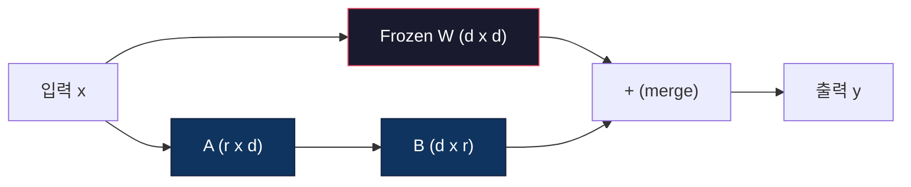
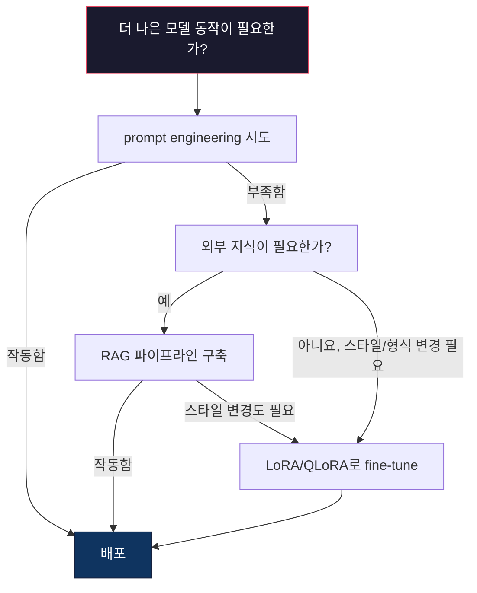

# LoRA & QLoRA로 Fine-Tuning하기

> 7B 모델을 full fine-tuning하려면 56GB VRAM이 필요합니다. 당신에게는 없을 것입니다. 대부분의 회사에도 없습니다. LoRA는 파라미터의 1% 미만만 학습해 같은 모델을 6GB에서 fine-tune할 수 있게 합니다. 이는 타협이 아닙니다. 대부분의 작업에서 full fine-tuning 품질에 맞먹습니다. 전체 오픈소스 fine-tuning 생태계가 이 한 가지 요령 위에서 돌아갑니다.

**Type:** Build
**Languages:** Python
**Prerequisites:** Phase 10, Lesson 06 (Instruction Tuning / SFT)
**Time:** ~75 minutes
**Related:** Phase 10은 SFT/DPO loop를 처음부터 다룹니다. 이 lesson은 이를 2026 PEFT toolkit(PEFT, TRL, Unsloth, Axolotl, LLaMA-Factory)에 연결합니다.

## 학습 목표

- pretrained model의 attention layer에 low-rank adapter matrix(A와 B)를 주입해 LoRA를 구현합니다
- LoRA와 full fine-tuning의 파라미터 절감을 계산합니다. d_model 차원의 rank r은 d^2 대신 2*r*d 파라미터를 학습합니다
- QLoRA(4-bit quantized base + LoRA adapters)를 사용해 소비자 GPU 메모리 안에서 모델을 fine-tune합니다
- 배포를 위해 LoRA weights를 base model에 다시 merge하고 adapter 유무에 따른 inference speed를 비교합니다

## 문제

base model이 있습니다. Llama 3 8B라고 해 봅시다. 이 모델이 회사의 목소리로 고객 지원 티켓에 답하게 만들고 싶습니다. 답은 SFT입니다. 하지만 SFT에는 비용 문제가 있습니다.

Full fine-tuning은 모델의 모든 파라미터를 업데이트합니다. Llama 3 8B에는 80억 개 파라미터가 있습니다. fp16에서는 각 파라미터가 2바이트를 차지합니다. weights를 로드하는 데만 16GB입니다. 학습 중에는 gradients(16GB), Adam의 optimizer states(momentum + variance에 32GB), activation도 필요합니다. 총합은 단일 8B 모델에 대략 56GB VRAM입니다.

A100 80GB는 겨우 이를 수용할 수 있습니다. 클라우드 제공자에서 A100 두 장은 시간당 $3-4가 듭니다. 예시 50,000개로 3 epoch 학습하면 6-10시간이 걸립니다. 실험당 $30-40입니다. hyperparameter를 맞추려고 10번 실험하면 배포하기도 전에 $400를 쓰게 됩니다.

이를 Llama 3 70B로 확장하면 숫자는 터무니없어집니다. weights만 140GB입니다. 클러스터가 필요합니다. 실험당 $100 이상입니다.

더 깊은 문제도 있습니다. Full fine-tuning은 모델의 모든 weight를 수정합니다. 고객 지원 데이터로 fine-tune하면 모델의 일반 능력이 저하될 수 있습니다. 이를 catastrophic forgetting이라고 합니다. 모델은 당신의 작업에는 더 좋아지고 나머지 모든 것에는 더 나빠집니다.

더 적은 파라미터를 학습하고, 더 적은 메모리를 쓰며, 모델의 기존 지식을 파괴하지 않는 방법이 필요합니다.

## 개념

### LoRA: Low-Rank Adaptation

Microsoft의 Edward Hu와 동료들은 2021년 6월 LoRA를 발표했습니다. 논문의 통찰은 fine-tuning 중 weight update가 낮은 intrinsic rank를 갖는다는 것입니다. 4096x4096 weight matrix의 1,670만 파라미터를 모두 업데이트할 필요가 없습니다. 업데이트의 유용한 정보는 rank 16 또는 32 행렬로 포착할 수 있습니다.

수식은 다음과 같습니다. 표준 linear layer는 다음을 계산합니다.

```text
y = Wx
```

여기서 W는 d_out x d_in 행렬입니다. 4096x4096 attention projection에서는 16,777,216 파라미터입니다.

LoRA는 W를 freeze하고 low-rank decomposition을 추가합니다.

```text
y = Wx + BAx
```

여기서 B는 (d_out x r), A는 (r x d_in)입니다. rank r은 d보다 훨씬 작으며 보통 8, 16, 32입니다.

4096x4096 layer에서 r=16이면:
- 원래 파라미터: 4096 x 4096 = 16,777,216
- LoRA 파라미터: (4096 x 16) + (16 x 4096) = 65,536 + 65,536 = 131,072
- 감소율: 131,072 / 16,777,216 = 0.78%

파라미터의 0.78%만 학습하면서 품질의 95-100%를 얻는 것입니다.



A는 random Gaussian으로 초기화됩니다. B는 0으로 초기화됩니다. 즉 LoRA contribution은 0에서 시작합니다. 모델은 원래 동작에서 학습을 시작하고 점차 adaptation을 학습합니다.

### 스케일링 계수: Alpha

LoRA는 low-rank update가 출력에 얼마나 영향을 주는지 제어하는 scaling factor alpha를 도입합니다.

```text
y = Wx + (alpha / r) * BAx
```

alpha = r이면 scaling은 1x입니다. alpha = 2r(흔한 기본값)이면 scaling은 2x입니다. 이 hyperparameter는 base learning rate와 독립적으로 LoRA path의 learning rate를 제어합니다.

실용 가이드:
- alpha = 2 * rank는 흔한 커뮤니티 관례입니다(원 논문은 대부분의 실험에서 alpha = rank 사용)
- alpha = rank는 1x scaling을 제공하며 보수적이지만 안정적입니다
- 더 높은 alpha는 step당 더 큰 update를 의미하며, 수렴을 빠르게 하거나 불안정을 유발할 수 있습니다

### LoRA를 적용할 위치

Transformer에는 많은 linear layer가 있습니다. 모두에 LoRA를 추가할 필요는 없습니다. 원 논문은 여러 조합을 테스트했습니다.

| Target Layers | Trainable Params (7B) | 품질 |
|--------------|----------------------|---------|
| q_proj only | 4.7M | 좋음 |
| q_proj + v_proj | 9.4M | 더 좋음 |
| q_proj + k_proj + v_proj + o_proj | 18.9M | attention에 최상 |
| All linear (attention + MLP) | 37.7M | 미미한 개선, 파라미터 2배 |

대부분 작업의 sweet spot은 q_proj + v_proj입니다. 이는 self-attention의 query와 value projection을 target으로 삼습니다. 이들은 모델이 무엇에 주의를 기울이고 어떤 정보를 추출하는지 제어합니다. MLP layer를 추가하면 code generation 같은 복잡한 작업에는 도움이 되지만, 단순한 작업에서는 체감 수익 대비 파라미터 수를 두 배로 늘립니다.

### Rank 선택

rank r은 adaptation의 표현력을 제어합니다.

| Rank | Trainable Params (per layer) | 적합한 경우 |
|------|---------------------------|----------|
| 4 | 32,768 | 단순 classification, sentiment |
| 8 | 65,536 | Single-domain Q&A, summarization |
| 16 | 131,072 | Multi-domain tasks, instruction following |
| 32 | 262,144 | Complex reasoning, code generation |
| 64 | 524,288 | 대부분 작업에서 체감 수익 |
| 128 | 1,048,576 | 정당화되는 경우가 드묾 |

Hu et al.은 단순 작업에서는 r=4만으로도 adaptation 대부분을 포착한다는 것을 보였습니다. 실제로는 r=8과 r=16이 가장 흔한 선택입니다. r=64를 넘기면 품질 개선은 드물고 LoRA의 메모리 이점을 잃기 시작합니다.

### QLoRA: 4-Bit Quantization + LoRA

University of Washington의 Tim Dettmers와 동료들은 2023년 5월 QLoRA를 발표했습니다. 아이디어는 frozen base model을 4-bit precision으로 quantize한 다음 그 위에 fp16 LoRA adapter를 붙이는 것입니다.

이는 메모리 방정식을 극적으로 바꿉니다.

| 방법 | 가중치 메모리(7B) | 학습 메모리(7B) | 필요한 GPU |
|--------|-------------------|---------------------|-------------|
| Full fine-tune (fp16) | 14GB | ~56GB | 1x A100 80GB |
| LoRA (fp16 base) | 14GB | ~18GB | 1x A100 40GB |
| QLoRA (4-bit base) | 3.5GB | ~6GB | 1x RTX 3090 24GB |

QLoRA는 세 가지 기술적 기여를 합니다.

**NF4(Normal Float 4-bit)**: neural network weight를 위해 특별히 설계된 새로운 데이터 타입입니다. neural network weight는 대략 정규분포를 따릅니다. NF4는 16개 quantization level을 표준 정규분포의 quantile에 배치합니다. 이는 정규분포 데이터에 정보이론적으로 최적입니다. 균등 4-bit quantization(INT4)이나 표준 Float4보다 정보 손실이 적습니다.

**Double quantization**: quantization constant 자체도 메모리를 차지합니다. weight 64개 블록마다 fp32 scale factor(4바이트)가 필요합니다. 7B 모델에서는 추가 0.4GB입니다. Double quantization은 이 constant를 fp8로 quantize해 overhead를 0.1GB로 줄입니다. 작지만 누적됩니다.

**Paged optimizers**: 학습 중 긴 sequence에서는 optimizer states(Adam의 momentum과 variance)가 GPU 메모리를 초과할 수 있습니다. Paged optimizers는 NVIDIA unified memory를 사용해 GPU 메모리가 고갈되면 optimizer states를 CPU RAM으로 자동 page out하고 필요할 때 다시 page in합니다. 일부 throughput을 희생하는 대신 OOM crash를 막습니다.

### 품질 문제

파라미터를 줄이거나 base를 quantize하면 품질이 나빠질까요? 여러 논문의 결과는 다음과 같습니다.

| 방법 | MMLU(5-shot) | MT-Bench | HumanEval |
|--------|--------------|----------|-----------|
| 전체 fine-tune(Llama 2 7B) | 48.3 | 6.72 | 14.6 |
| LoRA r=16 | 47.9 | 6.68 | 14.0 |
| QLoRA r=16 (NF4) | 47.5 | 6.61 | 13.4 |
| QLoRA r=64 (NF4) | 48.1 | 6.70 | 14.2 |

r=16의 LoRA는 대부분 benchmark에서 full fine-tuning 대비 1% 이내입니다. r=16의 QLoRA는 거기서 몇 분의 1 퍼센트를 더 잃습니다. r=64의 QLoRA는 메모리를 90% 덜 쓰면서 사실상 full fine-tuning과 맞먹습니다.

### 현실 비용

Llama 3 8B를 예시 50,000개로 fine-tuning(3 epochs)할 때:

| 방법 | GPU | 시간 | 비용 |
|--------|-----|------|------|
| Full fine-tune | 2x A100 80GB | 8 hours | ~$32 |
| LoRA r=16 | 1x A100 40GB | 4 hours | ~$8 |
| QLoRA r=16 | 1x RTX 4090 24GB | 6 hours | ~$5 |
| QLoRA r=16 (Unsloth) | 1x RTX 4090 24GB | 2.5 hours | ~$2 |
| QLoRA r=16 | 1x T4 16GB | 12 hours | ~$4 |

단일 소비자 GPU에서 QLoRA를 돌리는 비용은 점심값보다 적습니다. 이것이 2023년에 open-weight fine-tuning 커뮤니티가 폭발적으로 성장한 이유이고, 2026년에 아래 모든 training framework가 QLoRA를 기본으로 제공하는 이유입니다.

### 2026 PEFT stack

| Framework | 정체 | 선택할 때 |
|-----------|-----------|-----------|
| **Hugging Face PEFT** | 표준 LoRA/QLoRA/DoRA/IA3 라이브러리 | raw control을 원하고 training loop가 이미 `transformers.Trainer` 위에 있을 때 |
| **TRL** | HF의 reinforcement-from-feedback trainer(SFT, DPO, GRPO, PPO, ORPO) | SFT 이후 DPO/GRPO가 필요할 때. PEFT 위에 구축됨 |
| **Unsloth** | forward/backward pass의 Triton-kernel rewrite | 정확도 손실 없이 2-5배 속도 향상 + VRAM 절반을 원할 때. Llama/Mistral/Qwen 계열 |
| **Axolotl** | PEFT + TRL + DeepSpeed + Unsloth 위의 YAML-config wrapper | 재현 가능하고 version-controlled training run을 원할 때 |
| **LLaMA-Factory** | PEFT + TRL 위의 GUI/CLI/API | zero-code fine-tuning을 원할 때. 100개 이상 모델 계열 지원 |
| **torchtune** | `transformers` dep 없는 native PyTorch recipes | 최소 deps를 원하고 조직이 이미 PyTorch를 표준화했을 때 |

경험칙: 연구용 또는 일회성 실험 → PEFT. 반복 가능한 프로덕션 파이프라인 → Unsloth kernel을 켠 Axolotl. 버리는 프로토타입 → LLaMA-Factory.

### Adapter 병합

학습 후에는 두 가지가 있습니다. frozen base model과 작은 LoRA adapter(보통 10-100MB)입니다. 선택지는 두 가지입니다.

1. **분리해서 유지**: base model을 로드하고 그 위에 adapter를 로드합니다. 작업마다 adapter를 교체합니다. 하나의 base model에서 여러 fine-tuned variant를 서빙하는 방식입니다.

2. **영구적으로 merge**: W' = W + (alpha/r) * BA를 계산하고 결과를 새로운 full model로 저장합니다. merged model은 원본과 같은 크기입니다. inference overhead가 없고 관리할 adapter도 없습니다.

여러 작업(customer support adapter, code adapter, translation adapter)을 서빙하려면 분리해 유지하세요. 단일 specialized model을 배포하려면 merge하세요.

여러 adapter를 결합하는 advanced merging 기법:

- **TIES-Merging**(Yadav et al. 2023): 작은 magnitude의 파라미터를 잘라내고 sign conflict를 해결한 뒤 merge합니다. adapter 간 간섭을 줄입니다.
- **DARE**(Yu et al. 2023): merge 전에 adapter 파라미터를 무작위로 drop하고 나머지를 rescale합니다. capability 결합에 놀랄 만큼 효과적입니다.
- **Task arithmetic**: adapter weights를 단순히 더하거나 뺍니다. "code" adapter와 "math" adapter를 더하면 둘 다 잘하는 모델이 나오는 경우가 많습니다.

### Fine-Tune하지 말아야 할 때

Fine-tuning은 첫 번째 선택지가 아니라 세 번째 선택지입니다.

**첫째: prompt engineering.** 더 나은 시스템 프롬프트를 작성합니다. few-shot 예시를 추가합니다. chain-of-thought를 사용합니다. 비용은 들지 않고 몇 분이면 됩니다. 프롬프팅으로 80%까지 도달한다면 fine-tune이 필요 없을 가능성이 큽니다.

**둘째: RAG.** 모델이 특정 데이터(문서, 지식 베이스, 제품 카탈로그)를 알아야 한다면 이를 weights에 굽는 것보다 retrieval이 더 저렴하고 유지보수하기 쉽습니다. Lesson 06을 보세요.

**셋째: fine-tuning.** 프롬프팅으로 달성할 수 없는 특정 스타일, 형식, reasoning 패턴을 모델이 채택해야 할 때 사용합니다. 일관된 구조화 출력을 원할 때, 더 큰 모델을 더 작은 모델로 distill해야 할 때, 지연 시간이 중요해 few-shot prompting의 추가 토큰을 감당할 수 없을 때 사용합니다.



```figure
lora-params
```

## 직접 구현하기

순수 PyTorch로 LoRA를 처음부터 구현합니다. 라이브러리도, 마법도 없습니다. LoRA layer를 만들고, 모델에 주입하고, 학습하고, weights를 다시 merge합니다.

### 1단계: LoRA Layer

```python
import torch
import torch.nn as nn
import math

class LoRALayer(nn.Module):
    def __init__(self, in_features, out_features, rank=8, alpha=16):
        super().__init__()
        self.rank = rank
        self.alpha = alpha
        self.scaling = alpha / rank

        self.A = nn.Parameter(torch.randn(in_features, rank) * (1 / math.sqrt(rank)))
        self.B = nn.Parameter(torch.zeros(rank, out_features))

    def forward(self, x):
        return (x @ self.A @ self.B) * self.scaling
```

A는 scaled random value로 초기화됩니다. B는 0으로 초기화됩니다. 곱 BA가 0에서 시작하므로 모델은 원래 동작으로 시작합니다.

### 2단계: LoRA로 감싼 Linear Layer

```python
class LinearWithLoRA(nn.Module):
    def __init__(self, linear, rank=8, alpha=16):
        super().__init__()
        self.linear = linear
        self.lora = LoRALayer(
            linear.in_features, linear.out_features, rank, alpha
        )

        for param in self.linear.parameters():
            param.requires_grad = False

    def forward(self, x):
        return self.linear(x) + self.lora(x)
```

원래 linear layer는 frozen입니다. LoRA 파라미터(A와 B)만 학습 가능합니다.

### 3단계: 모델에 LoRA 주입

```python
def inject_lora(model, target_modules, rank=8, alpha=16):
    for param in model.parameters():
        param.requires_grad = False

    lora_layers = {}
    for name, module in model.named_modules():
        if isinstance(module, nn.Linear):
            if any(t in name for t in target_modules):
                parent_name = ".".join(name.split(".")[:-1])
                child_name = name.split(".")[-1]
                parent = dict(model.named_modules())[parent_name]
                lora_linear = LinearWithLoRA(module, rank, alpha)
                setattr(parent, child_name, lora_linear)
                lora_layers[name] = lora_linear
    return lora_layers
```

먼저 모델의 모든 파라미터를 freeze합니다. 그런 다음 모델 트리를 순회해 target 이름과 일치하는 linear layer를 찾고 LoRA로 감싼 버전으로 교체합니다. 전체 모델에서 LoRA A와 B matrix만 학습 가능한 파라미터입니다.

### 4단계: 파라미터 세기

```python
def count_parameters(model):
    total = sum(p.numel() for p in model.parameters())
    trainable = sum(p.numel() for p in model.parameters() if p.requires_grad)
    frozen = total - trainable
    return {
        "total": total,
        "trainable": trainable,
        "frozen": frozen,
        "trainable_pct": 100 * trainable / total if total > 0 else 0
    }
```

### 5단계: Weights 다시 merge

```python
def merge_lora_weights(model):
    for name, module in model.named_modules():
        if isinstance(module, LinearWithLoRA):
            with torch.no_grad():
                merged = (
                    module.lora.A @ module.lora.B
                ) * module.lora.scaling
                module.linear.weight.data += merged.T
            parent_name = ".".join(name.split(".")[:-1])
            child_name = name.split(".")[-1]
            if parent_name:
                parent = dict(model.named_modules())[parent_name]
            else:
                parent = model
            setattr(parent, child_name, module.linear)
```

merge 후에는 LoRA layer가 사라집니다. 모델은 원본과 같은 크기이며 adaptation이 weights에 baked-in됩니다. inference overhead가 없습니다.

### 6단계: 시뮬레이션된 QLoRA quantization

```python
def quantize_to_nf4(tensor, block_size=64):
    blocks = tensor.reshape(-1, block_size)
    scales = blocks.abs().max(dim=1, keepdim=True).values / 7.0
    scales = torch.clamp(scales, min=1e-8)
    quantized = torch.round(blocks / scales).clamp(-8, 7).to(torch.int8)
    return quantized, scales

def dequantize_from_nf4(quantized, scales, original_shape):
    dequantized = quantized.float() * scales
    return dequantized.reshape(original_shape)
```

이는 weight를 64개 블록 안의 16개 discrete level로 매핑해 4-bit quantization을 시뮬레이션합니다. 프로덕션 QLoRA는 GPU에서 진짜 NF4를 위해 bitsandbytes 라이브러리를 사용합니다.

### 7단계: 학습 loop

```python
def train_lora(model, data, epochs=5, lr=1e-3, batch_size=4):
    optimizer = torch.optim.AdamW(
        [p for p in model.parameters() if p.requires_grad], lr=lr
    )
    criterion = nn.MSELoss()

    losses = []
    for epoch in range(epochs):
        epoch_loss = 0.0
        n_batches = 0
        indices = torch.randperm(len(data["inputs"]))

        for i in range(0, len(indices), batch_size):
            batch_idx = indices[i:i + batch_size]
            x = data["inputs"][batch_idx]
            y = data["targets"][batch_idx]

            output = model(x)
            loss = criterion(output, y)

            optimizer.zero_grad()
            loss.backward()
            optimizer.step()

            epoch_loss += loss.item()
            n_batches += 1

        avg_loss = epoch_loss / n_batches
        losses.append(avg_loss)

    return losses
```

### 8단계: 전체 데모

```python
def demo():
    torch.manual_seed(42)
    d_model = 256
    n_classes = 10

    model = nn.Sequential(
        nn.Linear(d_model, 512),
        nn.ReLU(),
        nn.Linear(512, 512),
        nn.ReLU(),
        nn.Linear(512, n_classes),
    )

    n_samples = 500
    x = torch.randn(n_samples, d_model)
    y = torch.randint(0, n_classes, (n_samples,))
    y_onehot = torch.zeros(n_samples, n_classes).scatter_(1, y.unsqueeze(1), 1.0)

    data = {"inputs": x, "targets": y_onehot}

    params_before = count_parameters(model)

    lora_layers = inject_lora(
        model, target_modules=["0", "2"], rank=8, alpha=16
    )

    params_after = count_parameters(model)

    losses = train_lora(model, data, epochs=20, lr=1e-3)

    merge_lora_weights(model)
    params_merged = count_parameters(model)

    return {
        "params_before": params_before,
        "params_after": params_after,
        "params_merged": params_merged,
        "losses": losses,
    }
```

데모는 작은 모델을 만들고, 두 layer에 LoRA를 주입하고, 학습한 뒤 weights를 다시 merge합니다. LoRA 학습 중 파라미터 수는 전체 trainable에서 약 1% trainable로 줄어들고, merge 후에는 원래 아키텍처로 돌아갑니다.

## 활용하기

Hugging Face 생태계에서는 실제 모델에 LoRA를 적용하는 데 약 20줄이면 됩니다.

```python
from transformers import AutoModelForCausalLM, AutoTokenizer
from peft import LoraConfig, get_peft_model, TaskType

model = AutoModelForCausalLM.from_pretrained("meta-llama/Llama-3.1-8B")
tokenizer = AutoTokenizer.from_pretrained("meta-llama/Llama-3.1-8B")

lora_config = LoraConfig(
    task_type=TaskType.CAUSAL_LM,
    r=16,
    lora_alpha=32,
    lora_dropout=0.05,
    target_modules=["q_proj", "v_proj"],
)

model = get_peft_model(model, lora_config)
model.print_trainable_parameters()
```

QLoRA의 경우 bitsandbytes quantization을 추가합니다.

```python
from transformers import BitsAndBytesConfig

bnb_config = BitsAndBytesConfig(
    load_in_4bit=True,
    bnb_4bit_quant_type="nf4",
    bnb_4bit_compute_dtype=torch.bfloat16,
    bnb_4bit_use_double_quant=True,
)

model = AutoModelForCausalLM.from_pretrained(
    "meta-llama/Llama-3.1-8B",
    quantization_config=bnb_config,
    device_map="auto",
)

model = get_peft_model(model, lora_config)
```

이게 전부입니다. 같은 training loop, 같은 data pipeline입니다. 이제 base model은 4-bit에 있고 LoRA adapter는 fp16으로 학습되며, 전체가 6GB 안에 들어갑니다.

Hugging Face Trainer로 학습하려면 다음과 같습니다.

```python
from transformers import TrainingArguments, Trainer
from datasets import load_dataset

dataset = load_dataset("tatsu-lab/alpaca", split="train[:5000]")

training_args = TrainingArguments(
    output_dir="./lora-llama",
    num_train_epochs=3,
    per_device_train_batch_size=4,
    gradient_accumulation_steps=4,
    learning_rate=2e-4,
    fp16=True,
    logging_steps=10,
    save_strategy="epoch",
    optim="paged_adamw_8bit",
)

trainer = Trainer(
    model=model,
    args=training_args,
    train_dataset=dataset,
)

trainer.train()

model.save_pretrained("./lora-adapter")
```

저장된 adapter는 10-100MB입니다. base model은 그대로 유지됩니다. 전체 모델을 재배포하지 않고 Hugging Face Hub에서 adapter를 공유할 수 있습니다.

## 배포하기

이 lesson은 다음을 만듭니다.
- `outputs/prompt-lora-advisor.md` -- 특정 작업에 맞는 LoRA rank, target modules, hyperparameters를 결정하도록 돕는 프롬프트
- `outputs/skill-fine-tuning-guide.md` -- 언제 어떻게 fine-tune할지에 대한 의사결정 트리를 에이전트에게 가르치는 skill

## 연습 문제

1. **Rank ablation study.** rank 2, 4, 8, 16, 32, 64로 데모를 실행하세요. final loss vs. rank를 플로팅합니다. rank를 두 배로 늘려도 loss가 더 이상 절반으로 줄지 않는 diminishing returns 지점을 찾으세요. 256-dim feature의 단순 classification 작업에서는 r=8-16 근처여야 합니다.

2. **Target module comparison.** inject_lora를 수정해 layer "0"만, layer "2"만, layer "4"만, 그리고 세 개 모두를 target으로 삼게 하세요. 각 변형을 20 epoch 학습합니다. 수렴 속도와 final loss를 비교하세요. 이는 q_proj vs v_proj vs all linear layers를 target으로 삼는 실제 결정을 반영합니다.

3. **Quantization error analysis.** 학습된 모델의 weight matrix를 quantize_to_nf4 / dequantize_from_nf4 전후로 가져오세요. mean squared error, max absolute error, 원본과 복원 weights 사이의 correlation을 계산합니다. block_size 32, 64, 128, 256으로 실험하세요.

4. **Multi-adapter serving.** 데이터의 서로 다른 subset(even indices vs odd indices)으로 LoRA adapter 두 개를 학습하세요. 두 adapter를 모두 저장합니다. base model을 한 번 로드한 뒤 adapter를 교체하고, 같은 입력에서 각 adapter가 서로 다른 출력을 만드는지 확인하세요. 이것이 프로덕션 시스템이 하나의 base에서 여러 fine-tuned model을 서빙하는 방식입니다.

5. **Merge vs. unmerged inference.** 같은 입력 100개에서 merge_lora_weights 전후의 LoRA model 출력을 비교하세요. 출력이 동일한지 확인합니다(floating-point tolerance 1e-5 이내). 그런 다음 둘의 inference speed를 벤치마크하세요. merged는 두 번이 아니라 한 번의 matrix multiply이므로 약간 더 빨라야 합니다.

## 핵심 용어

| 용어 | 사람들이 흔히 말하는 것 | 실제 의미 |
|------|----------------|----------------------|
| LoRA | "효율적인 fine-tuning" | Low-Rank Adaptation입니다. base weights를 freeze하고, 곱이 전체 weight update를 근사하는 작은 matrix A와 B 두 개를 학습합니다 |
| QLoRA | "노트북에서 fine-tune" | Quantized LoRA입니다. base model을 4-bit NF4로 로드하고 그 위에서 LoRA adapter를 fp16으로 학습해 6GB VRAM에서 7B fine-tuning을 가능하게 합니다 |
| Rank (r) | "모델이 얼마나 배울 수 있는가" | A와 B matrix의 내부 차원입니다. 표현력과 파라미터 수의 균형을 제어합니다 |
| Alpha | "LoRA learning rate" | LoRA 출력에 적용되는 scaling factor입니다. alpha/r이 최종 출력에 대한 adaptation contribution을 scale합니다 |
| NF4 | "4-bit quantization" | Normal Float 4입니다. 정규분포 quantile에 quantization level을 둔 4-bit 데이터 타입으로 neural network weights에 최적입니다 |
| Adapter | "학습된 작은 부분" | 별도 파일(10-100MB)로 저장된 LoRA A와 B matrix이며, base model 사본 위에 로드할 수 있습니다 |
| Target modules | "어떤 layer에 LoRA를 적용할지" | LoRA adapter가 주입되는 특정 linear layer(q_proj, v_proj 등)입니다 |
| Merging | "구워 넣기" | W + (alpha/r) * BA를 계산해 원래 weight를 대체함으로써 inference에서 adapter overhead를 제거하는 것입니다 |
| Paged optimizers | "학습 중 OOM 방지" | GPU 메모리가 고갈될 때 optimizer states(Adam momentum, variance)를 CPU로 offload하는 것입니다 |
| Catastrophic forgetting | "Fine-tuning이 다른 모든 것을 망침" | 모든 weights를 업데이트하면서 모델이 이전에 학습한 capability를 잃는 현상입니다 |

## 더 읽을거리

- Hu et al., "LoRA: Low-Rank Adaptation of Large Language Models" (2021) -- low-rank decomposition 방법을 소개한 원 논문입니다. GPT-3 175B에서 rank 4까지 테스트했습니다
- Dettmers et al., "QLoRA: Efficient Finetuning of Quantized Language Models" (2023) -- NF4, double quantization, paged optimizers를 소개해 단일 48GB GPU에서 65B fine-tuning을 가능하게 했습니다
- PEFT library documentation (huggingface.co/docs/peft) -- Hugging Face 생태계에서 LoRA, QLoRA, 기타 parameter-efficient 방법을 위한 표준 라이브러리입니다
- Yadav et al., "TIES-Merging: Resolving Interference When Merging Models" (2023) -- 품질 저하 없이 여러 LoRA adapter를 결합하는 기법입니다
- [Rafailov et al., "Direct Preference Optimization: Your Language Model is Secretly a Reward Model" (NeurIPS 2023)](https://arxiv.org/abs/2305.18290) -- DPO 유도입니다. SFT 이후의 preference-tuning 단계이며 reward model이 필요 없습니다.
- [TRL documentation](https://huggingface.co/docs/trl/) -- `SFTTrainer`, `DPOTrainer`, `KTOTrainer`와 PEFT/bitsandbytes/Unsloth 통합 표면에 대한 공식 참조입니다.
- [Unsloth documentation](https://docs.unsloth.ai/) -- fine-tuning throughput을 두 배로 늘리고 메모리를 절반으로 줄이는 fused kernel입니다. TRL 아래의 성능 계층입니다.
- [Axolotl documentation](https://axolotl-ai-cloud.github.io/axolotl/) -- YAML로 설정하는 multi-GPU SFT/DPO/QLoRA trainer입니다. 손으로 쓴 script의 config-as-code 대안입니다.
