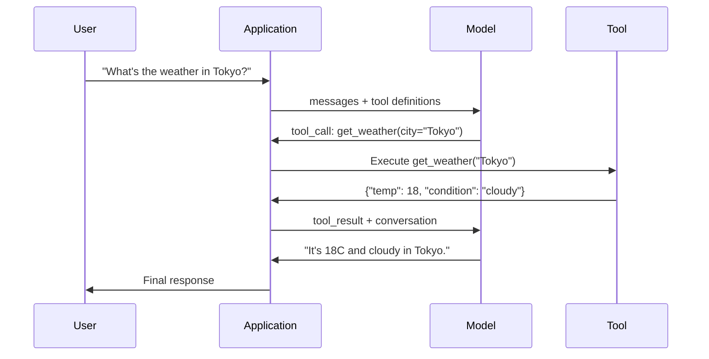

# 함수 호출과 도구 사용

> LLM은 아무것도 직접 할 수 없다. 텍스트를 생성한다. 그것이 전부다. 날씨를 확인하거나, 데이터베이스를 질의하거나, 이메일을 보내거나, 코드를 실행하거나, 파일을 읽을 수 없다. 지금까지 본 모든 "AI 에이전트"는 어떤 함수를 호출할지 말하는 JSON을 생성하는 LLM이고, 실제 호출은 여러분의 코드가 한다. 모델은 두뇌다. 도구는 손이다. 함수 호출은 둘을 연결하는 신경계다.

**Type:** Build
**Languages:** Python
**Prerequisites:** Phase 11 Lesson 03 (Structured Outputs)
**Time:** ~75 minutes
**Related:** Phase 11 · 14 (Model Context Protocol) — 도구를 여러 호스트가 공유한다면 인라인 함수 호출에서 MCP 서버로 넘어간다. 이 수업은 인라인 사례를 다루고, MCP는 프로토콜 사례를 다룬다.

## 학습 목표

- 함수 호출 루프를 구현한다: 도구 스키마를 정의하고, 모델의 도구 호출 JSON을 파싱하고, 함수를 실행하고, 결과를 반환한다.
- 모델이 안정적으로 호출할 수 있도록 명확한 설명과 타입이 지정된 매개변수를 갖춘 도구 스키마를 설계한다.
- 여러 함수 호출을 연결해 복잡한 질의에 답하는 멀티턴 에이전트 루프를 만든다.
- 병렬 도구 호출, 오류 전파, 무한 도구 루프 방지 같은 함수 호출 엣지 케이스를 처리한다.

## 문제

챗봇을 만든다고 하자. 사용자가 묻는다. "지금 도쿄 날씨가 어때?"

모델은 이렇게 답한다. "실시간 날씨 데이터에는 접근할 수 없지만, 계절을 기준으로 보면 도쿄는 아마 섭씨 15도 정도일 것입니다..."

이것은 면책 문구를 입은 환각이다. 모델은 날씨를 모른다. 앞으로도 모를 것이다. 날씨는 매시간 바뀐다. 모델의 학습 데이터는 몇 달 전 것이다.

올바른 답을 하려면 OpenWeatherMap API를 호출해 현재 온도를 가져오고 실제 숫자를 반환해야 한다. 모델은 API를 호출할 수 없다. 여러분의 코드는 할 수 있다. 빠진 조각은 모델이 "이 인수로 날씨 API를 호출해야 한다"고 말할 수 있게 하고, 여러분의 코드가 그것을 실행한 뒤 결과를 다시 넣어 주는 구조화된 프로토콜이다.

이것이 함수 호출이다. 모델은 어떤 함수를 어떤 인수로 호출할지 설명하는 구조화된 JSON을 출력한다. 애플리케이션은 그 함수를 실행한다. 결과는 대화로 돌아간다. 모델은 그 결과를 사용해 최종 답변을 만든다.

함수 호출이 없으면 LLM은 백과사전이다. 함수 호출이 있으면 에이전트가 된다.

## 개념

### 함수 호출 루프

모든 도구 사용 상호작용은 같은 5단계 루프를 따른다.



1단계: 사용자가 메시지를 보낸다. 2단계: 모델은 사용 가능한 함수를 설명하는 JSON Schema인 도구 정의와 함께 메시지를 받는다. 3단계: 모델은 텍스트로 답하는 대신 함수 이름과 인수가 담긴 구조화된 JSON 객체인 도구 호출을 출력한다. 4단계: 여러분의 코드가 함수를 실행하고 결과를 캡처한다. 5단계: 결과가 모델로 돌아가고, 모델은 이제 실제 데이터를 가지고 최종 답변을 만든다.

모델은 어떤 것도 실행하지 않는다. 무엇을 어떤 인수로 호출할지만 결정한다. 실행자는 여러분의 코드다.

### 도구 정의: JSON Schema 계약

각 도구는 JSON Schema로 정의된다. 이 스키마는 함수가 무엇을 하는지, 어떤 인수를 받는지, 그 인수들이 어떤 타입이어야 하는지를 모델에 알려 준다.

```json
{
  "type": "function",
  "function": {
    "name": "get_weather",
    "description": "Get current weather for a city. Returns temperature in Celsius and conditions.",
    "parameters": {
      "type": "object",
      "properties": {
        "city": {
          "type": "string",
          "description": "City name, e.g. 'Tokyo' or 'San Francisco'"
        },
        "units": {
          "type": "string",
          "enum": ["celsius", "fahrenheit"],
          "description": "Temperature units"
        }
      },
      "required": ["city"]
    }
  }
}
```

`description` 필드는 중요하다. 모델은 이 필드를 읽고 도구를 언제 어떻게 사용할지 결정한다. "날씨를 가져옴" 같은 모호한 설명은 "도시의 현재 날씨를 가져온다. 섭씨 온도와 상태를 반환한다."보다 도구 선택 품질을 떨어뜨린다. 설명은 도구 선택을 위한 프롬프트다.

### 제공자 비교

주요 제공자는 모두 함수 호출을 지원하지만 API 표면은 서로 다르다.

| 제공자 | API 매개변수 | 도구 호출 형식 | 병렬 호출 | 강제 호출 |
|----------|--------------|-----------------|---------------|----------------|
| OpenAI (GPT-5, o4) | `tools` | `tool_calls[].function` | 예(턴당 여러 개) | `tool_choice="required"` |
| Anthropic (Claude 4.6/4.7) | `tools` | `content[].type="tool_use"` | 예(여러 블록) | `tool_choice={"type":"any"}` |
| Google (Gemini 3) | `function_declarations` | `functionCall` | 예 | `function_calling_config` |
| 오픈 웨이트(Llama 4, Qwen3, DeepSeek-V3) | Llama 4는 네이티브 `tools`, 나머지는 Hermes 또는 ChatML | 혼합 | 모델에 따라 다름 | 프롬프트 기반 또는 지원 시 `tool_choice` |

2026년 기준 세 폐쇄형 제공자는 거의 동일한 JSON-Schema 기반 형식으로 수렴했다. Llama 4는 OpenAI 형태와 맞는 네이티브 `tools` 필드를 제공한다. 오픈 웨이트 파인튜닝 모델은 여전히 다양하다. 서드파티 파인튜닝에서는 Hermes 형식(NousResearch)이 가장 흔하다. 호스트 간에 공유되는 도구에는 인라인 함수 호출보다 MCP(Phase 11 · 14)를 선호하라. 서버가 모든 호스트에서 동일하기 때문이다.

### 도구 선택: 자동, 필수, 특정 함수

모델이 언제 도구를 사용할지 제어할 수 있다.

**Auto**(기본값): 모델이 도구를 호출할지 직접 답할지 결정한다. "2+2는?"에는 직접 답한다. "날씨가 어때?"에는 도구를 호출한다.

**Required**: 모델이 적어도 하나의 도구를 반드시 호출해야 한다. 사용자의 의도가 도구를 필요로 한다는 것을 알고 있을 때 사용한다. 모델이 실제 데이터를 조회하지 않고 추측하는 일을 막는다.

**특정 함수**: 모델이 특정 함수를 호출하도록 강제한다. `tool_choice={"type":"function", "function": {"name": "get_weather"}}`는 질의와 관계없이 날씨 도구가 호출되도록 보장한다. 업스트림 로직이 이미 필요한 도구를 결정한 라우팅 상황에서 사용한다.

### 병렬 함수 호출

GPT-4o와 Claude는 한 턴에 여러 함수를 호출할 수 있다. 사용자가 "도쿄와 뉴욕 날씨가 어때?"라고 묻는다. 모델은 두 도구 호출을 동시에 출력한다.

```json
[
  {"name": "get_weather", "arguments": {"city": "Tokyo"}},
  {"name": "get_weather", "arguments": {"city": "New York"}}
]
```

여러분의 코드는 둘을 실행하고(이상적으로는 동시에), 두 결과를 반환하며, 모델은 하나의 응답으로 합성한다. 이렇게 하면 왕복 횟수가 2번에서 1번으로 줄어든다. 질의당 5-10개의 도구 호출을 하는 에이전트에서는 병렬 호출이 지연 시간을 60-80% 줄인다.

### 구조화 출력과 함수 호출

Lesson 03에서는 구조화 출력을 다뤘다. 함수 호출은 같은 JSON Schema 장치를 사용하지만 목적이 다르다.

**구조화 출력**: 모델이 특정 형태의 데이터를 만들도록 강제한다. 출력이 최종 산출물이다. 예: 텍스트에서 제품 정보를 `{name, price, in_stock}` 형태로 추출한다.

**함수 호출**: 모델이 어떤 동작을 실행하려는 의도를 선언한다. 출력은 중간 단계다. 예: `get_weather(city="Tokyo")`는 모델이 최종 답변을 생성하는 것이 아니라 동작을 요청하는 것이다.

데이터 추출이 필요하면 구조화 출력을 사용한다. 모델이 외부 시스템과 상호작용해야 하면 함수 호출을 사용한다.

### 보안: 절대 양보할 수 없는 규칙

함수 호출은 LLM에 줄 수 있는 가장 위험한 기능이다. 모델이 무엇을 실행할지 선택한다. 도구 집합에 데이터베이스 질의가 있으면 모델이 질의를 만든다. 셸 명령이 있으면 모델이 그 명령을 작성한다.

**규칙 1: 모델이 생성한 SQL을 데이터베이스에 직접 전달하지 않는다.** 모델은 DROP TABLE, UNION 인젝션, 모든 행을 반환하는 질의를 생성할 수 있고 실제로 생성할 것이다. 항상 매개변수화하라. 항상 검증하라. 항상 작업 허용 목록을 사용하라.

**규칙 2: 함수를 허용 목록으로 제한한다.** 모델은 명시적으로 정의한 함수만 호출할 수 있어야 한다. 범용 "이름으로 아무 함수나 실행" 도구를 만들지 마라. 내부 함수가 50개 있어도 사용자에게 필요한 5개만 노출하라.

**규칙 3: 인수를 검증한다.** 모델이 도시 이름으로 `"; DROP TABLE users; --"`를 넘길 수도 있다. 실행 전에 모든 인수를 기대 타입, 범위, 형식과 대조해 검증하라.

**규칙 4: 도구 결과를 정제한다.** 도구가 민감한 데이터(API 키, PII, 내부 오류)를 반환한다면 모델에 다시 보내기 전에 필터링하라. 모델은 도구 결과를 응답에 그대로 포함할 것이다.

**규칙 5: 도구 호출에 속도 제한을 둔다.** 루프에 빠진 모델은 도구를 수백 번 호출할 수 있다. 최대치를 설정하라(대화당 10-20회가 합리적이다). 무한 루프를 끊어라.

### 오류 처리

도구는 실패한다. API는 타임아웃된다. 데이터베이스는 내려간다. 파일은 존재하지 않을 수 있다. 모델은 도구가 언제 왜 실패했는지 알아야 한다.

오류는 예외가 아니라 구조화된 도구 결과로 반환한다.

```json
{
  "error": true,
  "message": "City 'Toky' not found. Did you mean 'Tokyo'?",
  "code": "CITY_NOT_FOUND"
}
```

모델은 이것을 읽고, 인수를 조정하고, 재시도한다. 모델은 구조화된 오류 메시지를 바탕으로 자기 수정하는 데 능하다. 빈 응답이나 일반적인 "문제가 발생했습니다" 오류에서는 회복을 잘하지 못한다.

### MCP: Model Context Protocol

MCP는 도구 상호운용성을 위한 Anthropic의 공개 표준이다. 모든 애플리케이션이 자체 도구를 정의하는 대신, MCP는 범용 프로토콜을 제공한다. 도구는 MCP 서버가 제공하고, Claude Code, Cursor, 여러분의 애플리케이션 같은 MCP 클라이언트가 소비한다.

하나의 MCP 서버는 호환되는 어떤 클라이언트에도 도구를 노출할 수 있다. Postgres MCP 서버는 MCP 호환 에이전트에 데이터베이스 접근 권한을 준다. GitHub MCP 서버는 어떤 에이전트에도 저장소 접근 권한을 준다. 도구는 한 번 정의되고 어디서나 사용된다.

MCP는 함수 호출에 대해 네트워킹에서 HTTP가 하는 역할을 한다. 전송 계층을 표준화해 도구를 이식 가능하게 만든다.

## 직접 만들기

### 1단계: 도구 레지스트리 정의

도구 정의와 구현을 저장하는 레지스트리를 만든다. 각 도구에는 JSON Schema 정의(모델이 보는 것)와 Python 함수(여러분의 코드가 실행하는 것)가 있다.

```python
import json
import math
import time
import hashlib


TOOL_REGISTRY = {}


def register_tool(name, description, parameters, function):
    TOOL_REGISTRY[name] = {
        "definition": {
            "type": "function",
            "function": {
                "name": name,
                "description": description,
                "parameters": parameters,
            },
        },
        "function": function,
    }
```

### 2단계: 5개 도구 구현

계산기, 날씨 조회, 웹 검색 시뮬레이터, 파일 리더, 코드 실행기를 만든다.

```python
def calculator(expression, precision=2):
    allowed = set("0123456789+-*/.() ")
    if not all(c in allowed for c in expression):
        return {"error": True, "message": f"Invalid characters in expression: {expression}"}
    try:
        result = eval(expression, {"__builtins__": {}}, {"math": math})
        return {"result": round(float(result), precision), "expression": expression}
    except Exception as e:
        return {"error": True, "message": str(e)}


WEATHER_DB = {
    "tokyo": {"temp_c": 18, "condition": "cloudy", "humidity": 72, "wind_kph": 14},
    "new york": {"temp_c": 22, "condition": "sunny", "humidity": 45, "wind_kph": 8},
    "london": {"temp_c": 12, "condition": "rainy", "humidity": 88, "wind_kph": 22},
    "san francisco": {"temp_c": 16, "condition": "foggy", "humidity": 80, "wind_kph": 18},
    "sydney": {"temp_c": 25, "condition": "sunny", "humidity": 55, "wind_kph": 10},
}


def get_weather(city, units="celsius"):
    key = city.lower().strip()
    if key not in WEATHER_DB:
        suggestions = [c for c in WEATHER_DB if c.startswith(key[:3])]
        return {
            "error": True,
            "message": f"City '{city}' not found.",
            "suggestions": suggestions,
            "code": "CITY_NOT_FOUND",
        }
    data = WEATHER_DB[key].copy()
    if units == "fahrenheit":
        data["temp_f"] = round(data["temp_c"] * 9 / 5 + 32, 1)
        del data["temp_c"]
    data["city"] = city
    return data


SEARCH_DB = {
    "python function calling": [
        {"title": "OpenAI Function Calling Guide", "url": "https://platform.openai.com/docs/guides/function-calling", "snippet": "Learn how to connect LLMs to external tools."},
        {"title": "Anthropic Tool Use", "url": "https://docs.anthropic.com/en/docs/tool-use", "snippet": "Claude can interact with external tools and APIs."},
    ],
    "MCP protocol": [
        {"title": "Model Context Protocol", "url": "https://modelcontextprotocol.io", "snippet": "An open standard for connecting AI models to data sources."},
    ],
    "weather API": [
        {"title": "OpenWeatherMap API", "url": "https://openweathermap.org/api", "snippet": "Free weather API with current, forecast, and historical data."},
    ],
}


def web_search(query, max_results=3):
    key = query.lower().strip()
    for db_key, results in SEARCH_DB.items():
        if db_key in key or key in db_key:
            return {"query": query, "results": results[:max_results], "total": len(results)}
    return {"query": query, "results": [], "total": 0}


FILE_SYSTEM = {
    "data/config.json": '{"model": "gpt-4o", "temperature": 0.7, "max_tokens": 4096}',
    "data/users.csv": "name,email,role\nAlice,alice@example.com,admin\nBob,bob@example.com,user",
    "README.md": "# My Project\nA tool-use agent built from scratch.",
}


def read_file(path):
    if ".." in path or path.startswith("/"):
        return {"error": True, "message": "Path traversal not allowed.", "code": "FORBIDDEN"}
    if path not in FILE_SYSTEM:
        available = list(FILE_SYSTEM.keys())
        return {"error": True, "message": f"File '{path}' not found.", "available_files": available, "code": "NOT_FOUND"}
    content = FILE_SYSTEM[path]
    return {"path": path, "content": content, "size_bytes": len(content), "lines": content.count("\n") + 1}


def run_code(code, language="python"):
    if language != "python":
        return {"error": True, "message": f"Language '{language}' not supported. Only 'python' is available."}
    forbidden = ["import os", "import sys", "import subprocess", "exec(", "eval(", "__import__", "open("]
    for pattern in forbidden:
        if pattern in code:
            return {"error": True, "message": f"Forbidden operation: {pattern}", "code": "SECURITY_VIOLATION"}
    try:
        local_vars = {}
        exec(code, {"__builtins__": {"print": print, "range": range, "len": len, "str": str, "int": int, "float": float, "list": list, "dict": dict, "sum": sum, "min": min, "max": max, "abs": abs, "round": round, "sorted": sorted, "enumerate": enumerate, "zip": zip, "map": map, "filter": filter, "math": math}}, local_vars)
        result = local_vars.get("result", None)
        return {"success": True, "result": result, "variables": {k: str(v) for k, v in local_vars.items() if not k.startswith("_")}}
    except Exception as e:
        return {"error": True, "message": f"{type(e).__name__}: {e}"}
```

### 3단계: 모든 도구 등록

```python
def register_all_tools():
    register_tool(
        "calculator", "Evaluate a mathematical expression. Supports +, -, *, /, parentheses, and decimals. Returns the numeric result.",
        {"type": "object", "properties": {"expression": {"type": "string", "description": "Math expression, e.g. '(10 + 5) * 3'"}, "precision": {"type": "integer", "description": "Decimal places in result", "default": 2}}, "required": ["expression"]},
        calculator,
    )
    register_tool(
        "get_weather", "Get current weather for a city. Returns temperature, condition, humidity, and wind speed.",
        {"type": "object", "properties": {"city": {"type": "string", "description": "City name, e.g. 'Tokyo' or 'San Francisco'"}, "units": {"type": "string", "enum": ["celsius", "fahrenheit"], "description": "Temperature units, defaults to celsius"}}, "required": ["city"]},
        get_weather,
    )
    register_tool(
        "web_search", "Search the web for information. Returns a list of results with title, URL, and snippet.",
        {"type": "object", "properties": {"query": {"type": "string", "description": "Search query"}, "max_results": {"type": "integer", "description": "Maximum results to return", "default": 3}}, "required": ["query"]},
        web_search,
    )
    register_tool(
        "read_file", "Read the contents of a file. Returns the file content, size, and line count.",
        {"type": "object", "properties": {"path": {"type": "string", "description": "Relative file path, e.g. 'data/config.json'"}}, "required": ["path"]},
        read_file,
    )
    register_tool(
        "run_code", "Execute Python code in a sandboxed environment. Set a 'result' variable to return output.",
        {"type": "object", "properties": {"code": {"type": "string", "description": "Python code to execute"}, "language": {"type": "string", "enum": ["python"], "description": "Programming language"}}, "required": ["code"]},
        run_code,
    )
```

### 4단계: 함수 호출 루프 만들기

이것이 핵심 엔진이다. 모델이 어떤 도구를 호출할지 결정하는 과정을 시뮬레이션하고, 도구를 실행하고, 결과를 다시 넣는다.

```python
def simulate_model_decision(user_message, tools, conversation_history):
    msg = user_message.lower()

    if any(word in msg for word in ["weather", "temperature", "forecast"]):
        cities = []
        for city in WEATHER_DB:
            if city in msg:
                cities.append(city)
        if not cities:
            for word in msg.split():
                if word.capitalize() in [c.title() for c in WEATHER_DB]:
                    cities.append(word)
        if not cities:
            cities = ["tokyo"]
        calls = []
        for city in cities:
            calls.append({"name": "get_weather", "arguments": {"city": city.title()}})
        return calls

    if any(word in msg for word in ["calculate", "compute", "math", "what is", "how much"]):
        for token in msg.split():
            if any(c in token for c in "+-*/"):
                return [{"name": "calculator", "arguments": {"expression": token}}]
        if "+" in msg or "-" in msg or "*" in msg or "/" in msg:
            expr = "".join(c for c in msg if c in "0123456789+-*/.() ")
            if expr.strip():
                return [{"name": "calculator", "arguments": {"expression": expr.strip()}}]
        return [{"name": "calculator", "arguments": {"expression": "0"}}]

    if any(word in msg for word in ["search", "find", "look up", "google"]):
        query = msg.replace("search for", "").replace("look up", "").replace("find", "").strip()
        return [{"name": "web_search", "arguments": {"query": query}}]

    if any(word in msg for word in ["read", "file", "open", "cat", "show"]):
        for path in FILE_SYSTEM:
            if path.split("/")[-1].split(".")[0] in msg:
                return [{"name": "read_file", "arguments": {"path": path}}]
        return [{"name": "read_file", "arguments": {"path": "README.md"}}]

    if any(word in msg for word in ["run", "execute", "code", "python"]):
        return [{"name": "run_code", "arguments": {"code": "result = 'Hello from the sandbox!'", "language": "python"}}]

    return []


def execute_tool_call(tool_call):
    name = tool_call["name"]
    args = tool_call["arguments"]

    if name not in TOOL_REGISTRY:
        return {"error": True, "message": f"Unknown tool: {name}", "code": "UNKNOWN_TOOL"}

    tool = TOOL_REGISTRY[name]
    func = tool["function"]
    start = time.time()

    try:
        result = func(**args)
    except TypeError as e:
        result = {"error": True, "message": f"Invalid arguments: {e}"}

    elapsed_ms = round((time.time() - start) * 1000, 2)
    return {"tool": name, "result": result, "execution_time_ms": elapsed_ms}


def run_function_calling_loop(user_message, max_iterations=5):
    conversation = [{"role": "user", "content": user_message}]
    tool_definitions = [t["definition"] for t in TOOL_REGISTRY.values()]
    all_tool_results = []

    for iteration in range(max_iterations):
        tool_calls = simulate_model_decision(user_message, tool_definitions, conversation)

        if not tool_calls:
            break

        results = []
        for call in tool_calls:
            result = execute_tool_call(call)
            results.append(result)

        conversation.append({"role": "assistant", "content": None, "tool_calls": tool_calls})

        for result in results:
            conversation.append({"role": "tool", "content": json.dumps(result["result"]), "tool_name": result["tool"]})

        all_tool_results.extend(results)
        break

    return {"conversation": conversation, "tool_results": all_tool_results, "iterations": iteration + 1 if tool_calls else 0}
```

### 5단계: 인수 검증

실행 전에 도구 호출 인수를 JSON Schema와 대조해 확인하는 검증기를 만든다.

```python
def validate_tool_arguments(tool_name, arguments):
    if tool_name not in TOOL_REGISTRY:
        return [f"Unknown tool: {tool_name}"]

    schema = TOOL_REGISTRY[tool_name]["definition"]["function"]["parameters"]
    errors = []

    if not isinstance(arguments, dict):
        return [f"Arguments must be an object, got {type(arguments).__name__}"]

    for required_field in schema.get("required", []):
        if required_field not in arguments:
            errors.append(f"Missing required argument: {required_field}")

    properties = schema.get("properties", {})
    for arg_name, arg_value in arguments.items():
        if arg_name not in properties:
            errors.append(f"Unknown argument: {arg_name}")
            continue

        prop_schema = properties[arg_name]
        expected_type = prop_schema.get("type")

        type_checks = {"string": str, "integer": int, "number": (int, float), "boolean": bool, "array": list, "object": dict}
        if expected_type in type_checks:
            if not isinstance(arg_value, type_checks[expected_type]):
                errors.append(f"Argument '{arg_name}': expected {expected_type}, got {type(arg_value).__name__}")

        if "enum" in prop_schema and arg_value not in prop_schema["enum"]:
            errors.append(f"Argument '{arg_name}': '{arg_value}' not in {prop_schema['enum']}")

    return errors
```

### 6단계: 데모 실행

```python
def run_demo():
    register_all_tools()

    print("=" * 60)
    print("  Function Calling & Tool Use Demo")
    print("=" * 60)

    print("\n--- Registered Tools ---")
    for name, tool in TOOL_REGISTRY.items():
        desc = tool["definition"]["function"]["description"][:60]
        params = list(tool["definition"]["function"]["parameters"].get("properties", {}).keys())
        print(f"  {name}: {desc}...")
        print(f"    params: {params}")

    print(f"\n--- Argument Validation ---")
    validation_tests = [
        ("get_weather", {"city": "Tokyo"}, "Valid call"),
        ("get_weather", {}, "Missing required arg"),
        ("get_weather", {"city": "Tokyo", "units": "kelvin"}, "Invalid enum value"),
        ("calculator", {"expression": 123}, "Wrong type (int for string)"),
        ("unknown_tool", {"x": 1}, "Unknown tool"),
    ]
    for tool_name, args, label in validation_tests:
        errors = validate_tool_arguments(tool_name, args)
        status = "VALID" if not errors else f"ERRORS: {errors}"
        print(f"  {label}: {status}")

    print(f"\n--- Tool Execution ---")
    direct_tests = [
        {"name": "calculator", "arguments": {"expression": "(10 + 5) * 3 / 2"}},
        {"name": "get_weather", "arguments": {"city": "Tokyo"}},
        {"name": "get_weather", "arguments": {"city": "Mars"}},
        {"name": "web_search", "arguments": {"query": "python function calling"}},
        {"name": "read_file", "arguments": {"path": "data/config.json"}},
        {"name": "read_file", "arguments": {"path": "../etc/passwd"}},
        {"name": "run_code", "arguments": {"code": "result = sum(range(1, 101))"}},
        {"name": "run_code", "arguments": {"code": "import os; os.system('rm -rf /')"}},
    ]
    for call in direct_tests:
        result = execute_tool_call(call)
        print(f"\n  {call['name']}({json.dumps(call['arguments'])})")
        print(f"    -> {json.dumps(result['result'], indent=None)[:100]}")
        print(f"    time: {result['execution_time_ms']}ms")

    print(f"\n--- Full Function Calling Loop ---")
    test_queries = [
        "What's the weather in Tokyo?",
        "Calculate (100 + 250) * 0.15",
        "Search for MCP protocol",
        "Read the config file",
        "Run some Python code",
        "Tell me a joke",
    ]
    for query in test_queries:
        print(f"\n  User: {query}")
        result = run_function_calling_loop(query)
        if result["tool_results"]:
            for tr in result["tool_results"]:
                print(f"    Tool: {tr['tool']} ({tr['execution_time_ms']}ms)")
                print(f"    Result: {json.dumps(tr['result'], indent=None)[:90]}")
        else:
            print(f"    [No tool called -- direct response]")
        print(f"    Iterations: {result['iterations']}")

    print(f"\n--- Parallel Tool Calls ---")
    multi_city_query = "What's the weather in tokyo and london?"
    print(f"  User: {multi_city_query}")
    result = run_function_calling_loop(multi_city_query)
    print(f"  Tool calls made: {len(result['tool_results'])}")
    for tr in result["tool_results"]:
        city = tr["result"].get("city", "unknown")
        temp = tr["result"].get("temp_c", "N/A")
        print(f"    {city}: {temp}C, {tr['result'].get('condition', 'N/A')}")

    print(f"\n--- Security Checks ---")
    security_tests = [
        ("read_file", {"path": "../../etc/passwd"}),
        ("run_code", {"code": "import subprocess; subprocess.run(['ls'])"}),
        ("calculator", {"expression": "__import__('os').system('ls')"}),
    ]
    for tool_name, args in security_tests:
        result = execute_tool_call({"name": tool_name, "arguments": args})
        blocked = result["result"].get("error", False)
        print(f"  {tool_name}({list(args.values())[0][:40]}): {'BLOCKED' if blocked else 'ALLOWED'}")
```

## 사용하기

### OpenAI 함수 호출

```python
# from openai import OpenAI
#
# client = OpenAI()
#
# tools = [{
#     "type": "function",
#     "function": {
#         "name": "get_weather",
#         "description": "Get current weather for a city",
#         "parameters": {
#             "type": "object",
#             "properties": {
#                 "city": {"type": "string"},
#                 "units": {"type": "string", "enum": ["celsius", "fahrenheit"]}
#             },
#             "required": ["city"]
#         }
#     }
# }]
#
# response = client.chat.completions.create(
#     model="gpt-4o",
#     messages=[{"role": "user", "content": "Weather in Tokyo?"}],
#     tools=tools,
#     tool_choice="auto",
# )
#
# tool_call = response.choices[0].message.tool_calls[0]
# args = json.loads(tool_call.function.arguments)
# result = get_weather(**args)
#
# final = client.chat.completions.create(
#     model="gpt-4o",
#     messages=[
#         {"role": "user", "content": "Weather in Tokyo?"},
#         response.choices[0].message,
#         {"role": "tool", "tool_call_id": tool_call.id, "content": json.dumps(result)},
#     ],
# )
# print(final.choices[0].message.content)
```

OpenAI는 도구 호출을 `response.choices[0].message.tool_calls`로 반환한다. 각 호출에는 결과를 반환할 때 반드시 포함해야 하는 `id`가 있다. 모델은 이 ID를 사용해 결과를 호출과 매칭한다. GPT-4o는 하나의 응답에서 여러 도구 호출을 반환할 수 있으므로 순회하면서 모두 실행한다.

### Anthropic 도구 사용

```python
# import anthropic
#
# client = anthropic.Anthropic()
#
# response = client.messages.create(
#     model="claude-sonnet-4-20250514",
#     max_tokens=1024,
#     tools=[{
#         "name": "get_weather",
#         "description": "Get current weather for a city",
#         "input_schema": {
#             "type": "object",
#             "properties": {
#                 "city": {"type": "string"},
#                 "units": {"type": "string", "enum": ["celsius", "fahrenheit"]}
#             },
#             "required": ["city"]
#         }
#     }],
#     messages=[{"role": "user", "content": "Weather in Tokyo?"}],
# )
#
# tool_block = next(b for b in response.content if b.type == "tool_use")
# result = get_weather(**tool_block.input)
#
# final = client.messages.create(
#     model="claude-sonnet-4-20250514",
#     max_tokens=1024,
#     tools=[...],
#     messages=[
#         {"role": "user", "content": "Weather in Tokyo?"},
#         {"role": "assistant", "content": response.content},
#         {"role": "user", "content": [{"type": "tool_result", "tool_use_id": tool_block.id, "content": json.dumps(result)}]},
#     ],
# )
```

Anthropic은 도구 호출을 `type: "tool_use"`인 콘텐츠 블록으로 반환한다. 도구 결과는 `type: "tool_result"`인 사용자 메시지에 들어간다. 핵심 차이를 기억하라. Anthropic은 도구 매개변수 정의에 `input_schema`를 사용하지만, OpenAI는 `parameters`를 사용한다.

### MCP 통합

```python
# MCP servers expose tools over a standardized protocol.
# Any MCP-compatible client can discover and call these tools.
#
# Example: connecting to a Postgres MCP server
#
# from mcp import ClientSession, StdioServerParameters
# from mcp.client.stdio import stdio_client
#
# server_params = StdioServerParameters(
#     command="npx",
#     args=["-y", "@modelcontextprotocol/server-postgres", "postgresql://localhost/mydb"],
# )
#
# async with stdio_client(server_params) as (read, write):
#     async with ClientSession(read, write) as session:
#         await session.initialize()
#         tools = await session.list_tools()
#         result = await session.call_tool("query", {"sql": "SELECT count(*) FROM users"})
```

MCP는 도구 구현과 도구 소비를 분리한다. Postgres 서버는 SQL을 안다. GitHub 서버는 API를 안다. 여러분의 에이전트는 도구를 발견하고 호출하기만 하면 된다. 각 통합마다 제공자별 코드를 가질 필요가 없다.

## 출시하기

이 수업은 `outputs/prompt-tool-designer.md`를 만든다. 도구 정의를 설계하기 위한 재사용 가능한 프롬프트 템플릿이다. 도구가 무엇을 하길 원하는지 설명을 주면, 설명, 타입, 제약 조건이 포함된 완전한 JSON Schema 정의를 생성한다.

또한 `outputs/skill-function-calling-patterns.md`를 만든다. 프로덕션에서 함수 호출을 구현하기 위한 의사결정 프레임워크로, 도구 설계, 오류 처리, 보안, 제공자별 패턴을 다룬다.

## 연습 문제

1. **6번째 도구: 데이터베이스 질의를 추가한다.** 인메모리 테이블을 사용하는 시뮬레이션 SQL 도구를 구현한다. 이 도구는 원시 SQL이 아니라 테이블 이름과 필터 조건을 받는다. 테이블 이름이 허용 목록에 있는지, 필터 연산자가 `=`, `>`, `<`, `>=`, `<=`로 제한되는지 검증한다. 일치하는 행을 JSON으로 반환한다.

2. **오류 피드백을 사용하는 재시도를 구현한다.** 도구 호출이 실패하면(예: 도시를 찾을 수 없음) 오류 메시지를 모델 결정 함수에 다시 넣고 인수를 수정하게 한다. 각 호출이 몇 번 재시도되는지 추적한다. 도구 호출당 최대 재시도 횟수는 3회로 설정한다.

3. **다단계 에이전트를 만든다.** 어떤 질의는 도구 호출을 연결해야 한다. "설정 파일을 읽고 어떤 모델이 설정되어 있는지 알려 준 다음, 그 모델의 가격을 웹에서 검색해 줘." 누적 결과를 각 결정 단계에 전달하면서 모델이 더 이상 도구가 필요 없다고 결정할 때까지 실행되는 루프를 구현한다. 무한 루프를 막기 위해 10회 반복으로 제한한다.

4. **도구 선택 정확도를 측정한다.** 기대 도구 이름이 있는 테스트 질의 30개를 만든다. 30개 모두에 결정 함수를 실행하고 올바른 도구를 선택한 비율을 측정한다. 어떤 질의가 도구 간 혼동을 가장 많이 일으키는지 식별한다.

5. **도구 호출 캐싱을 구현한다.** 60초 안에 같은 도구가 동일한 인수로 호출되면 다시 실행하지 말고 캐시된 결과를 반환한다. `(tool_name, frozenset(args.items()))`를 키로 하는 딕셔너리를 사용한다. 20개 질의가 있는 대화에서 캐시 적중률을 측정한다.

## 핵심 용어

| 용어 | 사람들이 부르는 말 | 실제 의미 |
|------|----------------|----------------------|
| 함수 호출 | "도구 사용" | 모델이 특정 인수로 호출할 함수를 설명하는 구조화된 JSON을 출력한다. 실행하는 것은 모델이 아니라 여러분의 코드다. |
| 도구 정의 | "함수 스키마" | 도구의 이름, 목적, 매개변수, 타입을 설명하는 JSON Schema 객체다. 모델은 이것을 읽고 도구를 언제 어떻게 사용할지 결정한다. |
| 도구 선택 | "호출 모드" | 모델이 도구를 반드시 호출해야 하는지(required), 호출할 수 있는지(auto), 특정 도구를 반드시 호출해야 하는지(named)를 제어한다. |
| 병렬 호출 | "멀티 도구" | 모델이 한 턴에 여러 도구 호출을 출력해 왕복 횟수를 줄인다. GPT-4o와 Claude 모두 이를 지원한다. |
| 도구 결과 | "함수 출력" | 도구를 실행해서 얻은 반환값이다. 모델이 응답에서 실제 데이터를 사용할 수 있도록 메시지로 다시 보낸다. |
| 인수 검증 | "입력 확인" | 도구를 실행하기 전에 모델이 생성한 인수가 기대 타입, 범위, 제약 조건과 일치하는지 확인하는 일이다. |
| MCP | "도구 프로토콜" | Model Context Protocol이다. 호환되는 모든 클라이언트가 발견하고 호출할 수 있도록 서버를 통해 도구를 노출하는 Anthropic의 공개 표준이다. |
| 에이전트 루프 | "ReAct 루프" | 모델이 도구를 결정하고, 코드가 도구를 실행하고, 결과가 다시 들어가는 반복 주기다. 모델이 응답할 충분한 정보를 얻을 때까지 반복된다. |
| 도구 포이즈닝 | "도구를 통한 프롬프트 인젝션" | 도구 결과에 모델 동작을 조작하는 지시가 포함되는 공격이다. 모든 도구 출력을 정제하라. |
| 속도 제한 | "호출 예산" | 무한 루프와 폭주하는 API 비용을 막기 위해 대화당 도구 호출 최대 횟수를 설정하는 일이다. |

## 더 읽을거리

- [OpenAI Function Calling Guide](https://platform.openai.com/docs/guides/function-calling) -- 병렬 호출, 강제 호출, 구조화 인수를 포함해 GPT-4o의 도구 사용을 다루는 결정적 참조 문서
- [Anthropic Tool Use Guide](https://docs.anthropic.com/en/docs/tool-use) -- `input_schema`, 멀티 도구 응답, `tool_choice` 구성을 포함한 Claude의 도구 사용 구현
- [Model Context Protocol Specification](https://modelcontextprotocol.io) -- 서버/클라이언트 아키텍처를 갖춘 AI 애플리케이션 간 도구 상호운용성 공개 표준
- [Schick et al., 2023 -- "Toolformer: Language Models Can Teach Themselves to Use Tools"](https://arxiv.org/abs/2302.04761) -- LLM이 외부 도구를 언제 어떻게 호출할지 결정하도록 훈련하는 기초 논문
- [Patil et al., 2023 -- "Gorilla: Large Language Model Connected with Massive APIs"](https://arxiv.org/abs/2305.15334) -- 환각을 줄이면서 1,645개 API에 대해 정확한 API 호출을 하도록 LLM을 파인튜닝한 연구
- [Berkeley Function Calling Leaderboard](https://gorilla.cs.berkeley.edu/leaderboard.html) -- GPT-4o, Claude, Gemini, 오픈 모델의 함수 호출 정확도를 비교하는 실시간 벤치마크
- [Yao et al., "ReAct: Synergizing Reasoning and Acting in Language Models" (ICLR 2023)](https://arxiv.org/abs/2210.03629) -- 모든 도구 호출을 둘러싼 외부 에이전트 루프인 Thought-Action-Observation 루프. 이 수업이 끝나는 지점에서 Phase 14가 이어진다.
- [Anthropic — Building effective agents (Dec 2024)](https://www.anthropic.com/research/building-effective-agents) -- 하나의 도구 사용 기본 요소에서 만들어지는 다섯 가지 조합 가능한 패턴(프롬프트 체이닝, 라우팅, 병렬화, 오케스트레이터-워커, 평가자-최적화)
