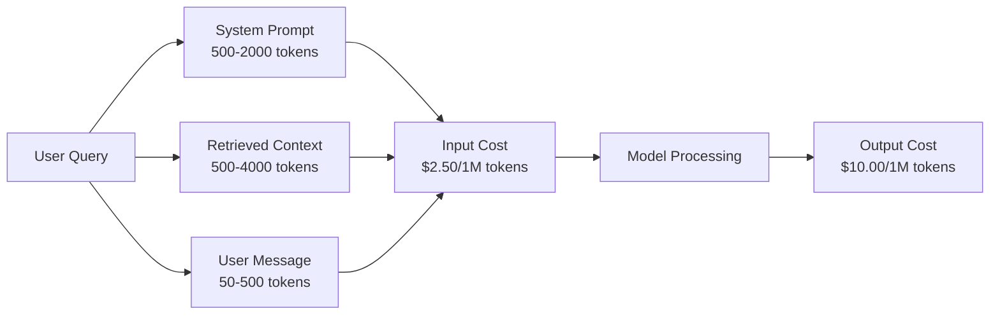
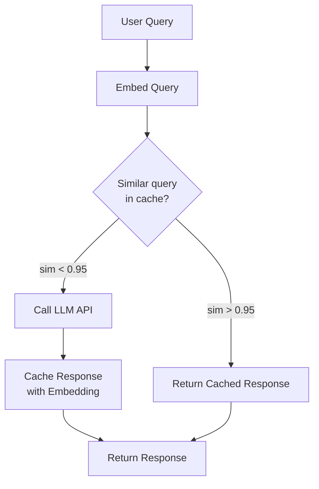
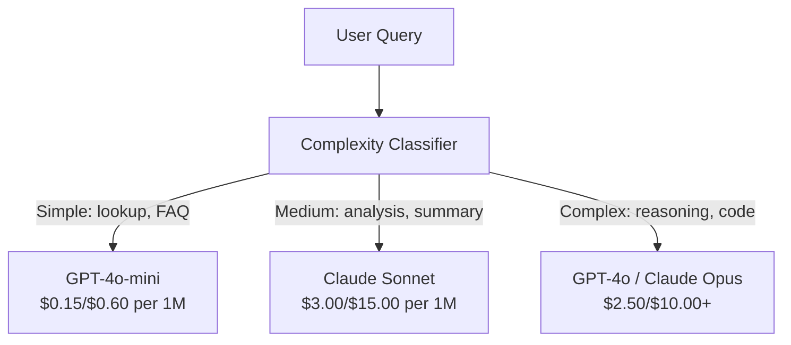

# 캐싱, 레이트 리미팅과 비용 최적화

> 대부분의 AI 스타트업은 나쁜 모델 때문에 죽지 않는다. 나쁜 단위 경제성 때문에 죽는다. GPT-4o 호출 한 번은 센트의 일부밖에 들지 않는다. 하지만 사용자 1만 명이 하루 10회 호출하면, 단 1달러를 청구하기 전에도 입력 토큰 비용만 $250이 든다. 살아남는 회사는 모든 API 호출을 함수 호출이 아니라 금융 거래로 다루는 회사다.

**Type:** Build
**Languages:** Python
**Prerequisites:** Phase 11 Lesson 09 (함수 호출)
**Time:** ~45 minutes
**Related:** Phase 11 · 15 (프롬프트 캐싱) -- 이 레슨은 애플리케이션 계층 캐싱(시맨틱 캐시, 정확 해시 캐시, 모델 라우팅)을 다룬다. 레슨 15는 제공자 계층 프롬프트 캐싱(Anthropic cache_control, OpenAI 자동 캐싱, Gemini CachedContent)을 다룬다. 둘을 결합하면 비용을 50-95% 줄일 수 있다.

## 학습 목표

- 새 API 호출을 만들지 않고 반복되거나 비슷한 쿼리를 캐시에서 제공하는 시맨틱 캐싱을 구현한다
- 제공자별 요청당 비용을 계산하고 토큰 인식 레이트 리미팅과 예산 알림을 구현한다
- 프롬프트 압축, 모델 라우팅(비싼 모델 대 저렴한 모델), 응답 캐싱을 포함한 비용 최적화 계층을 만든다
- 서로 다른 쿼리 유형에 맞게 정확 일치, 의미 유사도, 접두사 캐싱을 사용하는 계층형 캐싱 전략을 설계한다

## 문제

RAG 챗봇을 만들었다. 아주 잘 동작한다. 사용자도 좋아한다.

그러고 나서 청구서가 도착한다.

GPT-5는 입력 토큰 100만 개당 $5, 출력 토큰 100만 개당 $15가 든다. Claude Opus 4.7은 입력 $15 / 출력 $75다. Gemini 3 Pro는 입력 $1.25 / 출력 $5다. GPT-5-mini는 $0.25/$2다. 아래 가격은 예시이므로 항상 제공자의 최신 가격 페이지를 확인하라.

스타트업을 죽이는 계산은 이렇다:

- 일일 활성 사용자 10,000명
- 사용자당 하루 10개 쿼리
- 쿼리당 입력 토큰 1,000개(시스템 프롬프트 + 컨텍스트 + 사용자 메시지)
- 응답당 출력 토큰 500개

**일일 입력 비용:** 10,000 x 10 x 1,000 / 1,000,000 x $2.50 = **$250/일**
**일일 출력 비용:** 10,000 x 10 x 500 / 1,000,000 x $10.00 = **$500/일**
**월간 합계:** **$22,500/월**

이것은 LLM 비용만이다. 임베딩, 벡터 데이터베이스 호스팅, 인프라를 더하라. 챗봇 하나에 월 $30,000을 보게 된다.

잔인한 부분은 이 쿼리의 40-60%가 거의 중복이라는 점이다. 사용자는 같은 질문을 조금 다른 말로 묻는다. 모든 요청에서 동일한 시스템 프롬프트에는 매번 비용이 청구된다. RAG가 검색한 컨텍스트 문서도 같은 주제를 묻는 사용자들 사이에서 반복된다.

중복 계산에 정가를 내고 있는 것이다.

## 개념

### LLM 호출 비용의 해부

모든 API 호출에는 다섯 가지 비용 구성 요소가 있다.



시스템 프롬프트는 조용한 비용 폭탄이다. 요청마다 전송되는 1,500토큰짜리 시스템 프롬프트는 그 접두사만으로 요청 100만 건당 $3.75가 든다. 하루 요청 100K건이면 절대 바뀌지 않는 텍스트에 하루 $375, 월 $11,250을 내는 셈이다.

### 제공자 캐싱: 내장 할인

2026년 기준 세 주요 제공자는 모두 제공자 측 프롬프트 캐싱을 제공하지만 동작 방식은 다르다. 자세한 내용은 Phase 11 · 15를 참고하라.

| 제공자 | 메커니즘 | 할인 | 최소 길이 | 캐시 지속 시간 |
|----------|-----------|----------|---------|----------------|
| Anthropic | 명시적 cache_control 마커 | 캐시 히트 시 90%(쓰기 시 25% 추가 비용) | 1,024토큰(Sonnet/Opus), 2,048(Haiku) | 기본 5분, 확장 1시간(쓰기 프리미엄 2배) |
| OpenAI | 자동 접두사 매칭 | 캐시 히트 시 50% | 1,024토큰 | 최선 노력 기준 최대 1시간 |
| Google Gemini | 명시적 CachedContent API | 약 75% 절감(저장 비용 별도) | 4,096(Flash) / 32,768(Pro) | 사용자가 설정 가능한 TTL |

**Anthropic의 방식**은 명시적이다. 프롬프트의 섹션에 `cache_control: {"type": "ephemeral"}`을 표시한다. 첫 요청은 25%의 쓰기 프리미엄을 낸다. 같은 접두사를 쓰는 후속 요청은 90% 할인을 받는다. 보통 $0.005가 드는 2,000토큰 시스템 프롬프트는 캐시 히트 시 $0.000625가 든다. 요청 100K건이면 하루 $437.50을 절약한다.

**OpenAI의 방식**은 자동이다. 이전 요청과 일치하는 프롬프트 접두사는 50% 할인을 받는다. 마커가 필요 없다. 트레이드오프는 할인 폭과 제어권은 작지만 구현 노력이 0이라는 점이다.

### 시맨틱 캐싱: 직접 만드는 계층

제공자 캐싱은 동일한 접두사에만 동작한다. 시맨틱 캐싱은 더 어려운 경우, 즉 의미는 같지만 서로 다른 쿼리를 처리한다.

"반품 정책이 무엇인가요?"와 "상품을 어떻게 반품하나요?"는 문자열은 다르지만 의도는 같다. 시맨틱 캐시는 두 쿼리를 임베딩하고 코사인 유사도를 계산한 뒤, 유사도가 임계값(보통 0.92-0.95)을 넘으면 캐시된 응답을 반환한다.



임베딩 비용은 무시할 만하다. OpenAI의 text-embedding-3-small은 토큰 100만 개당 $0.02다. 캐시를 확인하는 비용은 전체 LLM 호출에 비하면 거의 없다.

### 정확 일치 캐싱: 해시하고 매칭하기

결정적 호출(temperature=0, 같은 모델, 같은 프롬프트)에서는 정확 일치 캐싱이 더 단순하고 빠르다. 전체 프롬프트를 해시하고 캐시를 확인한 뒤, 있으면 반환한다.

다음 경우에 완벽하게 동작한다:
- 시스템 프롬프트 + 고정 컨텍스트 + 동일한 사용자 쿼리
- 동일한 도구 정의를 사용하는 함수 호출
- 같은 문서가 여러 번 처리되는 배치 처리

### 레이트 리미팅: 예산 보호

레이트 리미팅은 단지 공정성의 문제가 아니다. 생존의 문제다.

**토큰 버킷 알고리즘:** 각 사용자는 초당 R 속도로 다시 채워지는 N개 토큰 버킷을 받는다. 요청은 버킷의 토큰을 소비한다. 버킷이 비어 있으면 요청을 거부한다. 이 방식은 평균 속도를 강제하면서도 버스트(버킷 전체를 한 번에 사용)를 허용한다.

**사용자별 할당량:** 사용자 티어별 일일/월간 토큰 한도를 설정한다.

| 티어 | 일일 토큰 한도 | 최대 요청/분 | 모델 접근 |
|------|------------------|------------------|-------------|
| 무료 | 50,000 | 10 | GPT-4o-mini만 |
| 프로 | 500,000 | 60 | GPT-4o, Claude Sonnet |
| 엔터프라이즈 | 5,000,000 | 300 | 모든 모델 |

### 모델 라우팅: 작업에 맞는 모델

모든 쿼리에 GPT-4o가 필요한 것은 아니다.

"매장이 몇 시에 닫나요?"에는 출력 $10/M 모델이 필요하지 않다. 출력 $0.60/M인 GPT-4o-mini가 충분히 처리한다. 출력 $1.25/M인 Claude Haiku도 처리한다. 단순한 분류기가 저렴한 쿼리는 저렴한 모델로, 복잡한 쿼리는 비싼 모델로 라우팅한다.



잘 튜닝된 라우터는 모델 비용만으로도 40-70%를 절약한다.

### 비용 추적: 돈이 어디로 가는지 알기

측정하지 않는 것은 최적화할 수 없다. 모든 API 호출에 다음을 기록하라:

- 타임스탬프
- 모델 이름
- 입력 토큰
- 출력 토큰
- 지연 시간(ms)
- 계산된 비용($)
- 사용자 ID
- 캐시 히트/미스
- 요청 카테고리

이 데이터는 어떤 기능이 비싼지, 어떤 사용자가 많이 소비하는지, 캐싱이 어디에서 가장 큰 영향을 주는지 보여준다.

### 배칭: 대량 할인

OpenAI의 Batch API는 요청을 비동기로 처리하며 50% 할인을 제공한다. 최대 50,000개 요청을 배치로 제출하면 결과가 24시간 안에 돌아온다.

배칭은 다음에 사용한다:
- 야간 문서 처리
- 대량 분류
- 평가 실행
- 데이터 보강 파이프라인

사용하지 말아야 할 곳: 실시간 사용자 대면 쿼리(지연 시간이 중요함).

### 예산 알림과 서킷 브레이커

서킷 브레이커는 한도에 도달하면 지출을 멈춘다. 이것이 없으면 버그나 남용이 몇 시간 만에 월간 예산을 태울 수 있다.

세 가지 임계값을 설정한다:
1. **경고**(예산의 70%): 알림 전송
2. **스로틀**(예산의 85%): 저렴한 모델만 사용하도록 전환
3. **중지**(예산의 95%): 새 요청을 거부하고 캐시된 응답만 반환

### 최적화 스택

이 기법들을 순서대로 적용하라. 각 계층은 이전 계층 위에서 복리처럼 효과가 누적된다.

| 계층 | 기법 | 일반적인 절감 | 구현 노력 |
|-------|-----------|----------------|----------------------|
| 1 | 제공자 프롬프트 캐싱 | 30-50% | 낮음(캐시 마커 추가) |
| 2 | 정확 일치 캐싱 | 10-20% | 낮음(해시 + dict) |
| 3 | 시맨틱 캐싱 | 15-30% | 중간(임베딩 + 유사도) |
| 4 | 모델 라우팅 | 40-70% | 중간(분류기) |
| 5 | 레이트 리미팅 | 예산 보호 | 낮음(토큰 버킷) |
| 6 | 프롬프트 압축 | 10-30% | 중간(프롬프트 재작성) |
| 7 | 배칭 | 적격 워크로드에서 50% | 낮음(batch API) |

1-5계층을 적용한 RAG 앱은 보통 비용을 월 $22,500에서 월 $4,000-6,000으로 줄인다. 이는 런웨이를 태우는 것과 비즈니스를 만드는 것의 차이다.

### 실제 절감: 전과 후

DAU 10,000명을 처리하는 RAG 챗봇의 실제 내역은 다음과 같다.

| 지표 | 최적화 전 | 최적화 후 | 절감 |
|--------|--------------------|--------------------|---------|
| 월간 LLM 비용 | $22,500 | $5,200 | 77% |
| 쿼리당 평균 비용 | $0.0075 | $0.0017 | 77% |
| 캐시 히트율 | 0% | 52% | -- |
| mini로 라우팅된 쿼리 | 0% | 65% | -- |
| P95 지연 시간 | 2,800ms | 900ms(캐시 히트: 50ms) | 68% |
| 월간 임베딩 비용 | $0 | $180 | (새 비용) |
| 총 월간 비용 | $22,500 | $5,380 | 76% |

시맨틱 캐싱의 임베딩 비용(월 $180)은 캐시 히트가 발생한 첫 한 시간 안에 회수된다.

## 직접 만들기

### 1단계: 비용 계산기

주요 모델의 현재 가격을 아는 토큰 비용 계산기를 만든다.

```python
import hashlib
import time
import json
import math
from dataclasses import dataclass, field


MODEL_PRICING = {
    "gpt-4o": {"input": 2.50, "output": 10.00, "cached_input": 1.25},
    "gpt-4o-mini": {"input": 0.15, "output": 0.60, "cached_input": 0.075},
    "gpt-4.1": {"input": 2.00, "output": 8.00, "cached_input": 0.50},
    "gpt-4.1-mini": {"input": 0.40, "output": 1.60, "cached_input": 0.10},
    "gpt-4.1-nano": {"input": 0.10, "output": 0.40, "cached_input": 0.025},
    "o3": {"input": 2.00, "output": 8.00, "cached_input": 0.50},
    "o3-mini": {"input": 1.10, "output": 4.40, "cached_input": 0.55},
    "o4-mini": {"input": 1.10, "output": 4.40, "cached_input": 0.275},
    "claude-opus-4": {"input": 15.00, "output": 75.00, "cached_input": 1.50},
    "claude-sonnet-4": {"input": 3.00, "output": 15.00, "cached_input": 0.30},
    "claude-haiku-3.5": {"input": 0.80, "output": 4.00, "cached_input": 0.08},
    "gemini-2.5-pro": {"input": 1.25, "output": 10.00, "cached_input": 0.3125},
    "gemini-2.5-flash": {"input": 0.15, "output": 0.60, "cached_input": 0.0375},
}


def calculate_cost(model, input_tokens, output_tokens, cached_input_tokens=0):
    if model not in MODEL_PRICING:
        return {"error": f"Unknown model: {model}"}
    pricing = MODEL_PRICING[model]
    non_cached = input_tokens - cached_input_tokens
    input_cost = (non_cached / 1_000_000) * pricing["input"]
    cached_cost = (cached_input_tokens / 1_000_000) * pricing["cached_input"]
    output_cost = (output_tokens / 1_000_000) * pricing["output"]
    total = input_cost + cached_cost + output_cost
    return {
        "model": model,
        "input_tokens": input_tokens,
        "output_tokens": output_tokens,
        "cached_input_tokens": cached_input_tokens,
        "input_cost": round(input_cost, 6),
        "cached_input_cost": round(cached_cost, 6),
        "output_cost": round(output_cost, 6),
        "total_cost": round(total, 6),
    }
```

### 2단계: 정확 일치 캐시

전체 프롬프트를 해시하고 동일한 요청에는 캐시된 응답을 반환한다.

```python
class ExactCache:
    def __init__(self, max_size=1000, ttl_seconds=3600):
        self.cache = {}
        self.max_size = max_size
        self.ttl = ttl_seconds
        self.hits = 0
        self.misses = 0

    def _hash(self, model, messages, temperature):
        key_data = json.dumps({"model": model, "messages": messages, "temperature": temperature}, sort_keys=True)
        return hashlib.sha256(key_data.encode()).hexdigest()

    def get(self, model, messages, temperature=0.0):
        if temperature > 0:
            self.misses += 1
            return None
        key = self._hash(model, messages, temperature)
        if key in self.cache:
            entry = self.cache[key]
            if time.time() - entry["timestamp"] < self.ttl:
                self.hits += 1
                entry["access_count"] += 1
                return entry["response"]
            del self.cache[key]
        self.misses += 1
        return None

    def put(self, model, messages, temperature, response):
        if temperature > 0:
            return
        if len(self.cache) >= self.max_size:
            oldest_key = min(self.cache, key=lambda k: self.cache[k]["timestamp"])
            del self.cache[oldest_key]
        key = self._hash(model, messages, temperature)
        self.cache[key] = {
            "response": response,
            "timestamp": time.time(),
            "access_count": 1,
        }

    def stats(self):
        total = self.hits + self.misses
        return {
            "hits": self.hits,
            "misses": self.misses,
            "hit_rate": round(self.hits / total, 4) if total > 0 else 0,
            "cache_size": len(self.cache),
        }
```

### 3단계: 시맨틱 캐시

쿼리를 임베딩하고 유사도가 임계값을 넘으면 캐시된 응답을 반환한다.

```python
def simple_embed(text):
    words = text.lower().split()
    vocab = {}
    for w in words:
        vocab[w] = vocab.get(w, 0) + 1
    norm = math.sqrt(sum(v * v for v in vocab.values()))
    if norm == 0:
        return {}
    return {k: v / norm for k, v in vocab.items()}


def cosine_similarity(a, b):
    if not a or not b:
        return 0.0
    all_keys = set(a) | set(b)
    dot = sum(a.get(k, 0) * b.get(k, 0) for k in all_keys)
    return dot


class SemanticCache:
    def __init__(self, similarity_threshold=0.85, max_size=500, ttl_seconds=3600):
        self.entries = []
        self.threshold = similarity_threshold
        self.max_size = max_size
        self.ttl = ttl_seconds
        self.hits = 0
        self.misses = 0

    def get(self, query):
        query_embedding = simple_embed(query)
        now = time.time()
        best_match = None
        best_sim = 0.0
        for entry in self.entries:
            if now - entry["timestamp"] > self.ttl:
                continue
            sim = cosine_similarity(query_embedding, entry["embedding"])
            if sim > best_sim:
                best_sim = sim
                best_match = entry
        if best_match and best_sim >= self.threshold:
            self.hits += 1
            best_match["access_count"] += 1
            return {"response": best_match["response"], "similarity": round(best_sim, 4), "original_query": best_match["query"]}
        self.misses += 1
        return None

    def put(self, query, response):
        if len(self.entries) >= self.max_size:
            self.entries.sort(key=lambda e: e["timestamp"])
            self.entries.pop(0)
        self.entries.append({
            "query": query,
            "embedding": simple_embed(query),
            "response": response,
            "timestamp": time.time(),
            "access_count": 1,
        })

    def stats(self):
        total = self.hits + self.misses
        return {
            "hits": self.hits,
            "misses": self.misses,
            "hit_rate": round(self.hits / total, 4) if total > 0 else 0,
            "cache_size": len(self.entries),
        }
```

### 4단계: 레이트 리미터

사용자별 할당량을 적용한 토큰 버킷 레이트 리미터다.

```python
class TokenBucketRateLimiter:
    def __init__(self):
        self.buckets = {}
        self.tiers = {
            "free": {"capacity": 50_000, "refill_rate": 500, "max_requests_per_min": 10},
            "pro": {"capacity": 500_000, "refill_rate": 5_000, "max_requests_per_min": 60},
            "enterprise": {"capacity": 5_000_000, "refill_rate": 50_000, "max_requests_per_min": 300},
        }

    def _get_bucket(self, user_id, tier="free"):
        if user_id not in self.buckets:
            tier_config = self.tiers.get(tier, self.tiers["free"])
            self.buckets[user_id] = {
                "tokens": tier_config["capacity"],
                "capacity": tier_config["capacity"],
                "refill_rate": tier_config["refill_rate"],
                "last_refill": time.time(),
                "request_timestamps": [],
                "max_rpm": tier_config["max_requests_per_min"],
                "tier": tier,
                "total_tokens_used": 0,
            }
        return self.buckets[user_id]

    def _refill(self, bucket):
        now = time.time()
        elapsed = now - bucket["last_refill"]
        refill = int(elapsed * bucket["refill_rate"])
        if refill > 0:
            bucket["tokens"] = min(bucket["capacity"], bucket["tokens"] + refill)
            bucket["last_refill"] = now

    def check(self, user_id, tokens_needed, tier="free"):
        bucket = self._get_bucket(user_id, tier)
        self._refill(bucket)
        now = time.time()
        bucket["request_timestamps"] = [t for t in bucket["request_timestamps"] if now - t < 60]
        if len(bucket["request_timestamps"]) >= bucket["max_rpm"]:
            return {"allowed": False, "reason": "rate_limit", "retry_after_seconds": 60 - (now - bucket["request_timestamps"][0])}
        if bucket["tokens"] < tokens_needed:
            deficit = tokens_needed - bucket["tokens"]
            wait = deficit / bucket["refill_rate"]
            return {"allowed": False, "reason": "token_limit", "tokens_available": bucket["tokens"], "retry_after_seconds": round(wait, 1)}
        return {"allowed": True, "tokens_available": bucket["tokens"]}

    def consume(self, user_id, tokens_used, tier="free"):
        bucket = self._get_bucket(user_id, tier)
        bucket["tokens"] -= tokens_used
        bucket["request_timestamps"].append(time.time())
        bucket["total_tokens_used"] += tokens_used

    def get_usage(self, user_id):
        if user_id not in self.buckets:
            return {"error": "User not found"}
        b = self.buckets[user_id]
        return {
            "user_id": user_id,
            "tier": b["tier"],
            "tokens_remaining": b["tokens"],
            "capacity": b["capacity"],
            "total_tokens_used": b["total_tokens_used"],
            "utilization": round(b["total_tokens_used"] / b["capacity"], 4) if b["capacity"] else 0,
        }
```

### 5단계: 비용 추적기

모든 호출을 기록하고 누적 합계를 계산한다.

```python
class CostTracker:
    def __init__(self, monthly_budget=1000.0):
        self.logs = []
        self.monthly_budget = monthly_budget
        self.alerts = []

    def log_call(self, model, input_tokens, output_tokens, cached_input_tokens=0, latency_ms=0, user_id="anonymous", cache_status="miss"):
        cost = calculate_cost(model, input_tokens, output_tokens, cached_input_tokens)
        entry = {
            "timestamp": time.time(),
            "model": model,
            "input_tokens": input_tokens,
            "output_tokens": output_tokens,
            "cached_input_tokens": cached_input_tokens,
            "latency_ms": latency_ms,
            "cost": cost["total_cost"],
            "user_id": user_id,
            "cache_status": cache_status,
        }
        self.logs.append(entry)
        self._check_budget()
        return entry

    def _check_budget(self):
        total = self.total_cost()
        pct = total / self.monthly_budget if self.monthly_budget > 0 else 0
        if pct >= 0.95 and not any(a["level"] == "stop" for a in self.alerts):
            self.alerts.append({"level": "stop", "message": f"Budget 95% consumed: ${total:.2f}/${self.monthly_budget:.2f}", "timestamp": time.time()})
        elif pct >= 0.85 and not any(a["level"] == "throttle" for a in self.alerts):
            self.alerts.append({"level": "throttle", "message": f"Budget 85% consumed: ${total:.2f}/${self.monthly_budget:.2f}", "timestamp": time.time()})
        elif pct >= 0.70 and not any(a["level"] == "warning" for a in self.alerts):
            self.alerts.append({"level": "warning", "message": f"Budget 70% consumed: ${total:.2f}/${self.monthly_budget:.2f}", "timestamp": time.time()})

    def total_cost(self):
        return round(sum(e["cost"] for e in self.logs), 6)

    def cost_by_model(self):
        by_model = {}
        for e in self.logs:
            m = e["model"]
            if m not in by_model:
                by_model[m] = {"calls": 0, "cost": 0, "input_tokens": 0, "output_tokens": 0}
            by_model[m]["calls"] += 1
            by_model[m]["cost"] = round(by_model[m]["cost"] + e["cost"], 6)
            by_model[m]["input_tokens"] += e["input_tokens"]
            by_model[m]["output_tokens"] += e["output_tokens"]
        return by_model

    def cache_savings(self):
        cache_hits = [e for e in self.logs if e["cache_status"] == "hit"]
        if not cache_hits:
            return {"saved": 0, "cache_hits": 0}
        saved = 0
        for e in cache_hits:
            full_cost = calculate_cost(e["model"], e["input_tokens"], e["output_tokens"])
            saved += full_cost["total_cost"]
        return {"saved": round(saved, 4), "cache_hits": len(cache_hits)}

    def summary(self):
        if not self.logs:
            return {"total_calls": 0, "total_cost": 0}
        total_latency = sum(e["latency_ms"] for e in self.logs)
        cache_hits = sum(1 for e in self.logs if e["cache_status"] == "hit")
        return {
            "total_calls": len(self.logs),
            "total_cost": self.total_cost(),
            "avg_cost_per_call": round(self.total_cost() / len(self.logs), 6),
            "avg_latency_ms": round(total_latency / len(self.logs), 1),
            "cache_hit_rate": round(cache_hits / len(self.logs), 4),
            "cost_by_model": self.cost_by_model(),
            "cache_savings": self.cache_savings(),
            "budget_remaining": round(self.monthly_budget - self.total_cost(), 2),
            "budget_utilization": round(self.total_cost() / self.monthly_budget, 4) if self.monthly_budget > 0 else 0,
            "alerts": self.alerts,
        }
```

### 6단계: 모델 라우터

쿼리를 처리할 수 있는 가장 저렴한 모델로 라우팅한다.

```python
SIMPLE_KEYWORDS = ["what time", "hours", "address", "phone", "price", "return policy", "hello", "hi", "thanks", "yes", "no"]
COMPLEX_KEYWORDS = ["analyze", "compare", "explain why", "write code", "debug", "architect", "design", "trade-off", "evaluate"]


def classify_complexity(query):
    q = query.lower()
    if len(q.split()) <= 5 or any(kw in q for kw in SIMPLE_KEYWORDS):
        return "simple"
    if any(kw in q for kw in COMPLEX_KEYWORDS):
        return "complex"
    return "medium"


def route_model(query, tier="pro"):
    complexity = classify_complexity(query)
    routing_table = {
        "simple": {"free": "gpt-4.1-nano", "pro": "gpt-4o-mini", "enterprise": "gpt-4o-mini"},
        "medium": {"free": "gpt-4o-mini", "pro": "claude-sonnet-4", "enterprise": "claude-sonnet-4"},
        "complex": {"free": "gpt-4o-mini", "pro": "gpt-4o", "enterprise": "claude-opus-4"},
    }
    model = routing_table[complexity].get(tier, "gpt-4o-mini")
    return {"query": query, "complexity": complexity, "model": model, "tier": tier}
```

### 7단계: 데모 실행

```python
def simulate_llm_call(model, query):
    input_tokens = len(query.split()) * 4 + 500
    output_tokens = 150 + (len(query.split()) * 2)
    latency = 200 + (output_tokens * 2)
    return {
        "model": model,
        "response": f"[Simulated {model} response to: {query[:50]}...]",
        "input_tokens": input_tokens,
        "output_tokens": output_tokens,
        "latency_ms": latency,
    }


def run_demo():
    print("=" * 60)
    print("  Caching, Rate Limiting & Cost Optimization Demo")
    print("=" * 60)

    print("\n--- Model Pricing ---")
    for model, pricing in list(MODEL_PRICING.items())[:6]:
        cost_1k = calculate_cost(model, 1000, 500)
        print(f"  {model}: ${cost_1k['total_cost']:.6f} per 1K in + 500 out")

    print("\n--- Cost Comparison: 100K Requests ---")
    for model in ["gpt-4o", "gpt-4o-mini", "claude-sonnet-4", "claude-haiku-3.5"]:
        cost = calculate_cost(model, 1000 * 100_000, 500 * 100_000)
        print(f"  {model}: ${cost['total_cost']:.2f}")

    print("\n--- Anthropic Cache Savings ---")
    no_cache = calculate_cost("claude-sonnet-4", 2000, 500, 0)
    with_cache = calculate_cost("claude-sonnet-4", 2000, 500, 1500)
    saving = no_cache["total_cost"] - with_cache["total_cost"]
    print(f"  Without cache: ${no_cache['total_cost']:.6f}")
    print(f"  With 1500 cached tokens: ${with_cache['total_cost']:.6f}")
    print(f"  Savings per call: ${saving:.6f} ({saving/no_cache['total_cost']*100:.1f}%)")

    exact_cache = ExactCache(max_size=100, ttl_seconds=300)
    semantic_cache = SemanticCache(similarity_threshold=0.75, max_size=100)
    rate_limiter = TokenBucketRateLimiter()
    tracker = CostTracker(monthly_budget=100.0)

    print("\n--- Exact Cache ---")
    messages_1 = [{"role": "user", "content": "What is the return policy?"}]
    result = exact_cache.get("gpt-4o-mini", messages_1, 0.0)
    print(f"  First lookup: {'HIT' if result else 'MISS'}")
    exact_cache.put("gpt-4o-mini", messages_1, 0.0, "You can return items within 30 days.")
    result = exact_cache.get("gpt-4o-mini", messages_1, 0.0)
    print(f"  Second lookup: {'HIT' if result else 'MISS'} -> {result}")
    result = exact_cache.get("gpt-4o-mini", messages_1, 0.7)
    print(f"  With temp=0.7: {'HIT' if result else 'MISS (non-deterministic, skip cache)'}")
    print(f"  Stats: {exact_cache.stats()}")

    print("\n--- Semantic Cache ---")
    test_queries = [
        ("What is the return policy?", "Items can be returned within 30 days with receipt."),
        ("How do I return an item?", None),
        ("What are your store hours?", "We are open 9am-9pm Monday through Saturday."),
        ("When does the store open?", None),
        ("Tell me about quantum computing", "Quantum computers use qubits..."),
        ("Explain quantum mechanics", None),
    ]
    for query, response in test_queries:
        cached = semantic_cache.get(query)
        if cached:
            print(f"  '{query[:40]}' -> CACHE HIT (sim={cached['similarity']}, original='{cached['original_query'][:40]}')")
        elif response:
            semantic_cache.put(query, response)
            print(f"  '{query[:40]}' -> MISS (stored)")
        else:
            print(f"  '{query[:40]}' -> MISS (no match)")
    print(f"  Stats: {semantic_cache.stats()}")

    print("\n--- Rate Limiting ---")
    for i in range(12):
        check = rate_limiter.check("user_1", 1000, "free")
        if check["allowed"]:
            rate_limiter.consume("user_1", 1000, "free")
        status = "OK" if check["allowed"] else f"BLOCKED ({check['reason']})"
        if i < 5 or not check["allowed"]:
            print(f"  Request {i+1}: {status}")
    print(f"  Usage: {rate_limiter.get_usage('user_1')}")

    print("\n--- Model Routing ---")
    routing_queries = [
        "What time do you close?",
        "Summarize this quarterly earnings report",
        "Analyze the trade-offs between microservices and monoliths",
        "Hello",
        "Write code for a binary search tree with deletion",
    ]
    for q in routing_queries:
        route = route_model(q, "pro")
        print(f"  '{q[:50]}' -> {route['model']} ({route['complexity']})")

    print("\n--- Full Pipeline: Before vs After Optimization ---")
    queries = [
        "What is the return policy?",
        "How do I return something?",
        "What are your hours?",
        "When do you open?",
        "Explain the difference between TCP and UDP",
        "Compare TCP vs UDP protocols",
        "Hello",
        "What is your phone number?",
        "Write a Python function to sort a list",
        "Analyze the pros and cons of serverless architecture",
    ]

    print("\n  [Before: no caching, single model (gpt-4o)]")
    tracker_before = CostTracker(monthly_budget=1000.0)
    for q in queries:
        result = simulate_llm_call("gpt-4o", q)
        tracker_before.log_call("gpt-4o", result["input_tokens"], result["output_tokens"], latency_ms=result["latency_ms"], cache_status="miss")
    before = tracker_before.summary()
    print(f"  Total cost: ${before['total_cost']:.6f}")
    print(f"  Avg cost/call: ${before['avg_cost_per_call']:.6f}")
    print(f"  Avg latency: {before['avg_latency_ms']}ms")

    print("\n  [After: caching + routing + rate limiting]")
    exact_c = ExactCache()
    semantic_c = SemanticCache(similarity_threshold=0.75)
    tracker_after = CostTracker(monthly_budget=1000.0)

    for q in queries:
        messages = [{"role": "user", "content": q}]
        cached = exact_c.get("gpt-4o", messages, 0.0)
        if cached:
            tracker_after.log_call("gpt-4o-mini", 0, 0, latency_ms=5, cache_status="hit")
            continue
        sem_cached = semantic_c.get(q)
        if sem_cached:
            tracker_after.log_call("gpt-4o-mini", 0, 0, latency_ms=15, cache_status="hit")
            continue
        route = route_model(q)
        result = simulate_llm_call(route["model"], q)
        tracker_after.log_call(route["model"], result["input_tokens"], result["output_tokens"], latency_ms=result["latency_ms"], cache_status="miss")
        exact_c.put(route["model"], messages, 0.0, result["response"])
        semantic_c.put(q, result["response"])

    after = tracker_after.summary()
    print(f"  Total cost: ${after['total_cost']:.6f}")
    print(f"  Avg cost/call: ${after['avg_cost_per_call']:.6f}")
    print(f"  Avg latency: {after['avg_latency_ms']}ms")
    print(f"  Cache hit rate: {after['cache_hit_rate']:.0%}")

    if before["total_cost"] > 0:
        savings_pct = (1 - after["total_cost"] / before["total_cost"]) * 100
        print(f"\n  SAVINGS: {savings_pct:.1f}% cost reduction")
        print(f"  Latency improvement: {(1 - after['avg_latency_ms'] / before['avg_latency_ms']) * 100:.1f}% faster")

    print("\n--- Budget Alerts Demo ---")
    alert_tracker = CostTracker(monthly_budget=0.01)
    for i in range(5):
        alert_tracker.log_call("gpt-4o", 5000, 2000, latency_ms=500)
    print(f"  Total spent: ${alert_tracker.total_cost():.6f} / ${alert_tracker.monthly_budget}")
    for alert in alert_tracker.alerts:
        print(f"  ALERT [{alert['level'].upper()}]: {alert['message']}")

    print("\n--- Cost Breakdown by Model ---")
    multi_tracker = CostTracker(monthly_budget=500.0)
    for _ in range(50):
        multi_tracker.log_call("gpt-4o-mini", 800, 200, latency_ms=150)
    for _ in range(30):
        multi_tracker.log_call("claude-sonnet-4", 1500, 500, latency_ms=400)
    for _ in range(10):
        multi_tracker.log_call("gpt-4o", 2000, 800, latency_ms=600)
    for _ in range(10):
        multi_tracker.log_call("claude-opus-4", 3000, 1000, latency_ms=1200)
    breakdown = multi_tracker.cost_by_model()
    for model, data in sorted(breakdown.items(), key=lambda x: x[1]["cost"], reverse=True):
        print(f"  {model}: {data['calls']} calls, ${data['cost']:.6f}, {data['input_tokens']:,} in / {data['output_tokens']:,} out")
    print(f"  Total: ${multi_tracker.total_cost():.6f}")

    print("\n" + "=" * 60)
    print("  Demo complete.")
    print("=" * 60)


if __name__ == "__main__":
    run_demo()
```

## 활용하기

### Anthropic 프롬프트 캐싱

```python
# import anthropic
#
# client = anthropic.Anthropic()
#
# response = client.messages.create(
#     model="claude-sonnet-4-20250514",
#     max_tokens=1024,
#     system=[
#         {
#             "type": "text",
#             "text": "You are a helpful customer support agent for Acme Corp...",
#             "cache_control": {"type": "ephemeral"},
#         }
#     ],
#     messages=[{"role": "user", "content": "What is the return policy?"}],
# )
#
# print(f"Input tokens: {response.usage.input_tokens}")
# print(f"Cache creation tokens: {response.usage.cache_creation_input_tokens}")
# print(f"Cache read tokens: {response.usage.cache_read_input_tokens}")
```

첫 호출은 캐시에 쓴다(25% 프리미엄). 이후 같은 시스템 프롬프트 접두사를 가진 모든 호출은 캐시에서 읽는다(90% 할인). 캐시는 5분 동안 유지되며 히트가 발생할 때마다 타이머가 리셋된다.

### OpenAI 자동 캐싱

```python
# from openai import OpenAI
#
# client = OpenAI()
#
# response = client.chat.completions.create(
#     model="gpt-4o",
#     messages=[
#         {"role": "system", "content": "You are a helpful customer support agent..."},
#         {"role": "user", "content": "What is the return policy?"},
#     ],
# )
#
# print(f"Prompt tokens: {response.usage.prompt_tokens}")
# print(f"Cached tokens: {response.usage.prompt_tokens_details.cached_tokens}")
# print(f"Completion tokens: {response.usage.completion_tokens}")
```

OpenAI는 자동으로 캐싱한다. 최근 요청과 일치하는 1,024토큰 이상의 프롬프트 접두사는 50% 할인을 받는다. 코드 변경은 필요 없다. 응답의 `prompt_tokens_details.cached_tokens`만 확인해 동작 여부를 검증하면 된다.

### OpenAI Batch API

```python
# import json
# from openai import OpenAI
#
# client = OpenAI()
#
# requests = []
# for i, query in enumerate(queries):
#     requests.append({
#         "custom_id": f"request-{i}",
#         "method": "POST",
#         "url": "/v1/chat/completions",
#         "body": {
#             "model": "gpt-4o-mini",
#             "messages": [{"role": "user", "content": query}],
#         },
#     })
#
# with open("batch_input.jsonl", "w") as f:
#     for r in requests:
#         f.write(json.dumps(r) + "\n")
#
# batch_file = client.files.create(file=open("batch_input.jsonl", "rb"), purpose="batch")
# batch = client.batches.create(input_file_id=batch_file.id, endpoint="/v1/chat/completions", completion_window="24h")
# print(f"Batch ID: {batch.id}, Status: {batch.status}")
```

Batch API는 모든 토큰에 일괄 50% 할인을 제공한다. 결과는 24시간 안에 도착한다. 평가, 데이터 라벨링, 대량 요약처럼 실시간이 아닌 워크로드에 적합하다.

### Redis를 사용하는 프로덕션 시맨틱 캐시

```python
# import redis
# import numpy as np
# from openai import OpenAI
#
# r = redis.Redis()
# client = OpenAI()
#
# def get_embedding(text):
#     response = client.embeddings.create(model="text-embedding-3-small", input=text)
#     return response.data[0].embedding
#
# def semantic_cache_lookup(query, threshold=0.95):
#     query_emb = np.array(get_embedding(query))
#     keys = r.keys("cache:emb:*")
#     best_sim, best_key = 0, None
#     for key in keys:
#         stored_emb = np.frombuffer(r.get(key), dtype=np.float32)
#         sim = np.dot(query_emb, stored_emb) / (np.linalg.norm(query_emb) * np.linalg.norm(stored_emb))
#         if sim > best_sim:
#             best_sim, best_key = sim, key
#     if best_sim >= threshold and best_key:
#         response_key = best_key.decode().replace("cache:emb:", "cache:resp:")
#         return r.get(response_key).decode()
#     return None
```

프로덕션에서는 선형 스캔을 벡터 인덱스(Redis Vector Search, Pinecone, pgvector)로 바꾼다. 선형 스캔은 항목이 1,000개 미만일 때 동작한다. 그 이상에서는 O(log n) 조회를 위해 ANN(approximate nearest neighbor)을 사용한다.

## 결과물

이 레슨은 `outputs/prompt-cost-optimizer.md`를 만든다. 이는 LLM 애플리케이션을 분석하고 예상 절감액과 함께 구체적인 비용 최적화를 추천하는 재사용 가능한 프롬프트다.

또한 `outputs/skill-cost-patterns.md`도 만든다. 이는 사용 사례에 맞는 캐싱 전략, 레이트 리미팅 설정, 모델 라우팅 규칙을 고르는 의사결정 프레임워크다.

## 연습 문제

1. **시맨틱 캐시에 LRU 축출을 구현하라.** 가장 오래된 항목을 먼저 내보내는 방식을 least-recently-used로 바꾼다. 각 항목의 마지막 접근 시간을 추적하고 캐시가 가득 차면 접근 시간이 가장 오래된 항목을 축출한다. 100개 쿼리에서 두 전략의 히트율을 비교한다.

2. **비용 예측 도구를 만들어라.** API 호출 로그(CostTracker 로그)가 주어졌을 때 최근 7일 평균을 기준으로 월간 비용을 예측한다. 평일/주말 패턴을 반영한다. 예상 월간 비용이 예산을 20% 넘게 초과하면 알림을 트리거한다.

3. **계층형 시맨틱 캐싱을 구현하라.** 두 유사도 임계값을 사용한다. 고신뢰 히트는 0.98(즉시 반환), 중간 신뢰 히트는 0.90(면책 문구와 함께 반환: "Based on a similar previous question..."). 각 히트가 어느 티어에서 왔는지 추적하고 사용자 만족도 차이를 측정한다.

4. **모델 라우팅 분류기를 만들어라.** 키워드 기반 분류기를 임베딩 기반 분류기로 바꾼다. 레이블이 붙은 쿼리 50개(simple/medium/complex)를 임베딩한 뒤, 가장 가까운 레이블 예시를 찾아 새 쿼리를 분류한다. 20개 쿼리 테스트 세트에 대해 분류 정확도를 측정한다.

5. **성능 저하 단계가 있는 서킷 브레이커를 구현하라.** 예산 70%에서는 경고를 기록한다. 85%에서는 모든 라우팅을 자동으로 가장 저렴한 모델(gpt-4o-mini)로 전환한다. 95%에서는 캐시된 응답만 제공하고 새 쿼리는 거부한다. $1.00 예산에 대해 요청 1,000개를 시뮬레이션하여 각 임계값이 올바르게 트리거되는지 검증한다.

## 핵심 용어

| 용어 | 사람들이 말하는 것 | 실제 의미 |
|------|----------------|----------------------|
| 프롬프트 캐싱 | "시스템 프롬프트를 캐시한다" | 반복되는 프롬프트 접두사가 할인을 받는 제공자 수준 캐싱(Anthropic 90%, OpenAI 50%) -- OpenAI는 코드 변경이 필요 없고, Anthropic은 명시적 마커가 필요함 |
| 시맨틱 캐싱 | "스마트 캐싱" | 쿼리를 임베딩하고 과거 쿼리와의 유사도를 계산한 뒤, 유사도가 임계값을 넘으면 캐시된 응답을 반환함 -- 정확 일치가 놓치는 패러프레이즈를 잡아냄 |
| 정확 일치 캐싱 | "해시 캐싱" | 전체 프롬프트(모델 + 메시지 + temperature)를 해시하고 동일한 입력에 캐시된 응답을 반환함 -- temperature=0인 결정적 호출에만 동작 |
| 토큰 버킷 | "레이트 리미터" | 각 사용자가 초당 R 속도로 다시 채워지는 N개 토큰 버킷을 가지는 알고리즘 -- 평균 속도 R을 강제하면서 최대 N까지 버스트를 허용 |
| 모델 라우팅 | "저가 라우팅" | 분류기를 사용해 단순 쿼리는 저렴한 모델(GPT-4o-mini, Haiku)로, 복잡한 쿼리는 비싼 모델(GPT-4o, Opus)로 보내는 방식 -- 모델 비용을 40-70% 절감 |
| 비용 추적 | "계량" | 모델, 토큰, 지연 시간, 비용, 사용자 ID와 함께 모든 API 호출을 기록해 돈이 정확히 어디로 가는지, 어떤 기능이 비싼지 파악함 |
| 서킷 브레이커 | "킬 스위치" | 지출이 예산 한도에 가까워질 때 서비스를 자동으로 저하(저렴한 모델, 캐시 전용)시키거나 요청을 완전히 중지함 |
| Batch API | "대량 할인" | OpenAI의 50% 할인 비동기 처리 -- 최대 50,000개 요청을 제출하고 24시간 안에 결과를 받음 |
| 프롬프트 압축 | "토큰 다이어트" | 의미를 보존하면서 더 적은 토큰을 쓰도록 시스템 프롬프트와 컨텍스트를 재작성함 -- 짧은 프롬프트는 비용이 낮고 종종 성능도 더 좋음 |
| 캐시 히트율 | "캐시 효율" | LLM을 호출하는 대신 캐시에서 제공된 요청의 비율 -- 프로덕션 챗봇에서는 40-60%가 일반적이며 비용도 비례해 절감 |

## 더 읽을거리

- [Anthropic 프롬프트 캐싱 가이드](https://docs.anthropic.com/en/docs/build-with-claude/prompt-caching) -- Anthropic의 명시적 cache_control 마커, 가격, 캐시 수명 동작에 대한 공식 문서
- [OpenAI 프롬프트 캐싱](https://platform.openai.com/docs/guides/prompt-caching) -- OpenAI의 자동 캐싱, usage 필드로 캐시 히트를 검증하는 방법, 최소 접두사 길이
- [OpenAI Batch API](https://platform.openai.com/docs/guides/batch) -- 50% discount for asynchronous processing, JSONL format, 24-hour completion window, and 50K request limits
- [GPTCache](https://github.com/zilliztech/GPTCache) -- open-source semantic caching library supporting multiple embedding backends, vector stores, and eviction policies
- [Martian Model Router](https://docs.withmartian.com) -- production model routing that automatically selects the cheapest model capable of handling each query
- [Not Diamond](https://www.notdiamond.ai) -- ML-based model router that learns from your traffic patterns to optimize cost/quality tradeoffs across providers
- [Helicone](https://www.helicone.ai) -- LLM observability platform with cost tracking, caching, rate limiting, and budget alerts as a proxy layer
- [Dean & Barroso, "The Tail at Scale" (CACM 2013)](https://research.google/pubs/the-tail-at-scale/) -- latency, throughput, TTFT/TPOT percentiles, and hedged requests; the cost model behind "pick the cheapest model that still meets P95."
- [Kwon et al., "Efficient Memory Management for Large Language Model Serving with PagedAttention" (SOSP 2023)](https://arxiv.org/abs/2309.06180) -- the vLLM paper; why paged KV-cache + continuous batching beat naive servers 24× on throughput, the infra layer under "caching and cost."
- [Dao et al., "FlashAttention-2: Faster Attention with Better Parallelism and Work Partitioning" (ICLR 2024)](https://arxiv.org/abs/2307.08691) -- kernel-level cost reduction orthogonal to prompt caching; read alongside speculative decoding and GQA for the full cost-curve picture.
